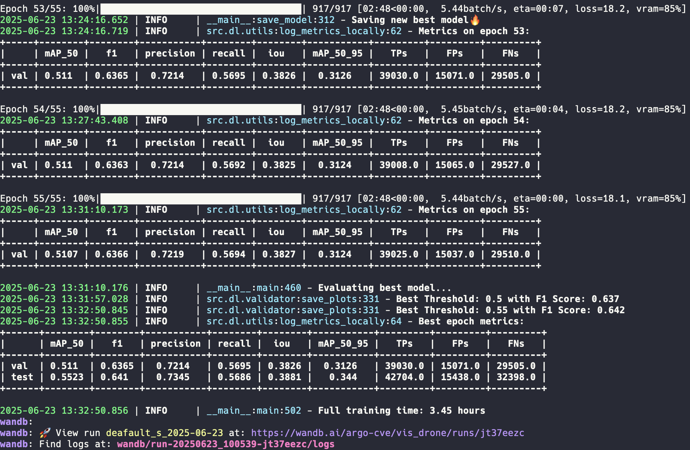
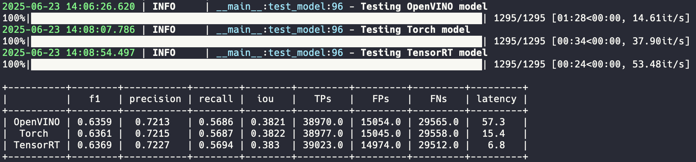
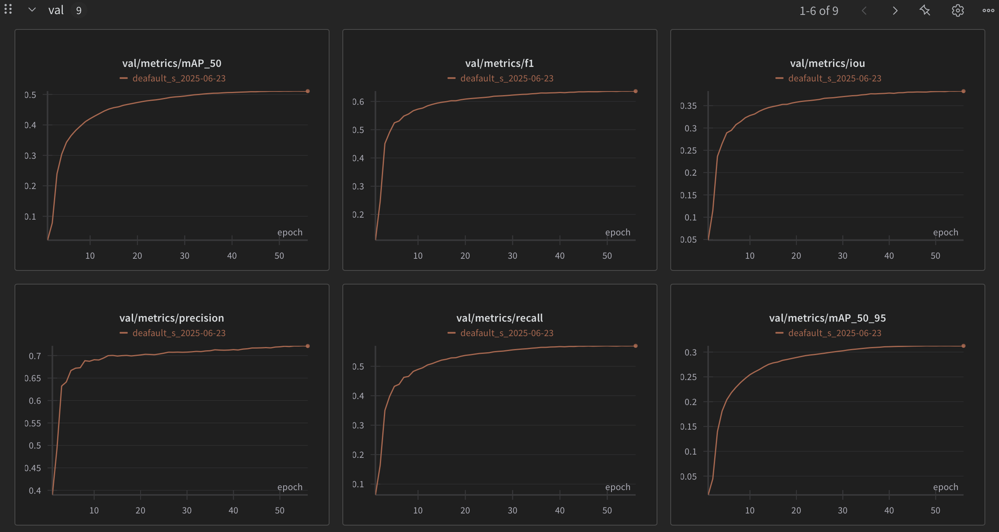
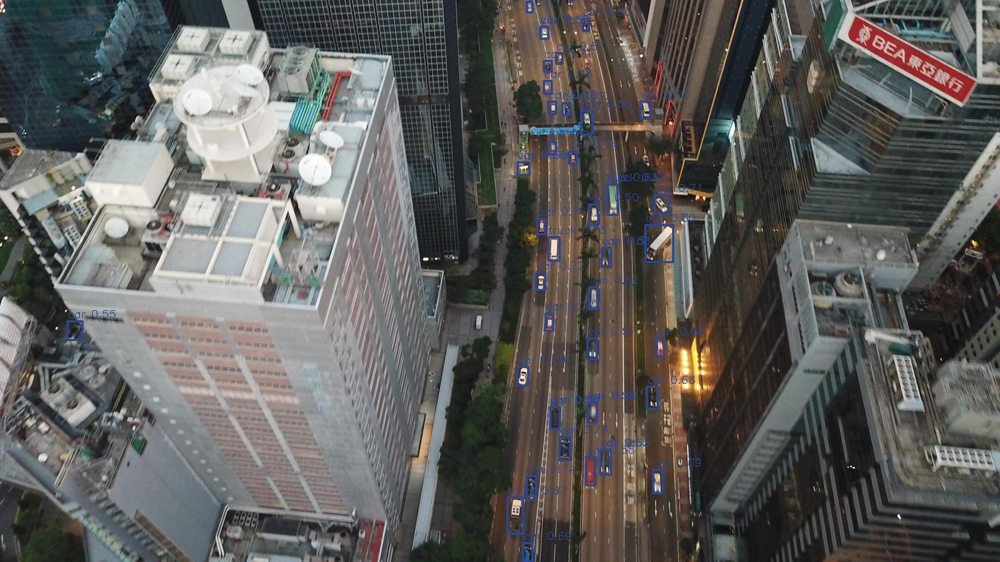
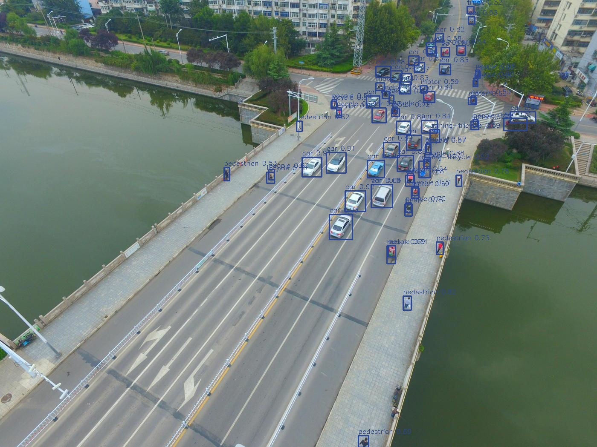

Project Path: custom_d_fine-production

Source Tree:

```txt
custom_d_fine-production
├── LICENSE
├── Makefile
├── README.md
├── config.yaml
├── demo
│   └── demo.py
├── pretrained
├── requirements.txt
└── src
    ├── d_fine
    │   ├── arch
    │   │   ├── common.py
    │   │   ├── dfine_decoder.py
    │   │   ├── hgnetv2.py
    │   │   ├── hybrid_encoder.py
    │   │   └── utils.py
    │   ├── configs.py
    │   ├── deim_criterion.py
    │   ├── dfine.py
    │   ├── dfine_criterion.py
    │   ├── dist_utils.py
    │   ├── matcher.py
    │   └── utils.py
    ├── dl
    │   ├── bench.py
    │   ├── dataset.py
    │   ├── export.py
    │   ├── infer.py
    │   ├── schedulers
    │   │   └── lr_scheduler.py
    │   ├── train.py
    │   ├── utils.py
    │   └── validator.py
    ├── etl
    │   ├── clean_csv.py
    │   ├── coco2yolo.py
    │   ├── create_test_csv.py
    │   ├── preprocess.py
    │   ├── remove_class.py
    │   ├── remove_dups.py
    │   ├── split.py
    │   ├── split_from_yolo.py
    │   ├── swap_labels.py
    │   └── yolo2coco.py
    └── infer
        ├── onnx_model.py
        ├── ov_model.py
        ├── torch_model.py
        ├── trt_model.py
        └── ultra_model.py

```

`LICENSE`:

```
                                 Apache License
                           Version 2.0, January 2004
                        http://www.apache.org/licenses/

   TERMS AND CONDITIONS FOR USE, REPRODUCTION, AND DISTRIBUTION

   1. Definitions.

      "License" shall mean the terms and conditions for use, reproduction,
      and distribution as defined by Sections 1 through 9 of this document.

      "Licensor" shall mean the copyright owner or entity authorized by
      the copyright owner that is granting the License.

      "Legal Entity" shall mean the union of the acting entity and all
      other entities that control, are controlled by, or are under common
      control with that entity. For the purposes of this definition,
      "control" means (i) the power, direct or indirect, to cause the
      direction or management of such entity, whether by contract or
      otherwise, or (ii) ownership of fifty percent (50%) or more of the
      outstanding shares, or (iii) beneficial ownership of such entity.

      "You" (or "Your") shall mean an individual or Legal Entity
      exercising permissions granted by this License.

      "Source" form shall mean the preferred form for making modifications,
      including but not limited to software source code, documentation
      source, and configuration files.

      "Object" form shall mean any form resulting from mechanical
      transformation or translation of a Source form, including but
      not limited to compiled object code, generated documentation,
      and conversions to other media types.

      "Work" shall mean the work of authorship, whether in Source or
      Object form, made available under the License, as indicated by a
      copyright notice that is included in or attached to the work
      (an example is provided in the Appendix below).

      "Derivative Works" shall mean any work, whether in Source or Object
      form, that is based on (or derived from) the Work and for which the
      editorial revisions, annotations, elaborations, or other modifications
      represent, as a whole, an original work of authorship. For the purposes
      of this License, Derivative Works shall not include works that remain
      separable from, or merely link (or bind by name) to the interfaces of,
      the Work and Derivative Works thereof.

      "Contribution" shall mean any work of authorship, including
      the original version of the Work and any modifications or additions
      to that Work or Derivative Works thereof, that is intentionally
      submitted to Licensor for inclusion in the Work by the copyright owner
      or by an individual or Legal Entity authorized to submit on behalf of
      the copyright owner. For the purposes of this definition, "submitted"
      means any form of electronic, verbal, or written communication sent
      to the Licensor or its representatives, including but not limited to
      communication on electronic mailing lists, source code control systems,
      and issue tracking systems that are managed by, or on behalf of, the
      Licensor for the purpose of discussing and improving the Work, but
      excluding communication that is conspicuously marked or otherwise
      designated in writing by the copyright owner as "Not a Contribution."

      "Contributor" shall mean Licensor and any individual or Legal Entity
      on behalf of whom a Contribution has been received by Licensor and
      subsequently incorporated within the Work.

   2. Grant of Copyright License. Subject to the terms and conditions of
      this License, each Contributor hereby grants to You a perpetual,
      worldwide, non-exclusive, no-charge, royalty-free, irrevocable
      copyright license to reproduce, prepare Derivative Works of,
      publicly display, publicly perform, sublicense, and distribute the
      Work and such Derivative Works in Source or Object form.

   3. Grant of Patent License. Subject to the terms and conditions of
      this License, each Contributor hereby grants to You a perpetual,
      worldwide, non-exclusive, no-charge, royalty-free, irrevocable
      (except as stated in this section) patent license to make, have made,
      use, offer to sell, sell, import, and otherwise transfer the Work,
      where such license applies only to those patent claims licensable
      by such Contributor that are necessarily infringed by their
      Contribution(s) alone or by combination of their Contribution(s)
      with the Work to which such Contribution(s) was submitted. If You
      institute patent litigation against any entity (including a
      cross-claim or counterclaim in a lawsuit) alleging that the Work
      or a Contribution incorporated within the Work constitutes direct
      or contributory patent infringement, then any patent licenses
      granted to You under this License for that Work shall terminate
      as of the date such litigation is filed.

   4. Redistribution. You may reproduce and distribute copies of the
      Work or Derivative Works thereof in any medium, with or without
      modifications, and in Source or Object form, provided that You
      meet the following conditions:

      (a) You must give any other recipients of the Work or
          Derivative Works a copy of this License; and

      (b) You must cause any modified files to carry prominent notices
          stating that You changed the files; and

      (c) You must retain, in the Source form of any Derivative Works
          that You distribute, all copyright, patent, trademark, and
          attribution notices from the Source form of the Work,
          excluding those notices that do not pertain to any part of
          the Derivative Works; and

      (d) If the Work includes a "NOTICE" text file as part of its
          distribution, then any Derivative Works that You distribute must
          include a readable copy of the attribution notices contained
          within such NOTICE file, excluding those notices that do not
          pertain to any part of the Derivative Works, in at least one
          of the following places: within a NOTICE text file distributed
          as part of the Derivative Works; within the Source form or
          documentation, if provided along with the Derivative Works; or,
          within a display generated by the Derivative Works, if and
          wherever such third-party notices normally appear. The contents
          of the NOTICE file are for informational purposes only and
          do not modify the License. You may add Your own attribution
          notices within Derivative Works that You distribute, alongside
          or as an addendum to the NOTICE text from the Work, provided
          that such additional attribution notices cannot be construed
          as modifying the License.

      You may add Your own copyright statement to Your modifications and
      may provide additional or different license terms and conditions
      for use, reproduction, or distribution of Your modifications, or
      for any such Derivative Works as a whole, provided Your use,
      reproduction, and distribution of the Work otherwise complies with
      the conditions stated in this License.

   5. Submission of Contributions. Unless You explicitly state otherwise,
      any Contribution intentionally submitted for inclusion in the Work
      by You to the Licensor shall be under the terms and conditions of
      this License, without any additional terms or conditions.
      Notwithstanding the above, nothing herein shall supersede or modify
      the terms of any separate license agreement you may have executed
      with Licensor regarding such Contributions.

   6. Trademarks. This License does not grant permission to use the trade
      names, trademarks, service marks, or product names of the Licensor,
      except as required for reasonable and customary use in describing the
      origin of the Work and reproducing the content of the NOTICE file.

   7. Disclaimer of Warranty. Unless required by applicable law or
      agreed to in writing, Licensor provides the Work (and each
      Contributor provides its Contributions) on an "AS IS" BASIS,
      WITHOUT WARRANTIES OR CONDITIONS OF ANY KIND, either express or
      implied, including, without limitation, any warranties or conditions
      of TITLE, NON-INFRINGEMENT, MERCHANTABILITY, or FITNESS FOR A
      PARTICULAR PURPOSE. You are solely responsible for determining the
      appropriateness of using or redistributing the Work and assume any
      risks associated with Your exercise of permissions under this License.

   8. Limitation of Liability. In no event and under no legal theory,
      whether in tort (including negligence), contract, or otherwise,
      unless required by applicable law (such as deliberate and grossly
      negligent acts) or agreed to in writing, shall any Contributor be
      liable to You for damages, including any direct, indirect, special,
      incidental, or consequential damages of any character arising as a
      result of this License or out of the use or inability to use the
      Work (including but not limited to damages for loss of goodwill,
      work stoppage, computer failure or malfunction, or any and all
      other commercial damages or losses), even if such Contributor
      has been advised of the possibility of such damages.

   9. Accepting Warranty or Additional Liability. While redistributing
      the Work or Derivative Works thereof, You may choose to offer,
      and charge a fee for, acceptance of support, warranty, indemnity,
      or other liability obligations and/or rights consistent with this
      License. However, in accepting such obligations, You may act only
      on Your own behalf and on Your sole responsibility, not on behalf
      of any other Contributor, and only if You agree to indemnify,
      defend, and hold each Contributor harmless for any liability
      incurred by, or claims asserted against, such Contributor by reason
      of your accepting any such warranty or additional liability.

   END OF TERMS AND CONDITIONS

   APPENDIX: How to apply the Apache License to your work.

      To apply the Apache License to your work, attach the following
      boilerplate notice, with the fields enclosed by brackets "[]"
      replaced with your own identifying information. (Don't include
      the brackets!)  The text should be enclosed in the appropriate
      comment syntax for the file format. We also recommend that a
      file or class name and description of purpose be included on the
      same "printed page" as the copyright notice for easier
      identification within third-party archives.

   Copyright [yyyy] [name of copyright owner]

   Licensed under the Apache License, Version 2.0 (the "License");
   you may not use this file except in compliance with the License.
   You may obtain a copy of the License at

       http://www.apache.org/licenses/LICENSE-2.0

   Unless required by applicable law or agreed to in writing, software
   distributed under the License is distributed on an "AS IS" BASIS,
   WITHOUT WARRANTIES OR CONDITIONS OF ANY KIND, either express or implied.
   See the License for the specific language governing permissions and
   limitations under the License.

```

`Makefile`:

```
.PHONY: full train preprocess split export bench infer

full:
	python -m src.etl.preprocess
	python -m src.etl.split
	python -m src.dl.train
	python -m src.dl.export
	python -m src.dl.bench

preprocess:
	python -m src.etl.preprocess

split:
	python -m src.etl.split

train:
	python -m src.dl.train

export:
	python -m src.dl.export

bench:
	python -m src.dl.bench

infer:
	python -m src.dl.infer

```

`README.md`:

```md
# SoTA Object Detection D-FINE model training, exporting, inferencing pipeline from scratch
This is a custom project to work with [D-FINE](https://arxiv.org/abs/2410.13842) - state of the art object detection transformer based model. Model author's repo: [D-FINE](https://github.com/Peterande/D-FINE).
This is not a fork, but a complete rewrite from scratch. Only model atchitecture and loss functions were used from original repo.

Check out [the tutorial video](https://youtu.be/_uEyRRw4miY) to get familiar with this pipeline.

## Main scripts
To run the scripts, use the following commands:
```bash
python -m src.etl.preprocess    # Converts images and PDFs to JPG format
python -m src.etl.split         # Creates train, validation, and test CSVs with image paths
python -m src.dl.train          # Runs the training pipeline
python -m src.dl.export         # Exports weights in various formats after training
python -m src.dl.bench          # Runs all exported models on the test set
python -m src.dl.infer          # Runs model ontest folder, saves visualisations and txt preds
```

Note: if you don't pass any parameters, you can run any of these scripts with `make script_name`, for exmaple: `make train` will run `python -m src.dl.train`. You can also just run `make` to run all scripts one by one (excluding last, infer script)

## Usage example
0. `git clone https://github.com/ArgoHA/custom_d_fine.git`
1. For bigger models (l, x) download from [gdrive](https://drive.google.com/drive/folders/1cjfMS_YV5LcoJsYi-fy0HWBZQU6eeP-7?usp=share_link) andput into `pretrained` folder
2. Prepare your data: `images` folder and `labels` folder (txt file per image in YOLO format).
```
📂 data/dataset
├── 📁 images
├── 📁 labels
```
3. Customize `config.yaml`, minimal example:
      - `exp_name`. This is experiment name which is used in model's output folder. After you train a model, you can run export/bench/infer and it will use the model under this name + current date.
      - `root`. Path to the directory where you store your dataset and where model outputs will be saved
      - `data_path`. Path to the folder with `images` and `labels`
      - `label_to_name`. Your custom dataset classes
      - `model_name`. Choose from n/s/m/l/x model sizes.
      - and usual things like: epochs, batch_size, num_workers. Check out config.yaml for all configs.
4. Run `preprocess` and `split` scripts from custom_d_fine repo.
5. Run `train` script, changing confurations, iterating, untill you get desired results.
6. Run `export`script to create ONNX, TensorRT, OpenVINO models.

[Training example with Colab](https://colab.research.google.com/drive/1ZV12qnUQMpC0g3j-0G-tYhmmdM98a41X?usp=sharing)

If you run train script passing the args in the command and not changing them in the config file - you should also pass changed args to other scripts like `export` or `infer`. Example:
```bash
python -m src.dl.train exp_name=my_experiment
python -m src.dl.export exp_name=my_experiment
```

## Exporting tips
Half precision:
- usually makes sense if your hardware was more FLOPs in fp16
- works best with TensorRT
- for Torch version, AMP is used when Half flag is true, but if FLOPs are the same for fp32 and fp16 - I see AMP being a little slower during inference.
- is not used for OpenVINO, as it automatically picks precision

Dynamic input means that during inference, we cut black paddings from letterbox. I don't recommend using it with D-FINE as accuracy degrades too much (probably because absolute Positional Encoding of pathces)

## Inference
Use inference classes in `src/infer`. Currently available:
- Torch
- TensorRT
- OpenVINO
- ONNX

You can run inference on a folder (path_to_test_data) of images or on a folder of videos. Crops will be created automatically. You can control it and paddings from config.yaml in the `infer` section.

## Outputs
- **Models**: Saved during the training process and export at `output/models/exp_name_date`. Includes training logs, table with main metrics, confusion matrics, f1-score_vs_threshold and precisino_recall_vs_threshold. In extended_metrics you can file per class metrics (saved during final eval after all epochs)
- **Debug images**: Preprocessed images (including augmentations) are saved at `output/debug_images/split` as they are fed into the model (except for normalization).
- **Evaluation predicts**: Visualised model's predictions on val set. Includes GT as green and preds as blue.
- **Bench images**: Visualised model's predictions with inference class. Uses all exported models
- **Infer**: Visualised model's predictions and predicted annotations in yolo txt format

## Results examples
**Train**



**Benchmarking**



**WandB**



**Infer**






## Features
- Training pipeline from SoTA D-FINE model
- Export to ONNX, OpenVino, TensorRT.
- Inference class for Torch, TensorRT, OpenVINO on images or videos
- Label smoothing in Focal loss
- Augs based on the [albumentations](https://albumentations.ai) lib
- Mosaic augmentation, multiscale aug
- Metrics: mAPs, Precision, Recall, F1-score, Confusion matrix, IoU, plots
- After training is done - runs a test to calculate the optimal conf threshold
- Exponential moving average model
- Batch accumulation
- Automatic mixed precision (40% less vRAM used and 15% faster training)
- Gradient clipping
- Keep ratio of the image and use paddings or use simple resize
- When ratio is kept, inference can be sped up with removal of grey paddings
- Visualisation of preprocessed images, model predictions and ground truth
- Warmup epochs to ignore background images for easier start of convirsion
- OneCycler used as scheduler, AdamW as optimizer
- Unified configuration file for all scrips
- Annotations in YOLO format, splits in csv format
- ETA displayed during training, precise strating epoch 2
- Logging file with training process
- WandB integration
- Batch inference
- Early stopping
- Gradio UI demo

## TODO
- Finetune with layers freeze
- Add support for cashing in dataset
- Add support for multi GPU training
- Instance segmentation
- Smart dataset preprocessing. Detect small objects. Detect near duplicates (remove from val/test)


## Acknowledgement
This project is built upon original [D-FINE repo](https://github.com/Peterande/D-FINE). Thank you to the D-FINE team for an awesome model!

``` bibtex
@misc{peng2024dfine,
      title={D-FINE: Redefine Regression Task in DETRs as Fine-grained Distribution Refinement},
      author={Yansong Peng and Hebei Li and Peixi Wu and Yueyi Zhang and Xiaoyan Sun and Feng Wu},
      year={2024},
      eprint={2410.13842},
      archivePrefix={arXiv},
      primaryClass={cs.CV}
}
```

```

`config.yaml`:

```yaml
project_name: gfrdeimdoclayout1600 # for wandb
exp_name: deimdoclayout1600 # experiment name

exp: ${exp_name}_${now_dir}

model_name: m # model size (n, s, m, l, x)

train:
  ### Paths ###
  root: /training-data/doclayout-yolo/train-dfine-20250625/ # project root with dataset and outputs
  pretrained_dataset: coco # coco, obj2coco
  pretrained_model_path: pretrained/dfine_${model_name}_${train.pretrained_dataset}.pth # dfine_m_obj2coco.pth

  data_path: ${train.root}/dataset # path to dataset
  path_to_test_data: ${train.root}/images  # path to test set, used in infer script
  path_to_save: ${train.root}/output/models/${exp} # where to save output

  debug_img_path: ${train.root}/output/debug_images
  eval_preds_path: ${train.root}/output/eval_preds
  bench_img_path: ${train.root}/output/bench_imgs
  infer_path: ${train.root}/output/infer

  ### Configs ###
  use_wandb: True
  device: cuda
  label_to_name: # dataset's classes
    0: abandon
    1: figure
    2: figure_caption
    3: forumula_caption
    4: isolate_formula
    5: plain_text
    6: table
    7: table_caption
    8: table_footnote
    9: title
  use_one_class: False

  img_size: [1600, 1600] # (h, w)
  keep_ratio: True # image aspect ratio, if True - image will be padded
  to_visualize_eval: True # save images with gt and preds
  debug_img_processing: True # save images after preprocessing

  amp_enabled: True # use automatic mixed precision
  clip_max_norm: 0.1 # gradient clipping

  batch_size: 16 # physical, should fit on the device
  b_accum_steps: 1 # grad accumulation (n * bs)
  epochs: 100
  early_stopping: 10 # 0 - no early stopping
  ignore_background_epochs: 0 # background images are not used for N epochs in train set
  num_workers: 12

  ### DEIM Specific Configs (add this section) ###
  deim:
    use_uni_set: True     # Whether to use the union of matched indices for box losses
    mal_gamma: 1.5        # Gamma for Matching-Aware Loss
    lr_gamma: 0.5         # Scaling factor for the minimum learning rate in FlatCosine scheduler
    warmup_iter: 2000     # Number of warmup iterations
    flat_epoch: 29        # Number of epochs with flat learning rate
    no_aug_epoch: 8       # Number of epochs at the end with no augmentations

  ### Validation ###
  conf_thresh: 0.5
  iou_thresh: 0.5

  ### EMA ###
  use_ema: True # use exponential moving average model
  ema_momentum: 0.9998

  ### Optimizer and Scheduler ###
  base_lr: ${train.lrs.${model_name}.base_lr}
  backbone_lr: ${train.lrs.${model_name}.backbone_lr}
  cycler_pct_start: 0.1
  weight_decay: 0.000125
  betas: [0.9, 0.999]
  label_smoothing: 0.0

  ### Augs ###
  mosaic_augs:
    mosaic_prob: 0.8
    no_mosaic_epochs: 5
    mosaic_scale: [0.5, 1.5]
    degrees: 0.0 # not recommended if bbox precision is critical
    translate: 0.2
    shear: 2.0

  augs:
    rotation_degree: 10 # maximum +- rotation
    rotation_p: 0.0 # probability of the rotation (with above degree)
    multiscale_prob: 0.0
    rotate_90: 0.05
    left_right_flip: 0.3
    up_down_flip: 0.0
    to_gray: 0.01
    blur: 0.01
    gamma: 0.02
    brightness: 0.02
    noise: 0.01
    coarse_dropout: 0.0

  ### Reproducibility ###
  seed: 42
  cudnn_fixed: False

  ### Recommended learning rates ###
  lrs:
    n:
      backbone_lr: 0.0004
      base_lr: 0.0008
    s:
      backbone_lr: 0.00006  # can setup up to 0.0002
      base_lr: 0.00025  # 0.0004
    m:
      backbone_lr: 0.00002  # 0.000025
      base_lr: 0.00015  # 0.00025
    l:
      backbone_lr: 0.00000625 # 0.0000125
      base_lr: 0.000125 # 0.00025
    x:
      backbone_lr: 0.0000015  # 0.0000025
      base_lr: 0.0001  # 0.00025


split:
  ignore_negatives: False # only use images with labels
  shuffle: True
  train_split: 0.85
  val_split: 0.15 # test_split = 1 - train_split - val_split


export: # TensorRT must be done on the inference device
  half: False # torch, tensorrt
  max_batch_size: 1 # torch, tensorrt
  dynamic_input: False # torch, openvino cpu only


infer:
  to_crop: True  # if True - saves crops of detected objects
  paddings: # if int - amount of pixes, if float - percentage of image size
    w: 0.05
    h: 0.05


### service ###
defaults:
  - _self_
  - override hydra/hydra_logging: disabled
  - override hydra/job_logging: disabled

hydra:
  output_subdir: null
  run:
    dir: .

now_dir: &nowdir ${now:%Y-%m-%d}

```

`demo\demo.py`:

```py
"""
Place model weights in the same folder as this file, update variables and run:
python -m demo.demo
"""

import time
from pathlib import Path

import cv2
import gradio as gr

from src.infer.torch_model import Torch_model


def visualize(img, preds):
    for pred in preds["boxes"]:
        print(pred)
        cv2.rectangle(
            img,
            (int(pred[0]), int(pred[1])),
            (int(pred[2]), int(pred[3])),
            (255, 0, 0),
            2,
        )
    return img


def predict_image(img):
    img_bgr = cv2.cvtColor(img, cv2.COLOR_RGB2BGR)
    t0 = time.perf_counter()
    results = model(img_bgr)
    print((time.perf_counter() - t0) * 1000, "ms", results)
    res_img = visualize(img, results[0])
    return res_img


model_name = "s"
classes = {0: "class_name"}
im_width = 640
im_height = 640
conf_thresh = 0.5
device = "cpu"

f_path = Path(__file__).parent

model = Torch_model(
    model_name=model_name,
    model_path=f_path / "model.pt",
    n_outputs=len(classes),
    input_width=im_width,
    input_height=im_height,
    conf_thresh=conf_thresh,
    device=device,
)

iface = gr.Interface(
    fn=predict_image,
    inputs=[gr.Image(type="numpy", label="Upload Image")],
    outputs=gr.Image(type="numpy", label="Result", format="png"),
    title="HW detection",
    description="Upload images for inference.",
)

if __name__ == "__main__":
    iface.launch()

```

`requirements.txt`:

```txt
albumentations==2.0.8
hydra-core==1.3.2
loguru==0.7.2
matplotlib==3.10.3
numpy==2.1.1
omegaconf==2.3.0
onnx
protobuf==6.32.0
onnxconverter-common==1.15.0
onnxruntime-gpu
onnxsim
opencv_python==4.10.0.84
opencv_python_headless==4.10.0.84
openvino==2025.2.0
pandas==2.2.3
Pillow==11.1.0
pillow_heif==0.18.0
PyYAML==6.0.2
scikit_learn==1.7.0
scipy==1.15.1
tensorrt-cu12
torchmetrics==1.7.4
faster-coco-eval==1.6.5
pycocotools==2.0.8
tqdm==4.66.5
difPy==4.2.1
gradio==5.37
wandb==0.21.0
tabulate==0.9.0

torch==2.8.0
torchvision==0.23.0

```

`src\d_fine\arch\common.py`:

```py
"""
Copied from RT-DETR (https://github.com/lyuwenyu/RT-DETR)
Copyright(c) 2023 lyuwenyu. All Rights Reserved.
Modifications Copyright (c) 2024 The D-FINE Authors. All Rights Reserved.
"""

import torch
import torch.nn as nn


class ConvNormLayer(nn.Module):
    def __init__(self, ch_in, ch_out, kernel_size, stride, padding=None, bias=False, act=None):
        super().__init__()
        self.conv = nn.Conv2d(
            ch_in,
            ch_out,
            kernel_size,
            stride,
            padding=(kernel_size - 1) // 2 if padding is None else padding,
            bias=bias,
        )
        self.norm = nn.BatchNorm2d(ch_out)
        self.act = nn.Identity() if act is None else get_activation(act)

    def forward(self, x):
        return self.act(self.norm(self.conv(x)))


class FrozenBatchNorm2d(nn.Module):
    """copy and modified from https://github.com/facebookresearch/detr/blob/master/models/backbone.py
    BatchNorm2d where the batch statistics and the affine parameters are fixed.
    Copy-paste from torchvision.misc.ops with added eps before rqsrt,
    without which any other models than torchvision.models.resnet[18,34,50,101]
    produce nans.
    """

    def __init__(self, num_features, eps=1e-5):
        super(FrozenBatchNorm2d, self).__init__()
        n = num_features
        self.register_buffer("weight", torch.ones(n))
        self.register_buffer("bias", torch.zeros(n))
        self.register_buffer("running_mean", torch.zeros(n))
        self.register_buffer("running_var", torch.ones(n))
        self.eps = eps
        self.num_features = n

    def _load_from_state_dict(
        self, state_dict, prefix, local_metadata, strict, missing_keys, unexpected_keys, error_msgs
    ):
        num_batches_tracked_key = prefix + "num_batches_tracked"
        if num_batches_tracked_key in state_dict:
            del state_dict[num_batches_tracked_key]

        super(FrozenBatchNorm2d, self)._load_from_state_dict(
            state_dict, prefix, local_metadata, strict, missing_keys, unexpected_keys, error_msgs
        )

    def forward(self, x):
        # move reshapes to the beginning
        # to make it fuser-friendly
        w = self.weight.reshape(1, -1, 1, 1)
        b = self.bias.reshape(1, -1, 1, 1)
        rv = self.running_var.reshape(1, -1, 1, 1)
        rm = self.running_mean.reshape(1, -1, 1, 1)
        scale = w * (rv + self.eps).rsqrt()
        bias = b - rm * scale
        return x * scale + bias

    def extra_repr(self):
        return "{num_features}, eps={eps}".format(**self.__dict__)


def freeze_batch_norm2d(module: nn.Module) -> nn.Module:
    if isinstance(module, nn.BatchNorm2d):
        module = FrozenBatchNorm2d(module.num_features)
    else:
        for name, child in module.named_children():
            _child = freeze_batch_norm2d(child)
            if _child is not child:
                setattr(module, name, _child)
    return module


def get_activation(act: str, inplace: bool = True):
    """get activation"""
    if act is None:
        return nn.Identity()

    elif isinstance(act, nn.Module):
        return act

    act = act.lower()

    if act == "silu" or act == "swish":
        m = nn.SiLU()

    elif act == "relu":
        m = nn.ReLU()

    elif act == "leaky_relu":
        m = nn.LeakyReLU()

    elif act == "silu":
        m = nn.SiLU()

    elif act == "gelu":
        m = nn.GELU()

    elif act == "hardsigmoid":
        m = nn.Hardsigmoid()

    else:
        raise RuntimeError("")

    if hasattr(m, "inplace"):
        m.inplace = inplace

    return m

```

`src\d_fine\arch\dfine_decoder.py`:

```py
"""
D-FINE: Redefine Regression Task of DETRs as Fine-grained Distribution Refinement
Copyright (c) 2024 The D-FINE Authors. All Rights Reserved.
---------------------------------------------------------------------------------
Modified from RT-DETR (https://github.com/lyuwenyu/RT-DETR)
Copyright (c) 2023 lyuwenyu. All Rights Reserved.
"""

import copy
import functools
import math
from collections import OrderedDict
from typing import List

import torch
import torch.nn as nn
import torch.nn.functional as F
import torch.nn.init as init

from .utils import (
    bias_init_with_prob,
    deformable_attention_core_func_v2,
    distance2bbox,
    get_activation,
    get_contrastive_denoising_training_group,
    inverse_sigmoid,
    weighting_function,
)

__all__ = ["DFINETransformer"]


class MLP(nn.Module):
    def __init__(self, input_dim, hidden_dim, output_dim, num_layers, act="relu"):
        super().__init__()
        self.num_layers = num_layers
        h = [hidden_dim] * (num_layers - 1)
        self.layers = nn.ModuleList(
            nn.Linear(n, k) for n, k in zip([input_dim] + h, h + [output_dim])
        )
        self.act = get_activation(act)

    def forward(self, x):
        for i, layer in enumerate(self.layers):
            x = self.act(layer(x)) if i < self.num_layers - 1 else layer(x)
        return x


class MSDeformableAttention(nn.Module):
    def __init__(
        self,
        embed_dim=256,
        num_heads=8,
        num_levels=4,
        num_points=4,
        method="default",
        offset_scale=0.5,
    ):
        """Multi-Scale Deformable Attention"""
        super(MSDeformableAttention, self).__init__()
        self.embed_dim = embed_dim
        self.num_heads = num_heads
        self.num_levels = num_levels
        self.offset_scale = offset_scale

        if isinstance(num_points, list):
            assert len(num_points) == num_levels, ""
            num_points_list = num_points
        else:
            num_points_list = [num_points for _ in range(num_levels)]

        self.num_points_list = num_points_list

        num_points_scale = [1 / n for n in num_points_list for _ in range(n)]
        self.register_buffer(
            "num_points_scale", torch.tensor(num_points_scale, dtype=torch.float32)
        )

        self.total_points = num_heads * sum(num_points_list)
        self.method = method

        self.head_dim = embed_dim // num_heads
        assert (
            self.head_dim * num_heads == self.embed_dim
        ), "embed_dim must be divisible by num_heads"

        self.sampling_offsets = nn.Linear(embed_dim, self.total_points * 2)
        self.attention_weights = nn.Linear(embed_dim, self.total_points)

        self.ms_deformable_attn_core = functools.partial(
            deformable_attention_core_func_v2, method=self.method
        )

        self._reset_parameters()

        if method == "discrete":
            for p in self.sampling_offsets.parameters():
                p.requires_grad = False

    def _reset_parameters(self):
        # sampling_offsets
        init.constant_(self.sampling_offsets.weight, 0)
        thetas = torch.arange(self.num_heads, dtype=torch.float32) * (
            2.0 * math.pi / self.num_heads
        )
        grid_init = torch.stack([thetas.cos(), thetas.sin()], -1)
        grid_init = grid_init / grid_init.abs().max(-1, keepdim=True).values
        grid_init = grid_init.reshape(self.num_heads, 1, 2).tile([1, sum(self.num_points_list), 1])
        scaling = torch.concat([torch.arange(1, n + 1) for n in self.num_points_list]).reshape(
            1, -1, 1
        )
        grid_init *= scaling
        self.sampling_offsets.bias.data[...] = grid_init.flatten()

        # attention_weights
        init.constant_(self.attention_weights.weight, 0)
        init.constant_(self.attention_weights.bias, 0)

    def forward(
        self,
        query: torch.Tensor,
        reference_points: torch.Tensor,
        value: torch.Tensor,
        value_spatial_shapes: List[int],
    ):
        """
        Args:
            query (Tensor): [bs, query_length, C]
            reference_points (Tensor): [bs, query_length, n_levels, 2], range in [0, 1], top-left (0,0),
                bottom-right (1, 1), including padding area
            value (Tensor): [bs, value_length, C]
            value_spatial_shapes (List): [n_levels, 2], [(H_0, W_0), (H_1, W_1), ..., (H_{L-1}, W_{L-1})]

        Returns:
            output (Tensor): [bs, Length_{query}, C]
        """
        bs, Len_q = query.shape[:2]

        sampling_offsets: torch.Tensor = self.sampling_offsets(query)
        sampling_offsets = sampling_offsets.reshape(
            bs, Len_q, self.num_heads, sum(self.num_points_list), 2
        )

        attention_weights = self.attention_weights(query).reshape(
            bs, Len_q, self.num_heads, sum(self.num_points_list)
        )
        attention_weights = F.softmax(attention_weights, dim=-1)

        if reference_points.shape[-1] == 2:
            offset_normalizer = torch.tensor(value_spatial_shapes)
            offset_normalizer = offset_normalizer.flip([1]).reshape(1, 1, 1, self.num_levels, 1, 2)
            sampling_locations = (
                reference_points.reshape(bs, Len_q, 1, self.num_levels, 1, 2)
                + sampling_offsets / offset_normalizer
            )
        elif reference_points.shape[-1] == 4:
            # reference_points [8, 480, None, 1,  4]
            # sampling_offsets [8, 480, 8,    12, 2]
            num_points_scale = self.num_points_scale.to(dtype=query.dtype).unsqueeze(-1)
            offset = (
                sampling_offsets
                * num_points_scale
                * reference_points[:, :, None, :, 2:]
                * self.offset_scale
            )
            sampling_locations = reference_points[:, :, None, :, :2] + offset
        else:
            raise ValueError(
                "Last dim of reference_points must be 2 or 4, but get {} instead.".format(
                    reference_points.shape[-1]
                )
            )

        output = self.ms_deformable_attn_core(
            value, value_spatial_shapes, sampling_locations, attention_weights, self.num_points_list
        )

        return output


class TransformerDecoderLayer(nn.Module):
    def __init__(
        self,
        d_model=256,
        n_head=8,
        dim_feedforward=1024,
        dropout=0.0,
        activation="relu",
        n_levels=4,
        n_points=4,
        cross_attn_method="default",
        layer_scale=None,
    ):
        super(TransformerDecoderLayer, self).__init__()
        if layer_scale is not None:
            dim_feedforward = round(layer_scale * dim_feedforward)
            d_model = round(layer_scale * d_model)

        # self attention
        self.self_attn = nn.MultiheadAttention(d_model, n_head, dropout=dropout, batch_first=True)
        self.dropout1 = nn.Dropout(dropout)
        self.norm1 = nn.LayerNorm(d_model)

        # cross attention
        self.cross_attn = MSDeformableAttention(
            d_model, n_head, n_levels, n_points, method=cross_attn_method
        )
        self.dropout2 = nn.Dropout(dropout)

        # gate
        self.gateway = Gate(d_model)

        # ffn
        self.linear1 = nn.Linear(d_model, dim_feedforward)
        self.activation = get_activation(activation)
        self.dropout3 = nn.Dropout(dropout)
        self.linear2 = nn.Linear(dim_feedforward, d_model)
        self.dropout4 = nn.Dropout(dropout)
        self.norm3 = nn.LayerNorm(d_model)

        self._reset_parameters()

    def _reset_parameters(self):
        init.xavier_uniform_(self.linear1.weight)
        init.xavier_uniform_(self.linear2.weight)

    def with_pos_embed(self, tensor, pos):
        return tensor if pos is None else tensor + pos

    def forward_ffn(self, tgt):
        return self.linear2(self.dropout3(self.activation(self.linear1(tgt))))

    def forward(
        self, target, reference_points, value, spatial_shapes, attn_mask=None, query_pos_embed=None
    ):
        # self attention
        q = k = self.with_pos_embed(target, query_pos_embed)

        target2, _ = self.self_attn(q, k, value=target, attn_mask=attn_mask)
        target = target + self.dropout1(target2)
        target = self.norm1(target)

        # cross attention
        target2 = self.cross_attn(
            self.with_pos_embed(target, query_pos_embed), reference_points, value, spatial_shapes
        )

        target = self.gateway(target, self.dropout2(target2))

        # ffn
        target2 = self.forward_ffn(target)
        target = target + self.dropout4(target2)
        target = self.norm3(target.clamp(min=-65504, max=65504))

        return target


class Gate(nn.Module):
    def __init__(self, d_model):
        super(Gate, self).__init__()
        self.gate = nn.Linear(2 * d_model, 2 * d_model)
        bias = bias_init_with_prob(0.5)
        init.constant_(self.gate.bias, bias)
        init.constant_(self.gate.weight, 0)
        self.norm = nn.LayerNorm(d_model)

    def forward(self, x1, x2):
        gate_input = torch.cat([x1, x2], dim=-1)
        gates = torch.sigmoid(self.gate(gate_input))
        gate1, gate2 = gates.chunk(2, dim=-1)
        return self.norm(gate1 * x1 + gate2 * x2)


class Integral(nn.Module):
    """
    A static layer that calculates integral results from a distribution.

    This layer computes the target location using the formula: `sum{Pr(n) * W(n)}`,
    where Pr(n) is the softmax probability vector representing the discrete
    distribution, and W(n) is the non-uniform Weighting Function.

    Args:
        reg_max (int): Max number of the discrete bins. Default is 32.
                       It can be adjusted based on the dataset or task requirements.
    """

    def __init__(self, reg_max=32):
        super(Integral, self).__init__()
        self.reg_max = reg_max

    def forward(self, x, project):
        shape = x.shape
        x = F.softmax(x.reshape(-1, self.reg_max + 1), dim=1)
        x = F.linear(x, project.to(x.device)).reshape(-1, 4)
        return x.reshape(list(shape[:-1]) + [-1])


class LQE(nn.Module):
    def __init__(self, k, hidden_dim, num_layers, reg_max):
        super(LQE, self).__init__()
        self.k = k
        self.reg_max = reg_max
        self.reg_conf = MLP(4 * (k + 1), hidden_dim, 1, num_layers)
        init.constant_(self.reg_conf.layers[-1].bias, 0)
        init.constant_(self.reg_conf.layers[-1].weight, 0)

    def forward(self, scores, pred_corners):
        B, L, _ = pred_corners.size()
        prob = F.softmax(pred_corners.reshape(B, L, 4, self.reg_max + 1), dim=-1)
        prob_topk, _ = prob.topk(self.k, dim=-1)
        stat = torch.cat([prob_topk, prob_topk.mean(dim=-1, keepdim=True)], dim=-1)
        quality_score = self.reg_conf(stat.reshape(B, L, -1))
        return scores + quality_score


class TransformerDecoder(nn.Module):
    """
    Transformer Decoder implementing Fine-grained Distribution Refinement (FDR).

    This decoder refines object detection predictions through iterative updates across multiple layers,
    utilizing attention mechanisms, location quality estimators, and distribution refinement techniques
    to improve bounding box accuracy and robustness.
    """

    def __init__(
        self,
        hidden_dim,
        decoder_layer,
        decoder_layer_wide,
        num_layers,
        num_head,
        reg_max,
        reg_scale,
        up,
        eval_idx=-1,
        layer_scale=2,
    ):
        super(TransformerDecoder, self).__init__()
        self.hidden_dim = hidden_dim
        self.num_layers = num_layers
        self.layer_scale = layer_scale
        self.num_head = num_head
        self.eval_idx = eval_idx if eval_idx >= 0 else num_layers + eval_idx
        self.up, self.reg_scale, self.reg_max = up, reg_scale, reg_max
        self.layers = nn.ModuleList(
            [copy.deepcopy(decoder_layer) for _ in range(self.eval_idx + 1)]
            + [copy.deepcopy(decoder_layer_wide) for _ in range(num_layers - self.eval_idx - 1)]
        )
        self.lqe_layers = nn.ModuleList(
            [copy.deepcopy(LQE(4, 64, 2, reg_max)) for _ in range(num_layers)]
        )

    def value_op(self, memory, value_proj, value_scale, memory_mask, memory_spatial_shapes):
        """
        Preprocess values for MSDeformableAttention.
        """
        value = value_proj(memory) if value_proj is not None else memory
        value = F.interpolate(memory, size=value_scale) if value_scale is not None else value
        if memory_mask is not None:
            value = value * memory_mask.to(value.dtype).unsqueeze(-1)
        value = value.reshape(value.shape[0], value.shape[1], self.num_head, -1)
        split_shape = [h * w for h, w in memory_spatial_shapes]
        return value.permute(0, 2, 3, 1).split(split_shape, dim=-1)

    def convert_to_deploy(self):
        self.project = weighting_function(self.reg_max, self.up, self.reg_scale, deploy=True)
        self.layers = self.layers[: self.eval_idx + 1]
        self.lqe_layers = nn.ModuleList(
            [nn.Identity()] * (self.eval_idx) + [self.lqe_layers[self.eval_idx]]
        )

    def forward(
        self,
        target,
        ref_points_unact,
        memory,
        spatial_shapes,
        bbox_head,
        score_head,
        query_pos_head,
        pre_bbox_head,
        integral,
        up,
        reg_scale,
        attn_mask=None,
        memory_mask=None,
        dn_meta=None,
    ):
        output = target
        output_detach = pred_corners_undetach = 0
        value = self.value_op(memory, None, None, memory_mask, spatial_shapes)

        dec_out_bboxes = []
        dec_out_logits = []
        dec_out_pred_corners = []
        dec_out_refs = []
        if not hasattr(self, "project"):
            project = weighting_function(self.reg_max, up, reg_scale)
        else:
            project = self.project

        ref_points_detach = F.sigmoid(ref_points_unact)

        for i, layer in enumerate(self.layers):
            ref_points_input = ref_points_detach.unsqueeze(2)
            query_pos_embed = query_pos_head(ref_points_detach).clamp(min=-10, max=10)

            # TODO Adjust scale if needed for detachable wider layers
            if i >= self.eval_idx + 1 and self.layer_scale > 1:
                query_pos_embed = F.interpolate(query_pos_embed, scale_factor=self.layer_scale)
                value = self.value_op(
                    memory, None, query_pos_embed.shape[-1], memory_mask, spatial_shapes
                )
                output = F.interpolate(output, size=query_pos_embed.shape[-1])
                output_detach = output.detach()

            output = layer(
                output, ref_points_input, value, spatial_shapes, attn_mask, query_pos_embed
            )

            if i == 0:
                # Initial bounding box predictions with inverse sigmoid refinement
                pre_bboxes = F.sigmoid(pre_bbox_head(output) + inverse_sigmoid(ref_points_detach))
                pre_scores = score_head[0](output)
                ref_points_initial = pre_bboxes.detach()

            # Refine bounding box corners using FDR, integrating previous layer's corrections
            pred_corners = bbox_head[i](output + output_detach) + pred_corners_undetach
            inter_ref_bbox = distance2bbox(
                ref_points_initial, integral(pred_corners, project), reg_scale
            )

            if self.training or i == self.eval_idx:
                scores = score_head[i](output)
                # Lqe does not affect the performance here.
                scores = self.lqe_layers[i](scores, pred_corners)
                dec_out_logits.append(scores)
                dec_out_bboxes.append(inter_ref_bbox)
                dec_out_pred_corners.append(pred_corners)
                dec_out_refs.append(ref_points_initial)

                if not self.training:
                    break

            pred_corners_undetach = pred_corners
            ref_points_detach = inter_ref_bbox.detach()
            output_detach = output.detach()

        return (
            torch.stack(dec_out_bboxes),
            torch.stack(dec_out_logits),
            torch.stack(dec_out_pred_corners),
            torch.stack(dec_out_refs),
            pre_bboxes,
            pre_scores,
        )


class DFINETransformer(nn.Module):
    __share__ = ["num_classes", "eval_spatial_size"]

    def __init__(
        self,
        num_classes=80,
        hidden_dim=256,
        num_queries=300,
        feat_channels=[512, 1024, 2048],
        feat_strides=[8, 16, 32],
        num_levels=3,
        num_points=4,
        nhead=8,
        num_layers=6,
        dim_feedforward=1024,
        dropout=0.0,
        activation="relu",
        num_denoising=100,
        label_noise_ratio=0.5,
        box_noise_scale=1.0,
        learn_query_content=False,
        eval_spatial_size=None,
        eval_idx=-1,
        eps=1e-2,
        aux_loss=True,
        cross_attn_method="default",
        query_select_method="default",
        reg_max=32,
        reg_scale=4.0,
        layer_scale=1,
    ):
        super().__init__()
        assert len(feat_channels) <= num_levels
        assert len(feat_strides) == len(feat_channels)

        for _ in range(num_levels - len(feat_strides)):
            feat_strides.append(feat_strides[-1] * 2)

        self.hidden_dim = hidden_dim
        scaled_dim = round(layer_scale * hidden_dim)
        self.nhead = nhead
        self.feat_strides = feat_strides
        self.num_levels = num_levels
        self.num_classes = num_classes
        self.num_queries = num_queries
        self.eps = eps
        self.num_layers = num_layers
        self.eval_spatial_size = eval_spatial_size
        self.aux_loss = aux_loss
        self.reg_max = reg_max

        assert query_select_method in ("default", "one2many", "agnostic"), ""
        assert cross_attn_method in ("default", "discrete"), ""
        self.cross_attn_method = cross_attn_method
        self.query_select_method = query_select_method

        # backbone feature projection
        self._build_input_proj_layer(feat_channels)

        # Transformer module
        self.up = nn.Parameter(torch.tensor([0.5]), requires_grad=False)
        self.reg_scale = nn.Parameter(torch.tensor([reg_scale]), requires_grad=False)
        decoder_layer = TransformerDecoderLayer(
            hidden_dim,
            nhead,
            dim_feedforward,
            dropout,
            activation,
            num_levels,
            num_points,
            cross_attn_method=cross_attn_method,
        )
        decoder_layer_wide = TransformerDecoderLayer(
            hidden_dim,
            nhead,
            dim_feedforward,
            dropout,
            activation,
            num_levels,
            num_points,
            cross_attn_method=cross_attn_method,
            layer_scale=layer_scale,
        )
        self.decoder = TransformerDecoder(
            hidden_dim,
            decoder_layer,
            decoder_layer_wide,
            num_layers,
            nhead,
            reg_max,
            self.reg_scale,
            self.up,
            eval_idx,
            layer_scale,
        )
        # denoising
        self.num_denoising = num_denoising
        self.label_noise_ratio = label_noise_ratio
        self.box_noise_scale = box_noise_scale
        if num_denoising > 0:
            self.denoising_class_embed = nn.Embedding(
                num_classes + 1, hidden_dim, padding_idx=num_classes
            )
            init.normal_(self.denoising_class_embed.weight[:-1])

        # decoder embedding
        self.learn_query_content = learn_query_content
        if learn_query_content:
            self.tgt_embed = nn.Embedding(num_queries, hidden_dim)
        self.query_pos_head = MLP(4, 2 * hidden_dim, hidden_dim, 2)

        # if num_select_queries != self.num_queries:
        #     layer = TransformerEncoderLayer(hidden_dim, nhead, dim_feedforward, activation='gelu')
        #     self.encoder = TransformerEncoder(layer, 1)

        self.enc_output = nn.Sequential(
            OrderedDict(
                [
                    ("proj", nn.Linear(hidden_dim, hidden_dim)),
                    (
                        "norm",
                        nn.LayerNorm(
                            hidden_dim,
                        ),
                    ),
                ]
            )
        )

        if query_select_method == "agnostic":
            self.enc_score_head = nn.Linear(hidden_dim, 1)
        else:
            self.enc_score_head = nn.Linear(hidden_dim, num_classes)

        self.enc_bbox_head = MLP(hidden_dim, hidden_dim, 4, 3)

        # decoder head
        self.eval_idx = eval_idx if eval_idx >= 0 else num_layers + eval_idx
        self.dec_score_head = nn.ModuleList(
            [nn.Linear(hidden_dim, num_classes) for _ in range(self.eval_idx + 1)]
            + [nn.Linear(scaled_dim, num_classes) for _ in range(num_layers - self.eval_idx - 1)]
        )
        self.pre_bbox_head = MLP(hidden_dim, hidden_dim, 4, 3)
        self.dec_bbox_head = nn.ModuleList(
            [
                MLP(hidden_dim, hidden_dim, 4 * (self.reg_max + 1), 3)
                for _ in range(self.eval_idx + 1)
            ]
            + [
                MLP(scaled_dim, scaled_dim, 4 * (self.reg_max + 1), 3)
                for _ in range(num_layers - self.eval_idx - 1)
            ]
        )
        self.integral = Integral(self.reg_max)

        # init encoder output anchors and valid_mask
        if self.eval_spatial_size:
            anchors, valid_mask = self._generate_anchors()
            self.register_buffer("anchors", anchors)
            self.register_buffer("valid_mask", valid_mask)
        # init encoder output anchors and valid_mask
        if self.eval_spatial_size:
            self.anchors, self.valid_mask = self._generate_anchors()

        self._reset_parameters(feat_channels)

    def convert_to_deploy(self):
        self.dec_score_head = nn.ModuleList(
            [nn.Identity()] * (self.eval_idx) + [self.dec_score_head[self.eval_idx]]
        )
        self.dec_bbox_head = nn.ModuleList(
            [
                self.dec_bbox_head[i] if i <= self.eval_idx else nn.Identity()
                for i in range(len(self.dec_bbox_head))
            ]
        )

    def _reset_parameters(self, feat_channels):
        bias = bias_init_with_prob(0.01)
        init.constant_(self.enc_score_head.bias, bias)
        init.constant_(self.enc_bbox_head.layers[-1].weight, 0)
        init.constant_(self.enc_bbox_head.layers[-1].bias, 0)

        init.constant_(self.pre_bbox_head.layers[-1].weight, 0)
        init.constant_(self.pre_bbox_head.layers[-1].bias, 0)

        for cls_, reg_ in zip(self.dec_score_head, self.dec_bbox_head):
            init.constant_(cls_.bias, bias)
            if hasattr(reg_, "layers"):
                init.constant_(reg_.layers[-1].weight, 0)
                init.constant_(reg_.layers[-1].bias, 0)

        init.xavier_uniform_(self.enc_output[0].weight)
        if self.learn_query_content:
            init.xavier_uniform_(self.tgt_embed.weight)
        init.xavier_uniform_(self.query_pos_head.layers[0].weight)
        init.xavier_uniform_(self.query_pos_head.layers[1].weight)
        for m, in_channels in zip(self.input_proj, feat_channels):
            if in_channels != self.hidden_dim:
                init.xavier_uniform_(m[0].weight)

    def _build_input_proj_layer(self, feat_channels):
        self.input_proj = nn.ModuleList()
        for in_channels in feat_channels:
            if in_channels == self.hidden_dim:
                self.input_proj.append(nn.Identity())
            else:
                self.input_proj.append(
                    nn.Sequential(
                        OrderedDict(
                            [
                                ("conv", nn.Conv2d(in_channels, self.hidden_dim, 1, bias=False)),
                                (
                                    "norm",
                                    nn.BatchNorm2d(
                                        self.hidden_dim,
                                    ),
                                ),
                            ]
                        )
                    )
                )

        in_channels = feat_channels[-1]

        for _ in range(self.num_levels - len(feat_channels)):
            if in_channels == self.hidden_dim:
                self.input_proj.append(nn.Identity())
            else:
                self.input_proj.append(
                    nn.Sequential(
                        OrderedDict(
                            [
                                (
                                    "conv",
                                    nn.Conv2d(
                                        in_channels, self.hidden_dim, 3, 2, padding=1, bias=False
                                    ),
                                ),
                                ("norm", nn.BatchNorm2d(self.hidden_dim)),
                            ]
                        )
                    )
                )
                in_channels = self.hidden_dim

    def _get_encoder_input(self, feats: List[torch.Tensor]):
        # get projection features
        proj_feats = [self.input_proj[i](feat) for i, feat in enumerate(feats)]
        if self.num_levels > len(proj_feats):
            len_srcs = len(proj_feats)
            for i in range(len_srcs, self.num_levels):
                if i == len_srcs:
                    proj_feats.append(self.input_proj[i](feats[-1]))
                else:
                    proj_feats.append(self.input_proj[i](proj_feats[-1]))

        # get encoder inputs
        feat_flatten = []
        spatial_shapes = []
        for i, feat in enumerate(proj_feats):
            _, _, h, w = feat.shape
            # [b, c, h, w] -> [b, h*w, c]
            feat_flatten.append(feat.flatten(2).permute(0, 2, 1))
            # [num_levels, 2]
            spatial_shapes.append([h, w])

        # [b, l, c]
        feat_flatten = torch.concat(feat_flatten, 1)
        return feat_flatten, spatial_shapes

    def _generate_anchors(
        self, spatial_shapes=None, grid_size=0.05, dtype=torch.float32, device="cpu"
    ):
        if spatial_shapes is None:
            spatial_shapes = []
            eval_h, eval_w = self.eval_spatial_size
            for s in self.feat_strides:
                spatial_shapes.append([int(eval_h / s), int(eval_w / s)])

        anchors = []
        for lvl, (h, w) in enumerate(spatial_shapes):
            grid_y, grid_x = torch.meshgrid(torch.arange(h), torch.arange(w), indexing="ij")
            grid_xy = torch.stack([grid_x, grid_y], dim=-1)
            grid_xy = (grid_xy.unsqueeze(0) + 0.5) / torch.tensor([w, h], dtype=dtype)
            wh = torch.ones_like(grid_xy) * grid_size * (2.0**lvl)
            lvl_anchors = torch.concat([grid_xy, wh], dim=-1).reshape(-1, h * w, 4)
            anchors.append(lvl_anchors)

        anchors = torch.concat(anchors, dim=1).to(device)
        valid_mask = ((anchors > self.eps) * (anchors < 1 - self.eps)).all(-1, keepdim=True)
        anchors = torch.log(anchors / (1 - anchors))
        anchors = torch.where(valid_mask, anchors, torch.inf)

        return anchors, valid_mask

    def _get_decoder_input(
        self, memory: torch.Tensor, spatial_shapes, denoising_logits=None, denoising_bbox_unact=None
    ):
        # prepare input for decoder
        if self.training or self.eval_spatial_size is None:
            anchors, valid_mask = self._generate_anchors(spatial_shapes, device=memory.device)
        else:
            anchors = self.anchors
            valid_mask = self.valid_mask
        if memory.shape[0] > 1:
            anchors = anchors.repeat(memory.shape[0], 1, 1)

        # memory = torch.where(valid_mask, memory, 0)
        # TODO fix type error for onnx export
        memory = valid_mask.to(memory.dtype) * memory

        output_memory: torch.Tensor = self.enc_output(memory)
        enc_outputs_logits: torch.Tensor = self.enc_score_head(output_memory)

        enc_topk_bboxes_list, enc_topk_logits_list = [], []
        enc_topk_memory, enc_topk_logits, enc_topk_anchors = self._select_topk(
            output_memory, enc_outputs_logits, anchors, self.num_queries
        )

        enc_topk_bbox_unact: torch.Tensor = self.enc_bbox_head(enc_topk_memory) + enc_topk_anchors

        if self.training:
            enc_topk_bboxes = F.sigmoid(enc_topk_bbox_unact)
            enc_topk_bboxes_list.append(enc_topk_bboxes)
            enc_topk_logits_list.append(enc_topk_logits)

        # if self.num_select_queries != self.num_queries:
        #     raise NotImplementedError('')

        if self.learn_query_content:
            content = self.tgt_embed.weight.unsqueeze(0).tile([memory.shape[0], 1, 1])
        else:
            content = enc_topk_memory.detach()

        enc_topk_bbox_unact = enc_topk_bbox_unact.detach()

        if denoising_bbox_unact is not None:
            enc_topk_bbox_unact = torch.concat([denoising_bbox_unact, enc_topk_bbox_unact], dim=1)
            content = torch.concat([denoising_logits, content], dim=1)

        return content, enc_topk_bbox_unact, enc_topk_bboxes_list, enc_topk_logits_list

    def _select_topk(
        self,
        memory: torch.Tensor,
        outputs_logits: torch.Tensor,
        outputs_anchors_unact: torch.Tensor,
        topk: int,
    ):
        if self.query_select_method == "default":
            _, topk_ind = torch.topk(outputs_logits.max(-1).values, topk, dim=-1)

        elif self.query_select_method == "one2many":
            _, topk_ind = torch.topk(outputs_logits.flatten(1), topk, dim=-1)
            topk_ind = topk_ind // self.num_classes

        elif self.query_select_method == "agnostic":
            _, topk_ind = torch.topk(outputs_logits.squeeze(-1), topk, dim=-1)

        topk_ind: torch.Tensor

        topk_anchors = outputs_anchors_unact.gather(
            dim=1, index=topk_ind.unsqueeze(-1).repeat(1, 1, outputs_anchors_unact.shape[-1])
        )

        topk_logits = (
            outputs_logits.gather(
                dim=1, index=topk_ind.unsqueeze(-1).repeat(1, 1, outputs_logits.shape[-1])
            )
            if self.training
            else None
        )

        topk_memory = memory.gather(
            dim=1, index=topk_ind.unsqueeze(-1).repeat(1, 1, memory.shape[-1])
        )

        return topk_memory, topk_logits, topk_anchors

    def forward(self, feats, targets=None):
        # input projection and embedding
        memory, spatial_shapes = self._get_encoder_input(feats)

        # prepare denoising training
        if self.training and self.num_denoising > 0:
            denoising_logits, denoising_bbox_unact, attn_mask, dn_meta = (
                get_contrastive_denoising_training_group(
                    targets,
                    self.num_classes,
                    self.num_queries,
                    self.denoising_class_embed,
                    num_denoising=self.num_denoising,
                    label_noise_ratio=self.label_noise_ratio,
                    box_noise_scale=1.0,
                )
            )
        else:
            denoising_logits, denoising_bbox_unact, attn_mask, dn_meta = None, None, None, None

        init_ref_contents, init_ref_points_unact, enc_topk_bboxes_list, enc_topk_logits_list = (
            self._get_decoder_input(memory, spatial_shapes, denoising_logits, denoising_bbox_unact)
        )

        # decoder
        out_bboxes, out_logits, out_corners, out_refs, pre_bboxes, pre_logits = self.decoder(
            init_ref_contents,
            init_ref_points_unact,
            memory,
            spatial_shapes,
            self.dec_bbox_head,
            self.dec_score_head,
            self.query_pos_head,
            self.pre_bbox_head,
            self.integral,
            self.up,
            self.reg_scale,
            attn_mask=attn_mask,
            dn_meta=dn_meta,
        )

        if self.training and dn_meta is not None:
            dn_pre_logits, pre_logits = torch.split(pre_logits, dn_meta["dn_num_split"], dim=1)
            dn_pre_bboxes, pre_bboxes = torch.split(pre_bboxes, dn_meta["dn_num_split"], dim=1)
            dn_out_bboxes, out_bboxes = torch.split(out_bboxes, dn_meta["dn_num_split"], dim=2)
            dn_out_logits, out_logits = torch.split(out_logits, dn_meta["dn_num_split"], dim=2)

            dn_out_corners, out_corners = torch.split(out_corners, dn_meta["dn_num_split"], dim=2)
            dn_out_refs, out_refs = torch.split(out_refs, dn_meta["dn_num_split"], dim=2)

        if self.training:
            out = {
                "pred_logits": out_logits[-1],
                "pred_boxes": out_bboxes[-1],
                "pred_corners": out_corners[-1],
                "ref_points": out_refs[-1],
                "up": self.up,
                "reg_scale": self.reg_scale,
            }
        else:
            out = {"pred_logits": out_logits[-1], "pred_boxes": out_bboxes[-1]}

        if self.training and self.aux_loss:
            out["aux_outputs"] = self._set_aux_loss2(
                out_logits[:-1],
                out_bboxes[:-1],
                out_corners[:-1],
                out_refs[:-1],
                out_corners[-1],
                out_logits[-1],
            )
            out["enc_aux_outputs"] = self._set_aux_loss(enc_topk_logits_list, enc_topk_bboxes_list)
            out["pre_outputs"] = {"pred_logits": pre_logits, "pred_boxes": pre_bboxes}
            out["enc_meta"] = {"class_agnostic": self.query_select_method == "agnostic"}

            if dn_meta is not None:
                out["dn_outputs"] = self._set_aux_loss2(
                    dn_out_logits,
                    dn_out_bboxes,
                    dn_out_corners,
                    dn_out_refs,
                    dn_out_corners[-1],
                    dn_out_logits[-1],
                )
                out["dn_pre_outputs"] = {"pred_logits": dn_pre_logits, "pred_boxes": dn_pre_bboxes}
                out["dn_meta"] = dn_meta

        return out

    @torch.jit.unused
    def _set_aux_loss(self, outputs_class, outputs_coord):
        # this is a workaround to make torchscript happy, as torchscript
        # doesn't support dictionary with non-homogeneous values, such
        # as a dict having both a Tensor and a list.
        return [{"pred_logits": a, "pred_boxes": b} for a, b in zip(outputs_class, outputs_coord)]

    @torch.jit.unused
    def _set_aux_loss2(
        self,
        outputs_class,
        outputs_coord,
        outputs_corners,
        outputs_ref,
        teacher_corners=None,
        teacher_logits=None,
    ):
        # this is a workaround to make torchscript happy, as torchscript
        # doesn't support dictionary with non-homogeneous values, such
        # as a dict having both a Tensor and a list.
        return [
            {
                "pred_logits": a,
                "pred_boxes": b,
                "pred_corners": c,
                "ref_points": d,
                "teacher_corners": teacher_corners,
                "teacher_logits": teacher_logits,
            }
            for a, b, c, d in zip(outputs_class, outputs_coord, outputs_corners, outputs_ref)
        ]

```

`src\d_fine\arch\hgnetv2.py`:

```py
"""
reference
- https://github.com/PaddlePaddle/PaddleDetection/blob/develop/ppdet/modeling/backbones/hgnet_v2.py

Copyright (c) 2024 The D-FINE Authors. All Rights Reserved.
"""

import logging
import os

import torch
import torch.nn as nn
import torch.nn.functional as F

from .common import FrozenBatchNorm2d

# Constants for initialization
kaiming_normal_ = nn.init.kaiming_normal_
zeros_ = nn.init.zeros_
ones_ = nn.init.ones_

__all__ = ["HGNetv2"]


class LearnableAffineBlock(nn.Module):
    def __init__(self, scale_value=1.0, bias_value=0.0):
        super().__init__()
        self.scale = nn.Parameter(torch.tensor([scale_value]), requires_grad=True)
        self.bias = nn.Parameter(torch.tensor([bias_value]), requires_grad=True)

    def forward(self, x):
        return self.scale * x + self.bias


class ConvBNAct(nn.Module):
    def __init__(
        self,
        in_chs,
        out_chs,
        kernel_size,
        stride=1,
        groups=1,
        padding="",
        use_act=True,
        use_lab=False,
    ):
        super().__init__()
        self.use_act = use_act
        self.use_lab = use_lab
        if padding == "same":
            self.conv = nn.Sequential(
                nn.ZeroPad2d([0, 1, 0, 1]),
                nn.Conv2d(in_chs, out_chs, kernel_size, stride, groups=groups, bias=False),
            )
        else:
            self.conv = nn.Conv2d(
                in_chs,
                out_chs,
                kernel_size,
                stride,
                padding=(kernel_size - 1) // 2,
                groups=groups,
                bias=False,
            )
        self.bn = nn.BatchNorm2d(out_chs)
        if self.use_act:
            self.act = nn.ReLU()
        else:
            self.act = nn.Identity()
        if self.use_act and self.use_lab:
            self.lab = LearnableAffineBlock()
        else:
            self.lab = nn.Identity()

    def forward(self, x):
        x = self.conv(x)
        x = self.bn(x)
        x = self.act(x)
        x = self.lab(x)
        return x


class LightConvBNAct(nn.Module):
    def __init__(
        self,
        in_chs,
        out_chs,
        kernel_size,
        groups=1,
        use_lab=False,
    ):
        super().__init__()
        self.conv1 = ConvBNAct(
            in_chs,
            out_chs,
            kernel_size=1,
            use_act=False,
            use_lab=use_lab,
        )
        self.conv2 = ConvBNAct(
            out_chs,
            out_chs,
            kernel_size=kernel_size,
            groups=out_chs,
            use_act=True,
            use_lab=use_lab,
        )

    def forward(self, x):
        x = self.conv1(x)
        x = self.conv2(x)
        return x


class StemBlock(nn.Module):
    # for HGNetv2
    def __init__(self, in_chs, mid_chs, out_chs, use_lab=False):
        super().__init__()
        self.stem1 = ConvBNAct(
            in_chs,
            mid_chs,
            kernel_size=3,
            stride=2,
            use_lab=use_lab,
        )
        self.stem2a = ConvBNAct(
            mid_chs,
            mid_chs // 2,
            kernel_size=2,
            stride=1,
            use_lab=use_lab,
        )
        self.stem2b = ConvBNAct(
            mid_chs // 2,
            mid_chs,
            kernel_size=2,
            stride=1,
            use_lab=use_lab,
        )
        self.stem3 = ConvBNAct(
            mid_chs * 2,
            mid_chs,
            kernel_size=3,
            stride=2,
            use_lab=use_lab,
        )
        self.stem4 = ConvBNAct(
            mid_chs,
            out_chs,
            kernel_size=1,
            stride=1,
            use_lab=use_lab,
        )
        self.pool = nn.MaxPool2d(kernel_size=2, stride=1, ceil_mode=True)

    def forward(self, x):
        x = self.stem1(x)
        x = F.pad(x, (0, 1, 0, 1))
        x2 = self.stem2a(x)
        x2 = F.pad(x2, (0, 1, 0, 1))
        x2 = self.stem2b(x2)
        x1 = self.pool(x)
        x = torch.cat([x1, x2], dim=1)
        x = self.stem3(x)
        x = self.stem4(x)
        return x


class EseModule(nn.Module):
    def __init__(self, chs):
        super().__init__()
        self.conv = nn.Conv2d(
            chs,
            chs,
            kernel_size=1,
            stride=1,
            padding=0,
        )
        self.sigmoid = nn.Sigmoid()

    def forward(self, x):
        identity = x
        x = x.mean((2, 3), keepdim=True)
        x = self.conv(x)
        x = self.sigmoid(x)
        return torch.mul(identity, x)


class HG_Block(nn.Module):
    def __init__(
        self,
        in_chs,
        mid_chs,
        out_chs,
        layer_num,
        kernel_size=3,
        residual=False,
        light_block=False,
        use_lab=False,
        agg="ese",
        drop_path=0.0,
    ):
        super().__init__()
        self.residual = residual

        self.layers = nn.ModuleList()
        for i in range(layer_num):
            if light_block:
                self.layers.append(
                    LightConvBNAct(
                        in_chs if i == 0 else mid_chs,
                        mid_chs,
                        kernel_size=kernel_size,
                        use_lab=use_lab,
                    )
                )
            else:
                self.layers.append(
                    ConvBNAct(
                        in_chs if i == 0 else mid_chs,
                        mid_chs,
                        kernel_size=kernel_size,
                        stride=1,
                        use_lab=use_lab,
                    )
                )

        # feature aggregation
        total_chs = in_chs + layer_num * mid_chs
        if agg == "se":
            aggregation_squeeze_conv = ConvBNAct(
                total_chs,
                out_chs // 2,
                kernel_size=1,
                stride=1,
                use_lab=use_lab,
            )
            aggregation_excitation_conv = ConvBNAct(
                out_chs // 2,
                out_chs,
                kernel_size=1,
                stride=1,
                use_lab=use_lab,
            )
            self.aggregation = nn.Sequential(
                aggregation_squeeze_conv,
                aggregation_excitation_conv,
            )
        else:
            aggregation_conv = ConvBNAct(
                total_chs,
                out_chs,
                kernel_size=1,
                stride=1,
                use_lab=use_lab,
            )
            att = EseModule(out_chs)
            self.aggregation = nn.Sequential(
                aggregation_conv,
                att,
            )

        self.drop_path = nn.Dropout(drop_path) if drop_path else nn.Identity()

    def forward(self, x):
        identity = x
        output = [x]
        for layer in self.layers:
            x = layer(x)
            output.append(x)
        x = torch.cat(output, dim=1)
        x = self.aggregation(x)
        if self.residual:
            x = self.drop_path(x) + identity
        return x


class HG_Stage(nn.Module):
    def __init__(
        self,
        in_chs,
        mid_chs,
        out_chs,
        block_num,
        layer_num,
        downsample=True,
        light_block=False,
        kernel_size=3,
        use_lab=False,
        agg="se",
        drop_path=0.0,
    ):
        super().__init__()
        self.downsample = downsample
        if downsample:
            self.downsample = ConvBNAct(
                in_chs,
                in_chs,
                kernel_size=3,
                stride=2,
                groups=in_chs,
                use_act=False,
                use_lab=use_lab,
            )
        else:
            self.downsample = nn.Identity()

        blocks_list = []
        for i in range(block_num):
            blocks_list.append(
                HG_Block(
                    in_chs if i == 0 else out_chs,
                    mid_chs,
                    out_chs,
                    layer_num,
                    residual=False if i == 0 else True,
                    kernel_size=kernel_size,
                    light_block=light_block,
                    use_lab=use_lab,
                    agg=agg,
                    drop_path=drop_path[i] if isinstance(drop_path, (list, tuple)) else drop_path,
                )
            )
        self.blocks = nn.Sequential(*blocks_list)

    def forward(self, x):
        x = self.downsample(x)
        x = self.blocks(x)
        return x


class HGNetv2(nn.Module):
    """
    HGNetV2
    Args:
        stem_channels: list. Number of channels for the stem block.
        stage_type: str. The stage configuration of HGNet. such as the number of channels, stride, etc.
        use_lab: boolean. Whether to use LearnableAffineBlock in network.
        lr_mult_list: list. Control the learning rate of different stages.
    Returns:
        model: nn.Layer. Specific HGNetV2 model depends on args.
    """

    arch_configs = {
        "B0": {
            "stem_channels": [3, 16, 16],
            "stage_config": {
                # in_channels, mid_channels, out_channels, num_blocks, downsample, light_block, kernel_size, layer_num
                "stage1": [16, 16, 64, 1, False, False, 3, 3],
                "stage2": [64, 32, 256, 1, True, False, 3, 3],
                "stage3": [256, 64, 512, 2, True, True, 5, 3],
                "stage4": [512, 128, 1024, 1, True, True, 5, 3],
            },
            "url": "https://github.com/Peterande/storage/releases/download/dfinev1.0/PPHGNetV2_B0_stage1.pth",
        },
        "B1": {
            "stem_channels": [3, 24, 32],
            "stage_config": {
                # in_channels, mid_channels, out_channels, num_blocks, downsample, light_block, kernel_size, layer_num
                "stage1": [32, 32, 64, 1, False, False, 3, 3],
                "stage2": [64, 48, 256, 1, True, False, 3, 3],
                "stage3": [256, 96, 512, 2, True, True, 5, 3],
                "stage4": [512, 192, 1024, 1, True, True, 5, 3],
            },
            "url": "https://github.com/Peterande/storage/releases/download/dfinev1.0/PPHGNetV2_B1_stage1.pth",
        },
        "B2": {
            "stem_channels": [3, 24, 32],
            "stage_config": {
                # in_channels, mid_channels, out_channels, num_blocks, downsample, light_block, kernel_size, layer_num
                "stage1": [32, 32, 96, 1, False, False, 3, 4],
                "stage2": [96, 64, 384, 1, True, False, 3, 4],
                "stage3": [384, 128, 768, 3, True, True, 5, 4],
                "stage4": [768, 256, 1536, 1, True, True, 5, 4],
            },
            "url": "https://github.com/Peterande/storage/releases/download/dfinev1.0/PPHGNetV2_B2_stage1.pth",
        },
        "B3": {
            "stem_channels": [3, 24, 32],
            "stage_config": {
                # in_channels, mid_channels, out_channels, num_blocks, downsample, light_block, kernel_size, layer_num
                "stage1": [32, 32, 128, 1, False, False, 3, 5],
                "stage2": [128, 64, 512, 1, True, False, 3, 5],
                "stage3": [512, 128, 1024, 3, True, True, 5, 5],
                "stage4": [1024, 256, 2048, 1, True, True, 5, 5],
            },
            "url": "https://github.com/Peterande/storage/releases/download/dfinev1.0/PPHGNetV2_B3_stage1.pth",
        },
        "B4": {
            "stem_channels": [3, 32, 48],
            "stage_config": {
                # in_channels, mid_channels, out_channels, num_blocks, downsample, light_block, kernel_size, layer_num
                "stage1": [48, 48, 128, 1, False, False, 3, 6],
                "stage2": [128, 96, 512, 1, True, False, 3, 6],
                "stage3": [512, 192, 1024, 3, True, True, 5, 6],
                "stage4": [1024, 384, 2048, 1, True, True, 5, 6],
            },
            "url": "https://github.com/Peterande/storage/releases/download/dfinev1.0/PPHGNetV2_B4_stage1.pth",
        },
        "B5": {
            "stem_channels": [3, 32, 64],
            "stage_config": {
                # in_channels, mid_channels, out_channels, num_blocks, downsample, light_block, kernel_size, layer_num
                "stage1": [64, 64, 128, 1, False, False, 3, 6],
                "stage2": [128, 128, 512, 2, True, False, 3, 6],
                "stage3": [512, 256, 1024, 5, True, True, 5, 6],
                "stage4": [1024, 512, 2048, 2, True, True, 5, 6],
            },
            "url": "https://github.com/Peterande/storage/releases/download/dfinev1.0/PPHGNetV2_B5_stage1.pth",
        },
        "B6": {
            "stem_channels": [3, 48, 96],
            "stage_config": {
                # in_channels, mid_channels, out_channels, num_blocks, downsample, light_block, kernel_size, layer_num
                "stage1": [96, 96, 192, 2, False, False, 3, 6],
                "stage2": [192, 192, 512, 3, True, False, 3, 6],
                "stage3": [512, 384, 1024, 6, True, True, 5, 6],
                "stage4": [1024, 768, 2048, 3, True, True, 5, 6],
            },
            "url": "https://github.com/Peterande/storage/releases/download/dfinev1.0/PPHGNetV2_B6_stage1.pth",
        },
    }

    def __init__(
        self,
        name,
        use_lab=False,
        return_idx=[1, 2, 3],
        freeze_stem_only=True,
        freeze_at=0,
        freeze_norm=True,
        pretrained=True,
        local_model_dir="weight/hgnetv2/",
    ):
        super().__init__()
        self.use_lab = use_lab
        self.return_idx = return_idx

        stem_channels = self.arch_configs[name]["stem_channels"]
        stage_config = self.arch_configs[name]["stage_config"]
        download_url = self.arch_configs[name]["url"]

        self._out_strides = [4, 8, 16, 32]
        self._out_channels = [stage_config[k][2] for k in stage_config]

        # stem
        self.stem = StemBlock(
            in_chs=stem_channels[0],
            mid_chs=stem_channels[1],
            out_chs=stem_channels[2],
            use_lab=use_lab,
        )

        # stages
        self.stages = nn.ModuleList()
        for i, k in enumerate(stage_config):
            (
                in_channels,
                mid_channels,
                out_channels,
                block_num,
                downsample,
                light_block,
                kernel_size,
                layer_num,
            ) = stage_config[k]
            self.stages.append(
                HG_Stage(
                    in_channels,
                    mid_channels,
                    out_channels,
                    block_num,
                    layer_num,
                    downsample,
                    light_block,
                    kernel_size,
                    use_lab,
                )
            )

        if freeze_at >= 0:
            self._freeze_parameters(self.stem)
            if not freeze_stem_only:
                for i in range(min(freeze_at + 1, len(self.stages))):
                    self._freeze_parameters(self.stages[i])

        if freeze_norm:
            self._freeze_norm(self)

        if pretrained:
            RED, GREEN, RESET = "\033[91m", "\033[92m", "\033[0m"
            try:
                model_path = local_model_dir + "PPHGNetV2_" + name + "_stage1.pth"
                if os.path.exists(model_path):
                    state = torch.load(model_path, map_location="cpu")
                    print(f"Loaded stage1 {name} HGNetV2 from local file.")
                else:
                    # If the file doesn't exist locally, download from the URL
                    if torch.distributed.get_rank() == 0:
                        print(
                            GREEN
                            + "If the pretrained HGNetV2 can't be downloaded automatically. Please check your network connection."
                            + RESET
                        )
                        print(
                            GREEN
                            + "Please check your network connection. Or download the model manually from "
                            + RESET
                            + f"{download_url}"
                            + GREEN
                            + " to "
                            + RESET
                            + f"{local_model_dir}."
                            + RESET
                        )
                        state = torch.hub.load_state_dict_from_url(
                            download_url, map_location="cpu", model_dir=local_model_dir
                        )
                        torch.distributed.barrier()
                    else:
                        torch.distributed.barrier()
                        state = torch.load(local_model_dir)

                    print(f"Loaded stage1 {name} HGNetV2 from URL.")

                self.load_state_dict(state)

            except (Exception, KeyboardInterrupt) as e:
                if torch.distributed.get_rank() == 0:
                    print(f"{str(e)}")
                    logging.error(
                        RED + "CRITICAL WARNING: Failed to load pretrained HGNetV2 model" + RESET
                    )
                    logging.error(
                        GREEN
                        + "Please check your network connection. Or download the model manually from "
                        + RESET
                        + f"{download_url}"
                        + GREEN
                        + " to "
                        + RESET
                        + f"{local_model_dir}."
                        + RESET
                    )
                exit()

    def _freeze_norm(self, m: nn.Module):
        if isinstance(m, nn.BatchNorm2d):
            m = FrozenBatchNorm2d(m.num_features)
        else:
            for name, child in m.named_children():
                _child = self._freeze_norm(child)
                if _child is not child:
                    setattr(m, name, _child)
        return m

    def _freeze_parameters(self, m: nn.Module):
        for p in m.parameters():
            p.requires_grad = False

    def forward(self, x):
        x = self.stem(x)
        outs = []
        for idx, stage in enumerate(self.stages):
            x = stage(x)
            if idx in self.return_idx:
                outs.append(x)
        return outs

```

`src\d_fine\arch\hybrid_encoder.py`:

```py
"""
D-FINE: Redefine Regression Task of DETRs as Fine-grained Distribution Refinement
Copyright (c) 2024 The D-FINE Authors. All Rights Reserved.
---------------------------------------------------------------------------------
Modified from RT-DETR (https://github.com/lyuwenyu/RT-DETR)
Copyright (c) 2023 lyuwenyu. All Rights Reserved.
"""

import copy
from collections import OrderedDict

import torch
import torch.nn as nn
import torch.nn.functional as F

from .utils import get_activation

__all__ = ["HybridEncoder"]


class ConvNormLayer_fuse(nn.Module):
    def __init__(self, ch_in, ch_out, kernel_size, stride, g=1, padding=None, bias=False, act=None):
        super().__init__()
        padding = (kernel_size - 1) // 2 if padding is None else padding
        self.conv = nn.Conv2d(
            ch_in, ch_out, kernel_size, stride, groups=g, padding=padding, bias=bias
        )
        self.norm = nn.BatchNorm2d(ch_out)
        self.act = nn.Identity() if act is None else get_activation(act)
        self.ch_in, self.ch_out, self.kernel_size, self.stride, self.g, self.padding, self.bias = (
            ch_in,
            ch_out,
            kernel_size,
            stride,
            g,
            padding,
            bias,
        )

    def forward(self, x):
        if hasattr(self, "conv_bn_fused"):
            y = self.conv_bn_fused(x)
        else:
            y = self.norm(self.conv(x))
        return self.act(y)

    def convert_to_deploy(self):
        if not hasattr(self, "conv_bn_fused"):
            self.conv_bn_fused = nn.Conv2d(
                self.ch_in,
                self.ch_out,
                self.kernel_size,
                self.stride,
                groups=self.g,
                padding=self.padding,
                bias=True,
            )

        kernel, bias = self.get_equivalent_kernel_bias()
        self.conv_bn_fused.weight.data = kernel
        self.conv_bn_fused.bias.data = bias
        self.__delattr__("conv")
        self.__delattr__("norm")

    def get_equivalent_kernel_bias(self):
        kernel3x3, bias3x3 = self._fuse_bn_tensor()

        return kernel3x3, bias3x3

    def _fuse_bn_tensor(self):
        kernel = self.conv.weight
        running_mean = self.norm.running_mean
        running_var = self.norm.running_var
        gamma = self.norm.weight
        beta = self.norm.bias
        eps = self.norm.eps
        std = (running_var + eps).sqrt()
        t = (gamma / std).reshape(-1, 1, 1, 1)
        return kernel * t, beta - running_mean * gamma / std


class ConvNormLayer(nn.Module):
    def __init__(self, ch_in, ch_out, kernel_size, stride, g=1, padding=None, bias=False, act=None):
        super().__init__()
        padding = (kernel_size - 1) // 2 if padding is None else padding
        self.conv = nn.Conv2d(
            ch_in, ch_out, kernel_size, stride, groups=g, padding=padding, bias=bias
        )
        self.norm = nn.BatchNorm2d(ch_out)
        self.act = nn.Identity() if act is None else get_activation(act)

    def forward(self, x):
        return self.act(self.norm(self.conv(x)))


class SCDown(nn.Module):
    def __init__(self, c1, c2, k, s):
        super().__init__()
        self.cv1 = ConvNormLayer_fuse(c1, c2, 1, 1)
        self.cv2 = ConvNormLayer_fuse(c2, c2, k, s, c2)

    def forward(self, x):
        return self.cv2(self.cv1(x))


class VGGBlock(nn.Module):
    def __init__(self, ch_in, ch_out, act="relu"):
        super().__init__()
        self.ch_in = ch_in
        self.ch_out = ch_out
        self.conv1 = ConvNormLayer(ch_in, ch_out, 3, 1, padding=1, act=None)
        self.conv2 = ConvNormLayer(ch_in, ch_out, 1, 1, padding=0, act=None)
        self.act = nn.Identity() if act is None else act

    def forward(self, x):
        if hasattr(self, "conv"):
            y = self.conv(x)
        else:
            y = self.conv1(x) + self.conv2(x)

        return self.act(y)

    def convert_to_deploy(self):
        if not hasattr(self, "conv"):
            self.conv = nn.Conv2d(self.ch_in, self.ch_out, 3, 1, padding=1)

        kernel, bias = self.get_equivalent_kernel_bias()
        self.conv.weight.data = kernel
        self.conv.bias.data = bias
        self.__delattr__("conv1")
        self.__delattr__("conv2")

    def get_equivalent_kernel_bias(self):
        kernel3x3, bias3x3 = self._fuse_bn_tensor(self.conv1)
        kernel1x1, bias1x1 = self._fuse_bn_tensor(self.conv2)

        return kernel3x3 + self._pad_1x1_to_3x3_tensor(kernel1x1), bias3x3 + bias1x1

    def _pad_1x1_to_3x3_tensor(self, kernel1x1):
        if kernel1x1 is None:
            return 0
        else:
            return F.pad(kernel1x1, [1, 1, 1, 1])

    def _fuse_bn_tensor(self, branch: ConvNormLayer):
        if branch is None:
            return 0, 0
        kernel = branch.conv.weight
        running_mean = branch.norm.running_mean
        running_var = branch.norm.running_var
        gamma = branch.norm.weight
        beta = branch.norm.bias
        eps = branch.norm.eps
        std = (running_var + eps).sqrt()
        t = (gamma / std).reshape(-1, 1, 1, 1)
        return kernel * t, beta - running_mean * gamma / std


class ELAN(nn.Module):
    # csp-elan
    def __init__(self, c1, c2, c3, c4, n=2, bias=False, act="silu", bottletype=VGGBlock):
        super().__init__()
        self.c = c3
        self.cv1 = ConvNormLayer_fuse(c1, c3, 1, 1, bias=bias, act=act)
        self.cv2 = nn.Sequential(
            bottletype(c3 // 2, c4, act=get_activation(act)),
            ConvNormLayer_fuse(c4, c4, 3, 1, bias=bias, act=act),
        )
        self.cv3 = nn.Sequential(
            bottletype(c4, c4, act=get_activation(act)),
            ConvNormLayer_fuse(c4, c4, 3, 1, bias=bias, act=act),
        )
        self.cv4 = ConvNormLayer_fuse(c3 + (2 * c4), c2, 1, 1, bias=bias, act=act)

    def forward(self, x):
        # y = [self.cv1(x)]
        y = list(self.cv1(x).chunk(2, 1))
        y.extend((m(y[-1])) for m in [self.cv2, self.cv3])
        return self.cv4(torch.cat(y, 1))


class RepNCSPELAN4(nn.Module):
    # csp-elan
    def __init__(self, c1, c2, c3, c4, n=3, bias=False, act="silu"):
        super().__init__()
        self.c = c3 // 2
        self.cv1 = ConvNormLayer_fuse(c1, c3, 1, 1, bias=bias, act=act)
        self.cv2 = nn.Sequential(
            CSPLayer(c3 // 2, c4, n, 1, bias=bias, act=act, bottletype=VGGBlock),
            ConvNormLayer_fuse(c4, c4, 3, 1, bias=bias, act=act),
        )
        self.cv3 = nn.Sequential(
            CSPLayer(c4, c4, n, 1, bias=bias, act=act, bottletype=VGGBlock),
            ConvNormLayer_fuse(c4, c4, 3, 1, bias=bias, act=act),
        )
        self.cv4 = ConvNormLayer_fuse(c3 + (2 * c4), c2, 1, 1, bias=bias, act=act)

    def forward_chunk(self, x):
        y = list(self.cv1(x).chunk(2, 1))
        y.extend((m(y[-1])) for m in [self.cv2, self.cv3])
        return self.cv4(torch.cat(y, 1))

    def forward(self, x):
        y = list(self.cv1(x).split((self.c, self.c), 1))
        y.extend(m(y[-1]) for m in [self.cv2, self.cv3])
        return self.cv4(torch.cat(y, 1))


class CSPLayer(nn.Module):
    def __init__(
        self,
        in_channels,
        out_channels,
        num_blocks=3,
        expansion=1.0,
        bias=False,
        act="silu",
        bottletype=VGGBlock,
    ):
        super(CSPLayer, self).__init__()
        hidden_channels = int(out_channels * expansion)
        self.conv1 = ConvNormLayer_fuse(in_channels, hidden_channels, 1, 1, bias=bias, act=act)
        self.conv2 = ConvNormLayer_fuse(in_channels, hidden_channels, 1, 1, bias=bias, act=act)
        self.bottlenecks = nn.Sequential(
            *[
                bottletype(hidden_channels, hidden_channels, act=get_activation(act))
                for _ in range(num_blocks)
            ]
        )
        if hidden_channels != out_channels:
            self.conv3 = ConvNormLayer_fuse(hidden_channels, out_channels, 1, 1, bias=bias, act=act)
        else:
            self.conv3 = nn.Identity()

    def forward(self, x):
        x_1 = self.conv1(x)
        x_1 = self.bottlenecks(x_1)
        x_2 = self.conv2(x)
        return self.conv3(x_1 + x_2)


# transformer
class TransformerEncoderLayer(nn.Module):
    def __init__(
        self,
        d_model,
        nhead,
        dim_feedforward=2048,
        dropout=0.1,
        activation="relu",
        normalize_before=False,
    ):
        super().__init__()
        self.normalize_before = normalize_before

        self.self_attn = nn.MultiheadAttention(d_model, nhead, dropout, batch_first=True)

        self.linear1 = nn.Linear(d_model, dim_feedforward)
        self.dropout = nn.Dropout(dropout)
        self.linear2 = nn.Linear(dim_feedforward, d_model)

        self.norm1 = nn.LayerNorm(d_model)
        self.norm2 = nn.LayerNorm(d_model)
        self.dropout1 = nn.Dropout(dropout)
        self.dropout2 = nn.Dropout(dropout)
        self.activation = get_activation(activation)

    @staticmethod
    def with_pos_embed(tensor, pos_embed):
        return tensor if pos_embed is None else tensor + pos_embed

    def forward(self, src, src_mask=None, pos_embed=None) -> torch.Tensor:
        residual = src
        if self.normalize_before:
            src = self.norm1(src)
        q = k = self.with_pos_embed(src, pos_embed)
        src, _ = self.self_attn(q, k, value=src, attn_mask=src_mask)

        src = residual + self.dropout1(src)
        if not self.normalize_before:
            src = self.norm1(src)

        residual = src
        if self.normalize_before:
            src = self.norm2(src)
        src = self.linear2(self.dropout(self.activation(self.linear1(src))))
        src = residual + self.dropout2(src)
        if not self.normalize_before:
            src = self.norm2(src)
        return src


class TransformerEncoder(nn.Module):
    def __init__(self, encoder_layer, num_layers, norm=None):
        super(TransformerEncoder, self).__init__()
        self.layers = nn.ModuleList([copy.deepcopy(encoder_layer) for _ in range(num_layers)])
        self.num_layers = num_layers
        self.norm = norm

    def forward(self, src, src_mask=None, pos_embed=None) -> torch.Tensor:
        output = src
        for layer in self.layers:
            output = layer(output, src_mask=src_mask, pos_embed=pos_embed)

        if self.norm is not None:
            output = self.norm(output)

        return output


class HybridEncoder(nn.Module):
    __share__ = [
        "eval_spatial_size",
    ]

    def __init__(
        self,
        in_channels=[512, 1024, 2048],
        feat_strides=[8, 16, 32],
        hidden_dim=256,
        nhead=8,
        dim_feedforward=1024,
        dropout=0.0,
        enc_act="gelu",
        use_encoder_idx=[2],
        num_encoder_layers=1,
        pe_temperature=10000,
        expansion=1.0,
        depth_mult=1.0,
        act="silu",
        eval_spatial_size=None,
    ):
        super().__init__()
        self.in_channels = in_channels
        self.feat_strides = feat_strides
        self.hidden_dim = hidden_dim
        self.use_encoder_idx = use_encoder_idx
        self.num_encoder_layers = num_encoder_layers
        self.pe_temperature = pe_temperature
        self.eval_spatial_size = eval_spatial_size
        self.out_channels = [hidden_dim for _ in range(len(in_channels))]
        self.out_strides = feat_strides

        # channel projection
        self.input_proj = nn.ModuleList()
        for in_channel in in_channels:
            proj = nn.Sequential(
                OrderedDict(
                    [
                        ("conv", nn.Conv2d(in_channel, hidden_dim, kernel_size=1, bias=False)),
                        ("norm", nn.BatchNorm2d(hidden_dim)),
                    ]
                )
            )

            self.input_proj.append(proj)

        # encoder transformer
        encoder_layer = TransformerEncoderLayer(
            hidden_dim,
            nhead=nhead,
            dim_feedforward=dim_feedforward,
            dropout=dropout,
            activation=enc_act,
        )

        self.encoder = nn.ModuleList(
            [
                TransformerEncoder(copy.deepcopy(encoder_layer), num_encoder_layers)
                for _ in range(len(use_encoder_idx))
            ]
        )

        # top-down fpn
        self.lateral_convs = nn.ModuleList()
        self.fpn_blocks = nn.ModuleList()
        for _ in range(len(in_channels) - 1, 0, -1):
            self.lateral_convs.append(ConvNormLayer_fuse(hidden_dim, hidden_dim, 1, 1))
            self.fpn_blocks.append(
                RepNCSPELAN4(
                    hidden_dim * 2,
                    hidden_dim,
                    hidden_dim * 2,
                    round(expansion * hidden_dim // 2),
                    round(3 * depth_mult),
                )
                # CSPLayer(hidden_dim * 2, hidden_dim, round(3 * depth_mult), act=act, expansion=expansion, bottletype=VGGBlock)
            )

        # bottom-up pan
        self.downsample_convs = nn.ModuleList()
        self.pan_blocks = nn.ModuleList()
        for _ in range(len(in_channels) - 1):
            self.downsample_convs.append(
                nn.Sequential(
                    SCDown(hidden_dim, hidden_dim, 3, 2),
                )
            )
            self.pan_blocks.append(
                RepNCSPELAN4(
                    hidden_dim * 2,
                    hidden_dim,
                    hidden_dim * 2,
                    round(expansion * hidden_dim // 2),
                    round(3 * depth_mult),
                )
                # CSPLayer(hidden_dim * 2, hidden_dim, round(3 * depth_mult), act=act, expansion=expansion, bottletype=VGGBlock)
            )

        self._reset_parameters()

    def _reset_parameters(self):
        if self.eval_spatial_size:
            for idx in self.use_encoder_idx:
                stride = self.feat_strides[idx]
                pos_embed = self.build_2d_sincos_position_embedding(
                    self.eval_spatial_size[1] // stride,
                    self.eval_spatial_size[0] // stride,
                    self.hidden_dim,
                    self.pe_temperature,
                )
                setattr(self, f"pos_embed{idx}", pos_embed)
                # self.register_buffer(f'pos_embed{idx}', pos_embed)

    @staticmethod
    def build_2d_sincos_position_embedding(w, h, embed_dim=256, temperature=10000.0):
        """ """
        grid_w = torch.arange(int(w), dtype=torch.float32)
        grid_h = torch.arange(int(h), dtype=torch.float32)
        grid_w, grid_h = torch.meshgrid(grid_w, grid_h, indexing="ij")
        assert (
            embed_dim % 4 == 0
        ), "Embed dimension must be divisible by 4 for 2D sin-cos position embedding"
        pos_dim = embed_dim // 4
        omega = torch.arange(pos_dim, dtype=torch.float32) / pos_dim
        omega = 1.0 / (temperature**omega)

        out_w = grid_w.flatten()[..., None] @ omega[None]
        out_h = grid_h.flatten()[..., None] @ omega[None]

        return torch.concat([out_w.sin(), out_w.cos(), out_h.sin(), out_h.cos()], dim=1)[None, :, :]

    def forward(self, feats):
        assert len(feats) == len(self.in_channels)
        proj_feats = [self.input_proj[i](feat) for i, feat in enumerate(feats)]

        # encoder
        if self.num_encoder_layers > 0:
            for i, enc_ind in enumerate(self.use_encoder_idx):
                h, w = proj_feats[enc_ind].shape[2:]
                # flatten [B, C, H, W] to [B, HxW, C]
                src_flatten = proj_feats[enc_ind].flatten(2).permute(0, 2, 1)
                if self.training or self.eval_spatial_size is None:
                    pos_embed = self.build_2d_sincos_position_embedding(
                        w, h, self.hidden_dim, self.pe_temperature
                    ).to(src_flatten.device)
                else:
                    pos_embed = getattr(self, f"pos_embed{enc_ind}", None).to(src_flatten.device)

                memory: torch.Tensor = self.encoder[i](src_flatten, pos_embed=pos_embed)
                proj_feats[enc_ind] = (
                    memory.permute(0, 2, 1).reshape(-1, self.hidden_dim, h, w).contiguous()
                )

        # broadcasting and fusion
        inner_outs = [proj_feats[-1]]
        for idx in range(len(self.in_channels) - 1, 0, -1):
            feat_heigh = inner_outs[0]
            feat_low = proj_feats[idx - 1]
            feat_heigh = self.lateral_convs[len(self.in_channels) - 1 - idx](feat_heigh)
            inner_outs[0] = feat_heigh
            upsample_feat = F.interpolate(feat_heigh, scale_factor=2.0, mode="nearest")
            inner_out = self.fpn_blocks[len(self.in_channels) - 1 - idx](
                torch.concat([upsample_feat, feat_low], dim=1)
            )
            inner_outs.insert(0, inner_out)

        outs = [inner_outs[0]]
        for idx in range(len(self.in_channels) - 1):
            feat_low = outs[-1]
            feat_height = inner_outs[idx + 1]
            downsample_feat = self.downsample_convs[idx](feat_low)
            out = self.pan_blocks[idx](torch.concat([downsample_feat, feat_height], dim=1))
            outs.append(out)

        return outs

```

`src\d_fine\arch\utils.py`:

```py
import math
from typing import List

import torch
import torch.nn as nn
import torch.nn.functional as F
from loguru import logger
from torch import Tensor
from torchvision.ops.boxes import box_area


def box_iou(boxes1: Tensor, boxes2: Tensor):
    area1 = box_area(boxes1)
    area2 = box_area(boxes2)

    lt = torch.max(boxes1[:, None, :2], boxes2[:, :2])  # [N,M,2]
    rb = torch.min(boxes1[:, None, 2:], boxes2[:, 2:])  # [N,M,2]

    wh = (rb - lt).clamp(min=0)  # [N,M,2]
    inter = wh[:, :, 0] * wh[:, :, 1]  # [N,M]

    union = area1[:, None] + area2 - inter

    iou = inter / union
    return iou, union


def generalized_box_iou(boxes1, boxes2):
    """
    Generalized IoU from https://giou.stanford.edu/

    The boxes should be in [x0, y0, x1, y1] format

    Returns a [N, M] pairwise matrix, where N = len(boxes1)
    and M = len(boxes2)
    """
    # degenerate boxes gives inf / nan results
    # so do an early check
    if not (boxes1[:, 2:] >= boxes1[:, :2]).all():
        logger.error(boxes1)
    assert (boxes1[:, 2:] >= boxes1[:, :2]).all()
    assert (boxes2[:, 2:] >= boxes2[:, :2]).all()
    iou, union = box_iou(boxes1, boxes2)

    lt = torch.min(boxes1[:, None, :2], boxes2[:, :2])
    rb = torch.max(boxes1[:, None, 2:], boxes2[:, 2:])

    wh = (rb - lt).clamp(min=0)  # [N,M,2]
    area = wh[:, :, 0] * wh[:, :, 1]

    return iou - (area - union) / area


def inverse_sigmoid(x: torch.Tensor, eps: float = 1e-5) -> torch.Tensor:
    x = x.clip(min=0.0, max=1.0)
    return torch.log(x.clip(min=eps) / (1 - x).clip(min=eps))


def box_cxcywh_to_xyxy(x):
    x_c, y_c, w, h = x.unbind(-1)
    b = [
        (x_c - 0.5 * w.clamp(min=0.0)),
        (y_c - 0.5 * h.clamp(min=0.0)),
        (x_c + 0.5 * w.clamp(min=0.0)),
        (y_c + 0.5 * h.clamp(min=0.0)),
    ]
    return torch.stack(b, dim=-1)


def box_xyxy_to_cxcywh(x: Tensor) -> Tensor:
    x0, y0, x1, y1 = x.unbind(-1)
    b = [(x0 + x1) / 2, (y0 + y1) / 2, (x1 - x0), (y1 - y0)]
    return torch.stack(b, dim=-1)


def bias_init_with_prob(prior_prob=0.01):
    """initialize conv/fc bias value according to a given probability value."""
    bias_init = float(-math.log((1 - prior_prob) / prior_prob))
    return bias_init


def get_activation(act: str, inpace: bool = True):
    """get activation"""
    if act is None:
        return nn.Identity()

    elif isinstance(act, nn.Module):
        return act

    act = act.lower()

    if act == "silu" or act == "swish":
        m = nn.SiLU()

    elif act == "relu":
        m = nn.ReLU()

    elif act == "leaky_relu":
        m = nn.LeakyReLU()

    elif act == "silu":
        m = nn.SiLU()

    elif act == "gelu":
        m = nn.GELU()

    elif act == "hardsigmoid":
        m = nn.Hardsigmoid()

    else:
        raise RuntimeError("")

    if hasattr(m, "inplace"):
        m.inplace = inpace

    return m


def distance2bbox(points, distance, reg_scale):
    """
    Decodes edge-distances into bounding box coordinates.

    Args:
        points (Tensor): (B, N, 4) or (N, 4) format, representing [x, y, w, h],
                         where (x, y) is the center and (w, h) are width and height.
        distance (Tensor): (B, N, 4) or (N, 4), representing distances from the
                           point to the left, top, right, and bottom boundaries.

        reg_scale (float): Controls the curvature of the Weighting Function.

    Returns:
        Tensor: Bounding boxes in (N, 4) or (B, N, 4) format [cx, cy, w, h].
    """
    reg_scale = abs(reg_scale)
    x1 = points[..., 0] - (0.5 * reg_scale + distance[..., 0]) * (points[..., 2] / reg_scale)
    y1 = points[..., 1] - (0.5 * reg_scale + distance[..., 1]) * (points[..., 3] / reg_scale)
    x2 = points[..., 0] + (0.5 * reg_scale + distance[..., 2]) * (points[..., 2] / reg_scale)
    y2 = points[..., 1] + (0.5 * reg_scale + distance[..., 3]) * (points[..., 3] / reg_scale)

    bboxes = torch.stack([x1, y1, x2, y2], -1)

    return box_xyxy_to_cxcywh(bboxes)


def weighting_function(reg_max, up, reg_scale, deploy=False):
    """
    Generates the non-uniform Weighting Function W(n) for bounding box regression.

    Args:
        reg_max (int): Max number of the discrete bins.
        up (Tensor): Controls upper bounds of the sequence,
                     where maximum offset is ±up * H / W.
        reg_scale (float): Controls the curvature of the Weighting Function.
                           Larger values result in flatter weights near the central axis W(reg_max/2)=0
                           and steeper weights at both ends.
        deploy (bool): If True, uses deployment mode settings.

    Returns:
        Tensor: Sequence of Weighting Function.
    """
    if deploy:
        upper_bound1 = (abs(up[0]) * abs(reg_scale)).item()
        upper_bound2 = (abs(up[0]) * abs(reg_scale) * 2).item()
        step = (upper_bound1 + 1) ** (2 / (reg_max - 2))
        left_values = [-((step) ** i) + 1 for i in range(reg_max // 2 - 1, 0, -1)]
        right_values = [(step) ** i - 1 for i in range(1, reg_max // 2)]
        values = (
            [-upper_bound2]
            + left_values
            + [torch.zeros_like(up[0][None])]
            + right_values
            + [upper_bound2]
        )
        return torch.tensor(values, dtype=up.dtype, device=up.device)
    else:
        upper_bound1 = abs(up[0]) * abs(reg_scale)
        upper_bound2 = abs(up[0]) * abs(reg_scale) * 2
        step = (upper_bound1 + 1) ** (2 / (reg_max - 2))
        left_values = [-((step) ** i) + 1 for i in range(reg_max // 2 - 1, 0, -1)]
        right_values = [(step) ** i - 1 for i in range(1, reg_max // 2)]
        values = (
            [-upper_bound2]
            + left_values
            + [torch.zeros_like(up[0][None])]
            + right_values
            + [upper_bound2]
        )
        return torch.cat(values, 0)


def deformable_attention_core_func_v2(
    value: torch.Tensor,
    value_spatial_shapes,
    sampling_locations: torch.Tensor,
    attention_weights: torch.Tensor,
    num_points_list: List[int],
    method="default",
):
    """
    Args:
        value (Tensor): [bs, value_length, n_head, c]
        value_spatial_shapes (Tensor|List): [n_levels, 2]
        value_level_start_index (Tensor|List): [n_levels]
        sampling_locations (Tensor): [bs, query_length, n_head, n_levels * n_points, 2]
        attention_weights (Tensor): [bs, query_length, n_head, n_levels * n_points]

    Returns:
        output (Tensor): [bs, Length_{query}, C]
    """
    bs, n_head, c, _ = value[0].shape
    _, Len_q, _, _, _ = sampling_locations.shape

    # sampling_offsets [8, 480, 8, 12, 2]
    if method == "default":
        sampling_grids = 2 * sampling_locations - 1

    elif method == "discrete":
        sampling_grids = sampling_locations

    sampling_grids = sampling_grids.permute(0, 2, 1, 3, 4).flatten(0, 1)
    sampling_locations_list = sampling_grids.split(num_points_list, dim=-2)

    sampling_value_list = []
    for level, (h, w) in enumerate(value_spatial_shapes):
        value_l = value[level].reshape(bs * n_head, c, h, w)
        sampling_grid_l: torch.Tensor = sampling_locations_list[level]

        if method == "default":
            sampling_value_l = F.grid_sample(
                value_l, sampling_grid_l, mode="bilinear", padding_mode="zeros", align_corners=False
            )

        elif method == "discrete":
            # n * m, seq, n, 2
            sampling_coord = (
                sampling_grid_l * torch.tensor([[w, h]], device=value_l.device) + 0.5
            ).to(torch.int64)

            # FIX ME? for rectangle input
            sampling_coord = sampling_coord.clamp(0, h - 1)
            sampling_coord = sampling_coord.reshape(bs * n_head, Len_q * num_points_list[level], 2)

            s_idx = (
                torch.arange(sampling_coord.shape[0], device=value_l.device)
                .unsqueeze(-1)
                .repeat(1, sampling_coord.shape[1])
            )
            sampling_value_l: torch.Tensor = value_l[
                s_idx, :, sampling_coord[..., 1], sampling_coord[..., 0]
            ]  # n l c

            sampling_value_l = sampling_value_l.permute(0, 2, 1).reshape(
                bs * n_head, c, Len_q, num_points_list[level]
            )

        sampling_value_list.append(sampling_value_l)

    attn_weights = attention_weights.permute(0, 2, 1, 3).reshape(
        bs * n_head, 1, Len_q, sum(num_points_list)
    )
    weighted_sample_locs = torch.concat(sampling_value_list, dim=-1) * attn_weights
    output = weighted_sample_locs.sum(-1).reshape(bs, n_head * c, Len_q)

    return output.permute(0, 2, 1)


def translate_gt(gt, reg_max, reg_scale, up):
    """
    Decodes bounding box ground truth (GT) values into distribution-based GT representations.

    This function maps continuous GT values into discrete distribution bins, which can be used
    for regression tasks in object detection models. It calculates the indices of the closest
    bins to each GT value and assigns interpolation weights to these bins based on their proximity
    to the GT value.

    Args:
        gt (Tensor): Ground truth bounding box values, shape (N, ).
        reg_max (int): Maximum number of discrete bins for the distribution.
        reg_scale (float): Controls the curvature of the Weighting Function.
        up (Tensor): Controls the upper bounds of the Weighting Function.

    Returns:
        Tuple[Tensor, Tensor, Tensor]:
            - indices (Tensor): Index of the left bin closest to each GT value, shape (N, ).
            - weight_right (Tensor): Weight assigned to the right bin, shape (N, ).
            - weight_left (Tensor): Weight assigned to the left bin, shape (N, ).
    """
    gt = gt.reshape(-1)
    function_values = weighting_function(reg_max, up, reg_scale)

    # Find the closest left-side indices for each value
    diffs = function_values.unsqueeze(0) - gt.unsqueeze(1)
    mask = diffs <= 0
    closest_left_indices = torch.sum(mask, dim=1) - 1

    # Calculate the weights for the interpolation
    indices = closest_left_indices.float()

    weight_right = torch.zeros_like(indices)
    weight_left = torch.zeros_like(indices)

    valid_idx_mask = (indices >= 0) & (indices < reg_max)
    valid_indices = indices[valid_idx_mask].long()

    # Obtain distances
    left_values = function_values[valid_indices]
    right_values = function_values[valid_indices + 1]

    left_diffs = torch.abs(gt[valid_idx_mask] - left_values)
    right_diffs = torch.abs(right_values - gt[valid_idx_mask])

    # Valid weights
    weight_right[valid_idx_mask] = left_diffs / (left_diffs + right_diffs)
    weight_left[valid_idx_mask] = 1.0 - weight_right[valid_idx_mask]

    # Invalid weights (out of range)
    invalid_idx_mask_neg = indices < 0
    weight_right[invalid_idx_mask_neg] = 0.0
    weight_left[invalid_idx_mask_neg] = 1.0
    indices[invalid_idx_mask_neg] = 0.0

    invalid_idx_mask_pos = indices >= reg_max
    weight_right[invalid_idx_mask_pos] = 1.0
    weight_left[invalid_idx_mask_pos] = 0.0
    indices[invalid_idx_mask_pos] = reg_max - 0.1

    return indices, weight_right, weight_left


def bbox2distance(points, bbox, reg_max, reg_scale, up, eps=0.1):
    """
    Converts bounding box coordinates to distances from a reference point.

    Args:
        points (Tensor): (n, 4) [x, y, w, h], where (x, y) is the center.
        bbox (Tensor): (n, 4) bounding boxes in "xyxy" format.
        reg_max (float): Maximum bin value.
        reg_scale (float): Controling curvarture of W(n).
        up (Tensor): Controling upper bounds of W(n).
        eps (float): Small value to ensure target < reg_max.

    Returns:
        Tensor: Decoded distances.
    """
    reg_scale = abs(reg_scale)
    left = (points[:, 0] - bbox[:, 0]) / (points[..., 2] / reg_scale + 1e-16) - 0.5 * reg_scale
    top = (points[:, 1] - bbox[:, 1]) / (points[..., 3] / reg_scale + 1e-16) - 0.5 * reg_scale
    right = (bbox[:, 2] - points[:, 0]) / (points[..., 2] / reg_scale + 1e-16) - 0.5 * reg_scale
    bottom = (bbox[:, 3] - points[:, 1]) / (points[..., 3] / reg_scale + 1e-16) - 0.5 * reg_scale
    four_lens = torch.stack([left, top, right, bottom], -1)
    four_lens, weight_right, weight_left = translate_gt(four_lens, reg_max, reg_scale, up)
    if reg_max is not None:
        four_lens = four_lens.clamp(min=0, max=reg_max - eps)
    return four_lens.reshape(-1).detach(), weight_right.detach(), weight_left.detach()


def get_contrastive_denoising_training_group(
    targets,
    num_classes,
    num_queries,
    class_embed,
    num_denoising=100,
    label_noise_ratio=0.5,
    box_noise_scale=1.0,
):
    """cnd"""
    if num_denoising <= 0:
        return None, None, None, None

    num_gts = [len(t["labels"]) for t in targets]
    device = targets[0]["labels"].device

    max_gt_num = max(num_gts)
    if max_gt_num == 0:
        dn_meta = {"dn_positive_idx": None, "dn_num_group": 0, "dn_num_split": [0, num_queries]}
        return None, None, None, dn_meta

    num_group = num_denoising // max_gt_num
    num_group = 1 if num_group == 0 else num_group
    # pad gt to max_num of a batch
    bs = len(num_gts)

    input_query_class = torch.full([bs, max_gt_num], num_classes, dtype=torch.int32, device=device)
    input_query_bbox = torch.zeros([bs, max_gt_num, 4], device=device)
    pad_gt_mask = torch.zeros([bs, max_gt_num], dtype=torch.bool, device=device)

    for i in range(bs):
        num_gt = num_gts[i]
        if num_gt > 0:
            input_query_class[i, :num_gt] = targets[i]["labels"]
            input_query_bbox[i, :num_gt] = targets[i]["boxes"]
            pad_gt_mask[i, :num_gt] = 1
    # each group has positive and negative queries.
    input_query_class = input_query_class.tile([1, 2 * num_group])
    input_query_bbox = input_query_bbox.tile([1, 2 * num_group, 1])
    pad_gt_mask = pad_gt_mask.tile([1, 2 * num_group])
    # positive and negative mask
    negative_gt_mask = torch.zeros([bs, max_gt_num * 2, 1], device=device)
    negative_gt_mask[:, max_gt_num:] = 1
    negative_gt_mask = negative_gt_mask.tile([1, num_group, 1])
    positive_gt_mask = 1 - negative_gt_mask
    # contrastive denoising training positive index
    positive_gt_mask = positive_gt_mask.squeeze(-1) * pad_gt_mask
    dn_positive_idx = torch.nonzero(positive_gt_mask)[:, 1]
    dn_positive_idx = torch.split(dn_positive_idx, [n * num_group for n in num_gts])
    # total denoising queries
    num_denoising = int(max_gt_num * 2 * num_group)

    if label_noise_ratio > 0:
        mask = torch.rand_like(input_query_class, dtype=torch.float) < (label_noise_ratio * 0.5)
        # randomly put a new one here
        new_label = torch.randint_like(mask, 0, num_classes, dtype=input_query_class.dtype)
        input_query_class = torch.where(mask & pad_gt_mask, new_label, input_query_class)

    if box_noise_scale > 0:
        known_bbox = box_cxcywh_to_xyxy(input_query_bbox)
        diff = torch.tile(input_query_bbox[..., 2:] * 0.5, [1, 1, 2]) * box_noise_scale
        rand_sign = torch.randint_like(input_query_bbox, 0, 2) * 2.0 - 1.0
        rand_part = torch.rand_like(input_query_bbox)
        rand_part = (rand_part + 1.0) * negative_gt_mask + rand_part * (1 - negative_gt_mask)
        # shrink_mask = torch.zeros_like(rand_sign)
        # shrink_mask[:, :, :2] = (rand_sign[:, :, :2] == 1)  # rand_sign == 1 → (x1, y1) ↘ →  smaller bbox
        # shrink_mask[:, :, 2:] = (rand_sign[:, :, 2:] == -1)  # rand_sign == -1 →  (x2, y2) ↖ →  smaller bbox
        # mask = rand_part > (upper_bound / (upper_bound+1))
        # # this is to make sure the dn bbox can be reversed to the original bbox by dfine head.
        # rand_sign = torch.where((shrink_mask * (1 - negative_gt_mask) * mask).bool(), \
        #                         rand_sign * upper_bound / (upper_bound+1) / rand_part, rand_sign)
        known_bbox += rand_sign * rand_part * diff
        known_bbox = torch.clip(known_bbox, min=0.0, max=1.0)
        input_query_bbox = box_xyxy_to_cxcywh(known_bbox)
        input_query_bbox[input_query_bbox < 0] *= -1
        input_query_bbox_unact = inverse_sigmoid(input_query_bbox)

    input_query_logits = class_embed(input_query_class)

    tgt_size = num_denoising + num_queries
    attn_mask = torch.full([tgt_size, tgt_size], False, dtype=torch.bool, device=device)
    # match query cannot see the reconstruction
    attn_mask[num_denoising:, :num_denoising] = True

    # reconstruct cannot see each other
    for i in range(num_group):
        if i == 0:
            attn_mask[
                max_gt_num * 2 * i : max_gt_num * 2 * (i + 1),
                max_gt_num * 2 * (i + 1) : num_denoising,
            ] = True
        if i == num_group - 1:
            attn_mask[max_gt_num * 2 * i : max_gt_num * 2 * (i + 1), : max_gt_num * i * 2] = True
        else:
            attn_mask[
                max_gt_num * 2 * i : max_gt_num * 2 * (i + 1),
                max_gt_num * 2 * (i + 1) : num_denoising,
            ] = True
            attn_mask[max_gt_num * 2 * i : max_gt_num * 2 * (i + 1), : max_gt_num * 2 * i] = True

    dn_meta = {
        "dn_positive_idx": dn_positive_idx,
        "dn_num_group": num_group,
        "dn_num_split": [num_denoising, num_queries],
    }

    # print(input_query_class.shape) # torch.Size([4, 196, 256])
    # print(input_query_bbox.shape) # torch.Size([4, 196, 4])
    # print(attn_mask.shape) # torch.Size([496, 496])

    return input_query_logits, input_query_bbox_unact, attn_mask, dn_meta

```

`src\d_fine\configs.py`:

```py
base_cfg = {
    "HGNetv2": {
        "pretrained": False,
        "local_model_dir": "weight/hgnetv2/",
        "freeze_stem_only": True,
    },
    "HybridEncoder": {
        "num_encoder_layers": 1,
        "nhead": 8,
        "dropout": 0.0,
        "enc_act": "gelu",
        "act": "silu",
    },
    "DFINETransformer": {
        "eval_idx": -1,
        "num_queries": 300,
        "num_denoising": 100,
        "label_noise_ratio": 0.5,
        "box_noise_scale": 1.0,
        "reg_max": 32,
        "layer_scale": 1,
        "cross_attn_method": "default",
        "query_select_method": "default",
    },
    "DFINECriterion": {
        "weight_dict": {
            "loss_vfl": 1,
            "loss_bbox": 5,
            "loss_giou": 2,
            "loss_fgl": 0.15,
            "loss_ddf": 1.5,
        },
        "losses": ["vfl", "boxes", "local"],
        "alpha": 0.75,
        "gamma": 2.0,
        "reg_max": 32,
    },
    "matcher": {
        "weight_dict": {"cost_class": 2, "cost_bbox": 5, "cost_giou": 2},
        "alpha": 0.25,
        "gamma": 2.0,
        "use_focal_loss": True,
    },
}

sizes_cfg = {
    "n": {
        "HGNetv2": {
            "name": "B0",
            "return_idx": [2, 3],
            "freeze_at": -1,
            "freeze_norm": False,
            "use_lab": True,
        },
        "HybridEncoder": {
            "in_channels": [512, 1024],
            "feat_strides": [16, 32],
            "hidden_dim": 128,
            "use_encoder_idx": [1],
            "dim_feedforward": 512,
            "expansion": 0.34,
            "depth_mult": 0.5,
        },
        "DFINETransformer": {
            "feat_channels": [128, 128],
            "feat_strides": [16, 32],
            "hidden_dim": 128,
            "num_levels": 2,
            "num_layers": 3,
            "reg_scale": 4,
            "num_points": [6, 6],
            "dim_feedforward": 512,
        },
    },
    "s": {
        "HGNetv2": {
            "name": "B0",
            "return_idx": [1, 2, 3],
            "freeze_at": -1,
            "freeze_norm": False,
            "use_lab": True,
        },
        "HybridEncoder": {
            "in_channels": [256, 512, 1024],
            "feat_strides": [8, 16, 32],
            "hidden_dim": 256,
            "use_encoder_idx": [2],
            "dim_feedforward": 1024,
            "expansion": 0.5,
            "depth_mult": 0.34,
        },
        "DFINETransformer": {
            "feat_channels": [256, 256, 256],
            "feat_strides": [8, 16, 32],
            "hidden_dim": 256,
            "num_levels": 3,
            "num_layers": 3,
            "reg_scale": 4,
            "num_points": [3, 6, 3],
        },
    },
    "m": {
        "HGNetv2": {
            "name": "B2",
            "return_idx": [1, 2, 3],
            "freeze_at": -1,
            "freeze_norm": False,
            "use_lab": True,
        },
        "HybridEncoder": {
            "in_channels": [384, 768, 1536],
            "feat_strides": [8, 16, 32],
            "hidden_dim": 256,
            "use_encoder_idx": [2],
            "dim_feedforward": 1024,
            "expansion": 1.0,
            "depth_mult": 0.67,
        },
        "DFINETransformer": {
            "feat_channels": [256, 256, 256],
            "feat_strides": [8, 16, 32],
            "hidden_dim": 256,
            "dim_feedforward": 1024,
            "num_levels": 3,
            "num_layers": 4,
            "reg_scale": 4,
            "num_points": [3, 6, 3],
        },
    },
    "l": {
        "HGNetv2": {
            "name": "B4",
            "return_idx": [1, 2, 3],
            "freeze_at": 0,
            "freeze_norm": True,
            "use_lab": False,
        },
        "HybridEncoder": {
            "in_channels": [512, 1024, 2048],
            "feat_strides": [8, 16, 32],
            "hidden_dim": 256,
            "use_encoder_idx": [2],
            "dim_feedforward": 1024,
            "expansion": 1.0,
            "depth_mult": 1.0,
        },
        "DFINETransformer": {
            "feat_channels": [256, 256, 256],
            "feat_strides": [8, 16, 32],
            "hidden_dim": 256,
            "dim_feedforward": 1024,
            "num_levels": 3,
            "num_layers": 6,
            "reg_scale": 4,
            "num_points": [3, 6, 3],
        },
    },
    "x": {
        "HGNetv2": {
            "name": "B5",
            "return_idx": [1, 2, 3],
            "freeze_at": 0,
            "freeze_norm": True,
            "use_lab": False,
        },
        "HybridEncoder": {
            "in_channels": [512, 1024, 2048],
            "feat_strides": [8, 16, 32],
            "hidden_dim": 384,
            "use_encoder_idx": [2],
            "dim_feedforward": 2048,
            "expansion": 1.0,
            "depth_mult": 1.0,
        },
        "DFINETransformer": {
            "feat_channels": [384, 384, 384],
            "feat_strides": [8, 16, 32],
            "hidden_dim": 256,
            "dim_feedforward": 1024,
            "num_levels": 3,
            "num_layers": 6,
            "reg_scale": 8,
            "num_points": [3, 6, 3],
        },
    },
}


def merge_configs(base, size_specific):
    result = {**base}
    for key, value in size_specific.items():
        if key in result and isinstance(result[key], dict):
            result[key] = merge_configs(result[key], value)
        else:
            result[key] = value
    return result


models = {size: merge_configs(base_cfg, config) for size, config in sizes_cfg.items()}

```

`src\d_fine\deim_criterion.py`:

```py
"""
DEIM: DETR with Improved Matching for Fast Convergence
Copyright (c) 2024 The DEIM Authors. All Rights Reserved.
---------------------------------------------------------------------------------
Modified from D-FINE (https://github.com/Peterande/D-FINE/)
Copyright (c) 2024 D-FINE Authors. All Rights Reserved.
"""

import torch
import torch.nn as nn
import torch.distributed
import torch.nn.functional as F
import torchvision

import copy

from .dfine_utils import bbox2distance
from .box_ops import box_cxcywh_to_xyxy, box_iou, generalized_box_iou
from ..misc.dist_utils import get_world_size, is_dist_available_and_initialized
from ..core import register


@register()
class DEIMCriterion(nn.Module):
    """ This class computes the loss for DEIM.
    """
    __share__ = ['num_classes', ]
    __inject__ = ['matcher', ]

    def __init__(self, \
        matcher,
        weight_dict,
        losses,
        alpha=0.2,
        gamma=2.0,
        num_classes=80,
        reg_max=32,
        boxes_weight_format=None,
        share_matched_indices=False,
        mal_alpha=None,
        use_uni_set=True,
        ):
        """Create the criterion.
        Parameters:
            matcher: module able to compute a matching between targets and proposals.
            weight_dict: dict containing as key the names of the losses and as values their relative weight.
            losses: list of all the losses to be applied. See get_loss for list of available losses.
            num_classes: number of object categories, omitting the special no-object category.
            reg_max (int): Max number of the discrete bins in D-FINE.
            boxes_weight_format: format for boxes weight (iou, ).
        """
        super().__init__()
        self.num_classes = num_classes
        self.matcher = matcher
        self.weight_dict = weight_dict
        self.losses = losses
        self.boxes_weight_format = boxes_weight_format
        self.share_matched_indices = share_matched_indices
        self.alpha = alpha
        self.gamma = gamma
        self.fgl_targets, self.fgl_targets_dn = None, None
        self.own_targets, self.own_targets_dn = None, None
        self.reg_max = reg_max
        self.num_pos, self.num_neg = None, None
        self.mal_alpha = mal_alpha
        self.use_uni_set = use_uni_set

    def loss_labels_focal(self, outputs, targets, indices, num_boxes):
        assert 'pred_logits' in outputs
        src_logits = outputs['pred_logits']
        idx = self._get_src_permutation_idx(indices)
        target_classes_o = torch.cat([t["labels"][J] for t, (_, J) in zip(targets, indices)])
        target_classes = torch.full(src_logits.shape[:2], self.num_classes,
                                    dtype=torch.int64, device=src_logits.device)
        target_classes[idx] = target_classes_o
        target = F.one_hot(target_classes, num_classes=self.num_classes+1)[..., :-1]
        loss = torchvision.ops.sigmoid_focal_loss(src_logits, target, self.alpha, self.gamma, reduction='none')
        loss = loss.mean(1).sum() * src_logits.shape[1] / num_boxes

        return {'loss_focal': loss}

    def loss_labels_vfl(self, outputs, targets, indices, num_boxes, values=None):
        assert 'pred_boxes' in outputs
        idx = self._get_src_permutation_idx(indices)
        if values is None:
            src_boxes = outputs['pred_boxes'][idx]
            target_boxes = torch.cat([t['boxes'][i] for t, (_, i) in zip(targets, indices)], dim=0)
            ious, _ = box_iou(box_cxcywh_to_xyxy(src_boxes), box_cxcywh_to_xyxy(target_boxes))
            ious = torch.diag(ious).detach()
        else:
            ious = values

        src_logits = outputs['pred_logits']
        target_classes_o = torch.cat([t["labels"][J] for t, (_, J) in zip(targets, indices)])
        target_classes = torch.full(src_logits.shape[:2], self.num_classes,
                                    dtype=torch.int64, device=src_logits.device)
        target_classes[idx] = target_classes_o
        target = F.one_hot(target_classes, num_classes=self.num_classes + 1)[..., :-1]

        target_score_o = torch.zeros_like(target_classes, dtype=src_logits.dtype)
        target_score_o[idx] = ious.to(target_score_o.dtype)
        target_score = target_score_o.unsqueeze(-1) * target

        pred_score = F.sigmoid(src_logits).detach()
        weight = self.alpha * pred_score.pow(self.gamma) * (1 - target) + target_score

        loss = F.binary_cross_entropy_with_logits(src_logits, target_score, weight=weight, reduction='none')
        loss = loss.mean(1).sum() * src_logits.shape[1] / num_boxes
        return {'loss_vfl': loss}

    def loss_labels_mal(self, outputs, targets, indices, num_boxes, values=None):
        assert 'pred_boxes' in outputs
        idx = self._get_src_permutation_idx(indices)
        if values is None:
            src_boxes = outputs['pred_boxes'][idx]
            target_boxes = torch.cat([t['boxes'][i] for t, (_, i) in zip(targets, indices)], dim=0)
            ious, _ = box_iou(box_cxcywh_to_xyxy(src_boxes), box_cxcywh_to_xyxy(target_boxes))
            ious = torch.diag(ious).detach()
        else:
            ious = values

        src_logits = outputs['pred_logits']
        target_classes_o = torch.cat([t["labels"][J] for t, (_, J) in zip(targets, indices)])
        target_classes = torch.full(src_logits.shape[:2], self.num_classes,
                                    dtype=torch.int64, device=src_logits.device)
        target_classes[idx] = target_classes_o
        target = F.one_hot(target_classes, num_classes=self.num_classes + 1)[..., :-1]

        target_score_o = torch.zeros_like(target_classes, dtype=src_logits.dtype)
        target_score_o[idx] = ious.to(target_score_o.dtype)
        target_score = target_score_o.unsqueeze(-1) * target

        pred_score = F.sigmoid(src_logits).detach()
        target_score = target_score.pow(self.gamma)
        if self.mal_alpha != None:
            weight = self.mal_alpha * pred_score.pow(self.gamma) * (1 - target) + target
        else:
            weight = pred_score.pow(self.gamma) * (1 - target) + target

        # print(" ### DEIM-gamma{}-alpha{} ### ".format(self.gamma, self.mal_alpha))
        loss = F.binary_cross_entropy_with_logits(src_logits, target_score, weight=weight, reduction='none')
        loss = loss.mean(1).sum() * src_logits.shape[1] / num_boxes
        return {'loss_mal': loss}

    def loss_boxes(self, outputs, targets, indices, num_boxes, boxes_weight=None):
        """Compute the losses related to the bounding boxes, the L1 regression loss and the GIoU loss
           targets dicts must contain the key "boxes" containing a tensor of dim [nb_target_boxes, 4]
           The target boxes are expected in format (center_x, center_y, w, h), normalized by the image size.
        """
        assert 'pred_boxes' in outputs
        idx = self._get_src_permutation_idx(indices)
        src_boxes = outputs['pred_boxes'][idx]
        target_boxes = torch.cat([t['boxes'][i] for t, (_, i) in zip(targets, indices)], dim=0)
        losses = {}
        loss_bbox = F.l1_loss(src_boxes, target_boxes, reduction='none')
        losses['loss_bbox'] = loss_bbox.sum() / num_boxes

        loss_giou = 1 - torch.diag(generalized_box_iou(\
            box_cxcywh_to_xyxy(src_boxes), box_cxcywh_to_xyxy(target_boxes)))
        loss_giou = loss_giou if boxes_weight is None else loss_giou * boxes_weight
        losses['loss_giou'] = loss_giou.sum() / num_boxes

        return losses

    def loss_local(self, outputs, targets, indices, num_boxes, T=5):
        """Compute Fine-Grained Localization (FGL) Loss
            and Decoupled Distillation Focal (DDF) Loss. """

        losses = {}
        if 'pred_corners' in outputs:
            idx = self._get_src_permutation_idx(indices)
            target_boxes = torch.cat([t['boxes'][i] for t, (_, i) in zip(targets, indices)], dim=0)

            pred_corners = outputs['pred_corners'][idx].reshape(-1, (self.reg_max+1))
            ref_points = outputs['ref_points'][idx].detach()
            with torch.no_grad():
                if self.fgl_targets_dn is None and 'is_dn' in outputs:
                        self.fgl_targets_dn= bbox2distance(ref_points, box_cxcywh_to_xyxy(target_boxes),
                                                        self.reg_max, outputs['reg_scale'], outputs['up'])
                if self.fgl_targets is None and 'is_dn' not in outputs:
                        self.fgl_targets = bbox2distance(ref_points, box_cxcywh_to_xyxy(target_boxes),
                                                        self.reg_max, outputs['reg_scale'], outputs['up'])

            target_corners, weight_right, weight_left = self.fgl_targets_dn if 'is_dn' in outputs else self.fgl_targets

            ious = torch.diag(box_iou(\
                        box_cxcywh_to_xyxy(outputs['pred_boxes'][idx]), box_cxcywh_to_xyxy(target_boxes))[0])
            weight_targets = ious.unsqueeze(-1).repeat(1, 1, 4).reshape(-1).detach()

            losses['loss_fgl'] = self.unimodal_distribution_focal_loss(
                pred_corners, target_corners, weight_right, weight_left, weight_targets, avg_factor=num_boxes)

            if 'teacher_corners' in outputs:
                pred_corners = outputs['pred_corners'].reshape(-1, (self.reg_max+1))
                target_corners = outputs['teacher_corners'].reshape(-1, (self.reg_max+1))
                if not torch.equal(pred_corners, target_corners):
                    weight_targets_local = outputs['teacher_logits'].sigmoid().max(dim=-1)[0]

                    mask = torch.zeros_like(weight_targets_local, dtype=torch.bool)
                    mask[idx] = True
                    mask = mask.unsqueeze(-1).repeat(1, 1, 4).reshape(-1)

                    weight_targets_local[idx] = ious.reshape_as(weight_targets_local[idx]).to(weight_targets_local.dtype)
                    weight_targets_local = weight_targets_local.unsqueeze(-1).repeat(1, 1, 4).reshape(-1).detach()

                    loss_match_local = weight_targets_local * (T ** 2) * (nn.KLDivLoss(reduction='none')
                    (F.log_softmax(pred_corners / T, dim=1), F.softmax(target_corners.detach() / T, dim=1))).sum(-1)
                    if 'is_dn' not in outputs:
                        batch_scale = 8 / outputs['pred_boxes'].shape[0]  # Avoid the influence of batch size per GPU
                        self.num_pos, self.num_neg = (mask.sum() * batch_scale) ** 0.5, ((~mask).sum() * batch_scale) ** 0.5
                    loss_match_local1 = loss_match_local[mask].mean() if mask.any() else 0
                    loss_match_local2 = loss_match_local[~mask].mean() if (~mask).any() else 0
                    losses['loss_ddf'] = (loss_match_local1 * self.num_pos + loss_match_local2 * self.num_neg) / (self.num_pos + self.num_neg)

        return losses

    def _get_src_permutation_idx(self, indices):
        # permute predictions following indices
        batch_idx = torch.cat([torch.full_like(src, i) for i, (src, _) in enumerate(indices)])
        src_idx = torch.cat([src for (src, _) in indices])
        return batch_idx, src_idx

    def _get_tgt_permutation_idx(self, indices):
        # permute targets following indices
        batch_idx = torch.cat([torch.full_like(tgt, i) for i, (_, tgt) in enumerate(indices)])
        tgt_idx = torch.cat([tgt for (_, tgt) in indices])
        return batch_idx, tgt_idx

    def _get_go_indices(self, indices, indices_aux_list):
        """Get a matching union set across all decoder layers. """
        results = []
        for indices_aux in indices_aux_list:
            indices = [(torch.cat([idx1[0], idx2[0]]), torch.cat([idx1[1], idx2[1]]))
                        for idx1, idx2 in zip(indices.copy(), indices_aux.copy())]

        for ind in [torch.cat([idx[0][:, None], idx[1][:, None]], 1) for idx in indices]:
            unique, counts = torch.unique(ind, return_counts=True, dim=0)
            count_sort_indices = torch.argsort(counts, descending=True)
            unique_sorted = unique[count_sort_indices]
            column_to_row = {}
            for idx in unique_sorted:
                row_idx, col_idx = idx[0].item(), idx[1].item()
                if row_idx not in column_to_row:
                    column_to_row[row_idx] = col_idx
            final_rows = torch.tensor(list(column_to_row.keys()), device=ind.device)
            final_cols = torch.tensor(list(column_to_row.values()), device=ind.device)
            results.append((final_rows.long(), final_cols.long()))
        return results

    def _clear_cache(self):
        self.fgl_targets, self.fgl_targets_dn = None, None
        self.own_targets, self.own_targets_dn = None, None
        self.num_pos, self.num_neg = None, None

    def get_loss(self, loss, outputs, targets, indices, num_boxes, **kwargs):
        loss_map = {
            'boxes': self.loss_boxes,
            'focal': self.loss_labels_focal,
            'vfl': self.loss_labels_vfl,
            'mal': self.loss_labels_mal,
            'local': self.loss_local,
        }
        assert loss in loss_map, f'do you really want to compute {loss} loss?'
        return loss_map[loss](outputs, targets, indices, num_boxes, **kwargs)

    def forward(self, outputs, targets, **kwargs):
        """ This performs the loss computation.
        Parameters:
             outputs: dict of tensors, see the output specification of the model for the format
             targets: list of dicts, such that len(targets) == batch_size.
                      The expected keys in each dict depends on the losses applied, see each loss' doc
        """
        outputs_without_aux = {k: v for k, v in outputs.items() if 'aux' not in k}

        # Retrieve the matching between the outputs of the last layer and the targets
        indices = self.matcher(outputs_without_aux, targets)['indices']
        self._clear_cache()

        # Get the matching union set across all decoder layers.
        if 'aux_outputs' in outputs:
            indices_aux_list, cached_indices, cached_indices_enc = [], [], []
            aux_outputs_list = outputs['aux_outputs']
            if 'pre_outputs' in outputs:
                aux_outputs_list = outputs['aux_outputs'] + [outputs['pre_outputs']]
            for i, aux_outputs in enumerate(aux_outputs_list):
                indices_aux = self.matcher(aux_outputs, targets)['indices']
                cached_indices.append(indices_aux)
                indices_aux_list.append(indices_aux)
            for i, aux_outputs in enumerate(outputs['enc_aux_outputs']):
                indices_enc = self.matcher(aux_outputs, targets)['indices']
                cached_indices_enc.append(indices_enc)
                indices_aux_list.append(indices_enc)
            indices_go = self._get_go_indices(indices, indices_aux_list)

            num_boxes_go = sum(len(x[0]) for x in indices_go)
            num_boxes_go = torch.as_tensor([num_boxes_go], dtype=torch.float, device=next(iter(outputs.values())).device)
            if is_dist_available_and_initialized():
                torch.distributed.all_reduce(num_boxes_go)
            num_boxes_go = torch.clamp(num_boxes_go / get_world_size(), min=1).item()
        else:
            assert 'aux_outputs' in outputs, ''

        # Compute the average number of target boxes accross all nodes, for normalization purposes
        num_boxes = sum(len(t["labels"]) for t in targets)
        num_boxes = torch.as_tensor([num_boxes], dtype=torch.float, device=next(iter(outputs.values())).device)
        if is_dist_available_and_initialized():
            torch.distributed.all_reduce(num_boxes)
        num_boxes = torch.clamp(num_boxes / get_world_size(), min=1).item()

        # Compute all the requested losses, main loss
        losses = {}
        for loss in self.losses:
            # TODO, indices and num_box are different from RT-DETRv2
            use_uni_set = self.use_uni_set and (loss in ['boxes', 'local'])
            indices_in = indices_go if use_uni_set else indices
            num_boxes_in = num_boxes_go if use_uni_set else num_boxes
            meta = self.get_loss_meta_info(loss, outputs, targets, indices_in)
            l_dict = self.get_loss(loss, outputs, targets, indices_in, num_boxes_in, **meta)
            l_dict = {k: l_dict[k] * self.weight_dict[k] for k in l_dict if k in self.weight_dict}
            losses.update(l_dict)

        # In case of auxiliary losses, we repeat this process with the output of each intermediate layer.
        if 'aux_outputs' in outputs:
            for i, aux_outputs in enumerate(outputs['aux_outputs']):
                if 'local' in self.losses:      # only work for local loss
                    aux_outputs['up'], aux_outputs['reg_scale'] = outputs['up'], outputs['reg_scale']
                for loss in self.losses:
                    # TODO, indices and num_box are different from RT-DETRv2
                    use_uni_set = self.use_uni_set and (loss in ['boxes', 'local'])
                    indices_in = indices_go if use_uni_set else cached_indices[i]
                    num_boxes_in = num_boxes_go if use_uni_set else num_boxes
                    meta = self.get_loss_meta_info(loss, aux_outputs, targets, indices_in)
                    l_dict = self.get_loss(loss, aux_outputs, targets, indices_in, num_boxes_in, **meta)

                    l_dict = {k: l_dict[k] * self.weight_dict[k] for k in l_dict if k in self.weight_dict}
                    l_dict = {k + f'_aux_{i}': v for k, v in l_dict.items()}
                    losses.update(l_dict)

        # In case of auxiliary traditional head output at first decoder layer. just for dfine
        if 'pre_outputs' in outputs:
            aux_outputs = outputs['pre_outputs']
            for loss in self.losses:
                # TODO, indices and num_box are different from RT-DETRv2
                use_uni_set = self.use_uni_set and (loss in ['boxes', 'local'])
                indices_in = indices_go if use_uni_set else cached_indices[-1]
                num_boxes_in = num_boxes_go if use_uni_set else num_boxes
                meta = self.get_loss_meta_info(loss, aux_outputs, targets, indices_in)
                l_dict = self.get_loss(loss, aux_outputs, targets, indices_in, num_boxes_in, **meta)

                l_dict = {k: l_dict[k] * self.weight_dict[k] for k in l_dict if k in self.weight_dict}
                l_dict = {k + '_pre': v for k, v in l_dict.items()}
                losses.update(l_dict)

        # In case of encoder auxiliary losses.
        if 'enc_aux_outputs' in outputs:
            assert 'enc_meta' in outputs, ''
            class_agnostic = outputs['enc_meta']['class_agnostic']
            if class_agnostic:
                orig_num_classes = self.num_classes
                self.num_classes = 1
                enc_targets = copy.deepcopy(targets)
                for t in enc_targets:
                    t['labels'] = torch.zeros_like(t["labels"])
            else:
                enc_targets = targets

            for i, aux_outputs in enumerate(outputs['enc_aux_outputs']):
                for loss in self.losses:
                    # TODO, indices and num_box are different from RT-DETRv2
                    use_uni_set = self.use_uni_set and (loss == 'boxes')
                    indices_in = indices_go if use_uni_set else cached_indices_enc[i]
                    num_boxes_in = num_boxes_go if use_uni_set else num_boxes
                    meta = self.get_loss_meta_info(loss, aux_outputs, enc_targets, indices_in)
                    l_dict = self.get_loss(loss, aux_outputs, enc_targets, indices_in, num_boxes_in, **meta)
                    l_dict = {k: l_dict[k] * self.weight_dict[k] for k in l_dict if k in self.weight_dict}
                    l_dict = {k + f'_enc_{i}': v for k, v in l_dict.items()}
                    losses.update(l_dict)

            if class_agnostic:
                self.num_classes = orig_num_classes

        # In case of cdn auxiliary losses.
        if 'dn_outputs' in outputs:
            assert 'dn_meta' in outputs, ''
            indices_dn = self.get_cdn_matched_indices(outputs['dn_meta'], targets)
            dn_num_boxes = num_boxes * outputs['dn_meta']['dn_num_group']

            for i, aux_outputs in enumerate(outputs['dn_outputs']):
                if 'local' in self.losses:      # only work for local loss
                    aux_outputs['is_dn'] = True
                    aux_outputs['up'], aux_outputs['reg_scale'] = outputs['up'], outputs['reg_scale']
                for loss in self.losses:
                    meta = self.get_loss_meta_info(loss, aux_outputs, targets, indices_dn)
                    l_dict = self.get_loss(loss, aux_outputs, targets, indices_dn, dn_num_boxes, **meta)
                    l_dict = {k: l_dict[k] * self.weight_dict[k] for k in l_dict if k in self.weight_dict}
                    l_dict = {k + f'_dn_{i}': v for k, v in l_dict.items()}
                    losses.update(l_dict)

            # In case of auxiliary traditional head output at first decoder layer, just for dfine
            if 'dn_pre_outputs' in outputs:
                aux_outputs = outputs['dn_pre_outputs']
                for loss in self.losses:
                    meta = self.get_loss_meta_info(loss, aux_outputs, targets, indices_dn)
                    l_dict = self.get_loss(loss, aux_outputs, targets, indices_dn, dn_num_boxes, **meta)
                    l_dict = {k: l_dict[k] * self.weight_dict[k] for k in l_dict if k in self.weight_dict}
                    l_dict = {k + '_dn_pre': v for k, v in l_dict.items()}
                    losses.update(l_dict)

        # For debugging Objects365 pre-train.
        losses = {k:torch.nan_to_num(v, nan=0.0) for k, v in losses.items()}
        return losses

    def get_loss_meta_info(self, loss, outputs, targets, indices):
        if self.boxes_weight_format is None:
            return {}

        src_boxes = outputs['pred_boxes'][self._get_src_permutation_idx(indices)]
        target_boxes = torch.cat([t['boxes'][j] for t, (_, j) in zip(targets, indices)], dim=0)

        if self.boxes_weight_format == 'iou':
            iou, _ = box_iou(box_cxcywh_to_xyxy(src_boxes.detach()), box_cxcywh_to_xyxy(target_boxes))
            iou = torch.diag(iou)
        elif self.boxes_weight_format == 'giou':
            iou = torch.diag(generalized_box_iou(\
                box_cxcywh_to_xyxy(src_boxes.detach()), box_cxcywh_to_xyxy(target_boxes)))
        else:
            raise AttributeError()

        if loss in ('boxes', ):
            meta = {'boxes_weight': iou}
        elif loss in ('vfl', 'mal'):
            meta = {'values': iou}
        else:
            meta = {}

        return meta

    @staticmethod
    def get_cdn_matched_indices(dn_meta, targets):
        """get_cdn_matched_indices
        """
        dn_positive_idx, dn_num_group = dn_meta["dn_positive_idx"], dn_meta["dn_num_group"]
        num_gts = [len(t['labels']) for t in targets]
        device = targets[0]['labels'].device

        dn_match_indices = []
        for i, num_gt in enumerate(num_gts):
            if num_gt > 0:
                gt_idx = torch.arange(num_gt, dtype=torch.int64, device=device)
                gt_idx = gt_idx.tile(dn_num_group)
                assert len(dn_positive_idx[i]) == len(gt_idx)
                dn_match_indices.append((dn_positive_idx[i], gt_idx))
            else:
                dn_match_indices.append((torch.zeros(0, dtype=torch.int64, device=device), \
                    torch.zeros(0, dtype=torch.int64,  device=device)))

        return dn_match_indices


    def feature_loss_function(self, fea, target_fea):
        loss = (fea - target_fea) ** 2 * ((fea > 0) | (target_fea > 0)).float()
        return torch.abs(loss)


    def unimodal_distribution_focal_loss(self, pred, label, weight_right, weight_left, weight=None, reduction='sum', avg_factor=None):
        dis_left = label.long()
        dis_right = dis_left + 1

        loss = F.cross_entropy(pred, dis_left, reduction='none') * weight_left.reshape(-1) \
             + F.cross_entropy(pred, dis_right, reduction='none') * weight_right.reshape(-1)

        if weight is not None:
            weight = weight.float()
            loss = loss * weight

        if avg_factor is not None:
            loss = loss.sum() / avg_factor
        elif reduction == 'mean':
            loss = loss.mean()
        elif reduction == 'sum':
            loss = loss.sum()

        return loss

    def get_gradual_steps(self, outputs):
        num_layers = len(outputs['aux_outputs']) + 1 if 'aux_outputs' in outputs else 1
        step = .5 / (num_layers - 1)
        opt_list = [.5  + step * i for i in range(num_layers)] if num_layers > 1 else [1]
        return opt_list

```

`src\d_fine\dfine.py`:

```py
from pathlib import Path

import torch.nn as nn
import torch.optim as optim

from src.d_fine.dfine_criterion import DFINECriterion
from src.d_fine.deim_criterion import DEIMCriterion

from .arch.dfine_decoder import DFINETransformer
from .arch.hgnetv2 import HGNetv2
from .arch.hybrid_encoder import HybridEncoder
from .configs import models
from .matcher import HungarianMatcher
from .utils import load_tuning_state

__all__ = ["DFINE"]


class DFINE(nn.Module):
    __inject__ = [
        "backbone",
        "encoder",
        "decoder",
    ]

    def __init__(
        self,
        backbone: nn.Module,
        encoder: nn.Module,
        decoder: nn.Module,
    ):
        super().__init__()
        self.backbone = backbone
        self.decoder = decoder
        self.encoder = encoder

    def forward(self, x, targets=None):
        x = self.backbone(x)
        x = self.encoder(x)
        x = self.decoder(x, targets)
        return x

    def deploy(self):
        self.eval()
        for m in self.modules():
            if hasattr(m, "convert_to_deploy"):
                m.convert_to_deploy()
        return self


def build_model(model_name, num_classes, device, img_size=None, pretrained_model_path=None):
    model_cfg = models[model_name]
    model_cfg["HybridEncoder"]["eval_spatial_size"] = img_size
    model_cfg["DFINETransformer"]["eval_spatial_size"] = img_size

    backbone = HGNetv2(**model_cfg["HGNetv2"])
    encoder = HybridEncoder(**model_cfg["HybridEncoder"])
    decoder = DFINETransformer(num_classes=num_classes, **model_cfg["DFINETransformer"])

    model = DFINE(backbone, encoder, decoder)

    if pretrained_model_path:
        if not Path(pretrained_model_path).exists():
            raise FileNotFoundError(f"{pretrained_model_path} does not exist")
        model = load_tuning_state(model, str(pretrained_model_path))
    return model.to(device)

def build_loss(cfg, num_classes): # <-- Changed signature to pass full cfg
    """Builds the loss function based on the model_type in the config."""
    model_cfg = models[cfg.model_name]
    matcher = HungarianMatcher(**model_cfg["matcher"])

    if cfg.model_type == 'deim':
        print("Building DEIM Loss (DEIMCriterion)...")
        loss_fn = DEIMCriterion(
            matcher,
            num_classes=num_classes,
            # DEIM uses MAL loss instead of VFL
            losses=['mal', 'boxes', 'local'], 
            weight_dict={
                "loss_mal": 1,
                "loss_bbox": 5,
                "loss_giou": 2,
                "loss_fgl": 0.15,
                "loss_ddf": 1.5,
            },
            gamma=cfg.deim.mal_gamma, # Use DEIM specific gamma
            use_uni_set=cfg.deim.use_uni_set,
            **model_cfg["DFINECriterion"] # Re-use other params
        )
    else: # Default to original D-FINE
        print("Building D-FINE Loss (DFINECriterion)...")
        loss_fn = DFINECriterion(
            matcher,
            num_classes=num_classes,
            label_smoothing=cfg.train.label_smoothing,
            **model_cfg["DFINECriterion"],
        )

    return loss_fn

def build_optimizer(model, lr, backbone_lr, betas, weight_decay, base_lr):
    backbone_exclude_norm = []
    backbone_norm = []
    encdec_norm_bias = []
    rest = []

    for name, param in model.named_parameters():
        # Group 1 and 2: "backbone" in name
        if "backbone" in name:
            if "norm" in name or "bn" in name:
                # Group 2: backbone + norm/bn
                backbone_norm.append(param)
            else:
                # Group 1: backbone but not norm/bn
                backbone_exclude_norm.append(param)

        # Group 3: "encoder" or "decoder" plus "norm"/"bn"/"bias"
        elif ("encoder" in name or "decoder" in name) and (
            "norm" in name or "bn" in name or "bias" in name
        ):
            encdec_norm_bias.append(param)

        else:
            rest.append(param)

    group1 = {"params": backbone_exclude_norm, "lr": backbone_lr, "initial_lr": backbone_lr}
    group2 = {
        "params": backbone_norm,
        "lr": backbone_lr,
        "weight_decay": 0.0,
        "initial_lr": backbone_lr,
    }
    group3 = {"params": encdec_norm_bias, "weight_decay": 0.0, "lr": base_lr, "initial_lr": base_lr}
    group4 = {"params": rest, "lr": base_lr, "initial_lr": base_lr}

    param_groups = [group1, group2, group3, group4]

    return optim.AdamW(param_groups, lr=lr, betas=betas, weight_decay=weight_decay)

```

`src\d_fine\dfine_criterion.py`:

```py
"""
D-FINE: Redefine Regression Task of DETRs as Fine-grained Distribution Refinement
Copyright (c) 2024 The D-FINE Authors. All Rights Reserved.
---------------------------------------------------------------------------------
Modified from RT-DETR (https://github.com/lyuwenyu/RT-DETR)
Copyright (c) 2023 lyuwenyu. All Rights Reserved.
"""

import copy

import torch
import torch.distributed
import torch.nn as nn
import torch.nn.functional as F
import torchvision

from .arch.utils import bbox2distance, box_cxcywh_to_xyxy, box_iou, generalized_box_iou
from .dist_utils import get_world_size, is_dist_available_and_initialized


class DFINECriterion(nn.Module):
    """This class computes the loss for D-FINE."""

    __share__ = [
        "num_classes",
    ]
    __inject__ = [
        "matcher",
    ]

    def __init__(
        self,
        matcher,
        weight_dict,
        losses,
        alpha=0.2,
        gamma=2.0,
        num_classes=80,
        reg_max=32,
        boxes_weight_format=None,
        share_matched_indices=False,
        label_smoothing: float = 0.0,
    ):
        """Create the criterion.
        Parameters:
            matcher: module able to compute a matching between targets and proposals.
            weight_dict: dict containing as key the names of the losses and as values their relative weight.
            losses: list of all the losses to be applied. See get_loss for list of available losses.
            num_classes: number of object categories, omitting the special no-object category.
            reg_max (int): Max number of the discrete bins in D-FINE.
            boxes_weight_format: format for boxes weight (iou, ).
        """
        super().__init__()
        self.num_classes = num_classes
        self.matcher = matcher
        self.weight_dict = weight_dict
        self.losses = losses
        self.boxes_weight_format = boxes_weight_format
        self.share_matched_indices = share_matched_indices
        self.alpha = alpha
        self.gamma = gamma
        self.fgl_targets, self.fgl_targets_dn = None, None
        self.own_targets, self.own_targets_dn = None, None
        self.reg_max = reg_max
        self.num_pos, self.num_neg = None, None
        self.label_smoothing = label_smoothing

    def loss_labels_focal(self, outputs, targets, indices, num_boxes):
        assert "pred_logits" in outputs
        src_logits = outputs["pred_logits"]
        idx = self._get_src_permutation_idx(indices)
        target_classes_o = torch.cat([t["labels"][J] for t, (_, J) in zip(targets, indices)])
        target_classes = torch.full(
            src_logits.shape[:2], self.num_classes, dtype=torch.int64, device=src_logits.device
        )
        target_classes[idx] = target_classes_o

        # build float one-hot then apply label smoothing
        target = F.one_hot(target_classes, num_classes=self.num_classes + 1)[..., :-1].float()
        if self.label_smoothing is not None and self.label_smoothing > 0:
            C = target.shape[-1]
            eps = self.label_smoothing
            # distribute smoothing mass over all classes
            target = target * (1 - eps) + eps / C

        loss = torchvision.ops.sigmoid_focal_loss(
            src_logits, target, self.alpha, self.gamma, reduction="none"
        )
        loss = loss.mean(1).sum() * src_logits.shape[1] / num_boxes
        return {"loss_focal": loss}

    def loss_labels_vfl(self, outputs, targets, indices, num_boxes, values=None):
        assert "pred_boxes" in outputs
        idx = self._get_src_permutation_idx(indices)
        if values is None:
            src_boxes = outputs["pred_boxes"][idx]
            target_boxes = torch.cat([t["boxes"][i] for t, (_, i) in zip(targets, indices)], dim=0)
            ious, _ = box_iou(box_cxcywh_to_xyxy(src_boxes), box_cxcywh_to_xyxy(target_boxes))
            ious = torch.diag(ious).detach()
        else:
            ious = values

        src_logits = outputs["pred_logits"]
        target_classes_o = torch.cat([t["labels"][J] for t, (_, J) in zip(targets, indices)])
        target_classes = torch.full(
            src_logits.shape[:2], self.num_classes, dtype=torch.int64, device=src_logits.device
        )
        target_classes[idx] = target_classes_o
        target = F.one_hot(target_classes, num_classes=self.num_classes + 1)[..., :-1]

        target_score_o = torch.zeros_like(target_classes, dtype=src_logits.dtype)
        target_score_o[idx] = ious.to(target_score_o.dtype)
        target_score = target_score_o.unsqueeze(-1) * target

        pred_score = F.sigmoid(src_logits).detach()
        weight = self.alpha * pred_score.pow(self.gamma) * (1 - target) + target_score

        loss = F.binary_cross_entropy_with_logits(
            src_logits, target_score, weight=weight, reduction="none"
        )
        loss = loss.mean(1).sum() * src_logits.shape[1] / num_boxes
        return {"loss_vfl": loss}

    def loss_boxes(self, outputs, targets, indices, num_boxes, boxes_weight=None):
        """Compute the losses related to the bounding boxes, the L1 regression loss and the GIoU loss
        targets dicts must contain the key "boxes" containing a tensor of dim [nb_target_boxes, 4]
        The target boxes are expected in format (center_x, center_y, w, h), normalized by the image size.
        """
        assert "pred_boxes" in outputs
        idx = self._get_src_permutation_idx(indices)
        src_boxes = outputs["pred_boxes"][idx]
        target_boxes = torch.cat([t["boxes"][i] for t, (_, i) in zip(targets, indices)], dim=0)
        losses = {}
        loss_bbox = F.l1_loss(src_boxes, target_boxes, reduction="none")
        losses["loss_bbox"] = loss_bbox.sum() / num_boxes

        loss_giou = 1 - torch.diag(
            generalized_box_iou(box_cxcywh_to_xyxy(src_boxes), box_cxcywh_to_xyxy(target_boxes))
        )
        loss_giou = loss_giou if boxes_weight is None else loss_giou * boxes_weight
        losses["loss_giou"] = loss_giou.sum() / num_boxes

        return losses

    def loss_local(self, outputs, targets, indices, num_boxes, T=5):
        """Compute Fine-Grained Localization (FGL) Loss
        and Decoupled Distillation Focal (DDF) Loss."""

        losses = {}
        if "pred_corners" in outputs:
            idx = self._get_src_permutation_idx(indices)
            target_boxes = torch.cat([t["boxes"][i] for t, (_, i) in zip(targets, indices)], dim=0)

            pred_corners = outputs["pred_corners"][idx].reshape(-1, (self.reg_max + 1))
            ref_points = outputs["ref_points"][idx].detach()
            with torch.no_grad():
                if self.fgl_targets_dn is None and "is_dn" in outputs:
                    self.fgl_targets_dn = bbox2distance(
                        ref_points,
                        box_cxcywh_to_xyxy(target_boxes),
                        self.reg_max,
                        outputs["reg_scale"],
                        outputs["up"],
                    )
                if self.fgl_targets is None and "is_dn" not in outputs:
                    self.fgl_targets = bbox2distance(
                        ref_points,
                        box_cxcywh_to_xyxy(target_boxes),
                        self.reg_max,
                        outputs["reg_scale"],
                        outputs["up"],
                    )

            target_corners, weight_right, weight_left = (
                self.fgl_targets_dn if "is_dn" in outputs else self.fgl_targets
            )

            ious = torch.diag(
                box_iou(
                    box_cxcywh_to_xyxy(outputs["pred_boxes"][idx]), box_cxcywh_to_xyxy(target_boxes)
                )[0]
            )
            weight_targets = ious.unsqueeze(-1).repeat(1, 1, 4).reshape(-1).detach()

            losses["loss_fgl"] = self.unimodal_distribution_focal_loss(
                pred_corners,
                target_corners,
                weight_right,
                weight_left,
                weight_targets,
                avg_factor=num_boxes,
            )

            if "teacher_corners" in outputs:
                pred_corners = outputs["pred_corners"].reshape(-1, (self.reg_max + 1))
                target_corners = outputs["teacher_corners"].reshape(-1, (self.reg_max + 1))
                if torch.equal(pred_corners, target_corners):
                    losses["loss_ddf"] = pred_corners.sum() * 0
                else:
                    weight_targets_local = outputs["teacher_logits"].sigmoid().max(dim=-1)[0]

                    mask = torch.zeros_like(weight_targets_local, dtype=torch.bool)
                    mask[idx] = True
                    mask = mask.unsqueeze(-1).repeat(1, 1, 4).reshape(-1)

                    weight_targets_local[idx] = ious.reshape_as(weight_targets_local[idx]).to(
                        weight_targets_local.dtype
                    )
                    weight_targets_local = (
                        weight_targets_local.unsqueeze(-1).repeat(1, 1, 4).reshape(-1).detach()
                    )

                    loss_match_local = (
                        weight_targets_local
                        * (T**2)
                        * (
                            nn.KLDivLoss(reduction="none")(
                                F.log_softmax(pred_corners / T, dim=1),
                                F.softmax(target_corners.detach() / T, dim=1),
                            )
                        ).sum(-1)
                    )
                    if "is_dn" not in outputs:
                        batch_scale = (
                            8 / outputs["pred_boxes"].shape[0]
                        )  # Avoid the influence of batch size per GPU
                        self.num_pos, self.num_neg = (
                            (mask.sum() * batch_scale) ** 0.5,
                            ((~mask).sum() * batch_scale) ** 0.5,
                        )
                    loss_match_local1 = loss_match_local[mask].mean() if mask.any() else 0
                    loss_match_local2 = loss_match_local[~mask].mean() if (~mask).any() else 0
                    losses["loss_ddf"] = (
                        loss_match_local1 * self.num_pos + loss_match_local2 * self.num_neg
                    ) / (self.num_pos + self.num_neg)

        return losses

    def _get_src_permutation_idx(self, indices):
        # permute predictions following indices
        batch_idx = torch.cat([torch.full_like(src, i) for i, (src, _) in enumerate(indices)])
        src_idx = torch.cat([src for (src, _) in indices])
        return batch_idx, src_idx

    def _get_tgt_permutation_idx(self, indices):
        # permute targets following indices
        batch_idx = torch.cat([torch.full_like(tgt, i) for i, (_, tgt) in enumerate(indices)])
        tgt_idx = torch.cat([tgt for (_, tgt) in indices])
        return batch_idx, tgt_idx

    def _get_go_indices(self, indices, indices_aux_list):
        """Get a matching union set across all decoder layers."""
        results = []
        for indices_aux in indices_aux_list:
            indices = [
                (torch.cat([idx1[0], idx2[0]]), torch.cat([idx1[1], idx2[1]]))
                for idx1, idx2 in zip(indices.copy(), indices_aux.copy())
            ]

        for ind in [torch.cat([idx[0][:, None], idx[1][:, None]], 1) for idx in indices]:
            unique, counts = torch.unique(ind, return_counts=True, dim=0)
            count_sort_indices = torch.argsort(counts, descending=True)
            unique_sorted = unique[count_sort_indices]
            column_to_row = {}
            for idx in unique_sorted:
                row_idx, col_idx = idx[0].item(), idx[1].item()
                if row_idx not in column_to_row:
                    column_to_row[row_idx] = col_idx
            final_rows = torch.tensor(list(column_to_row.keys()), device=ind.device)
            final_cols = torch.tensor(list(column_to_row.values()), device=ind.device)
            results.append((final_rows.long(), final_cols.long()))
        return results

    def _clear_cache(self):
        self.fgl_targets, self.fgl_targets_dn = None, None
        self.own_targets, self.own_targets_dn = None, None
        self.num_pos, self.num_neg = None, None

    def get_loss(self, loss, outputs, targets, indices, num_boxes, **kwargs):
        loss_map = {
            "boxes": self.loss_boxes,
            "focal": self.loss_labels_focal,
            "vfl": self.loss_labels_vfl,
            "local": self.loss_local,
        }
        assert loss in loss_map, f"do you really want to compute {loss} loss?"
        return loss_map[loss](outputs, targets, indices, num_boxes, **kwargs)

    def forward(self, outputs, targets, **kwargs):
        """This performs the loss computation.
        Parameters:
             outputs: dict of tensors, see the output specification of the model for the format
             targets: list of dicts, such that len(targets) == batch_size.
                      The expected keys in each dict depends on the losses applied, see each loss' doc
        """
        outputs_without_aux = {k: v for k, v in outputs.items() if "aux" not in k}

        # Retrieve the matching between the outputs of the last layer and the targets
        indices = self.matcher(outputs_without_aux, targets)["indices"]
        self._clear_cache()

        # Get the matching union set across all decoder layers.
        if "aux_outputs" in outputs:
            indices_aux_list, cached_indices, cached_indices_enc = [], [], []
            for i, aux_outputs in enumerate(outputs["aux_outputs"] + [outputs["pre_outputs"]]):
                indices_aux = self.matcher(aux_outputs, targets)["indices"]
                cached_indices.append(indices_aux)
                indices_aux_list.append(indices_aux)
            for i, aux_outputs in enumerate(outputs["enc_aux_outputs"]):
                indices_enc = self.matcher(aux_outputs, targets)["indices"]
                cached_indices_enc.append(indices_enc)
                indices_aux_list.append(indices_enc)
            indices_go = self._get_go_indices(indices, indices_aux_list)

            num_boxes_go = sum(len(x[0]) for x in indices_go)
            num_boxes_go = torch.as_tensor(
                [num_boxes_go], dtype=torch.float, device=next(iter(outputs.values())).device
            )
            if is_dist_available_and_initialized():
                torch.distributed.all_reduce(num_boxes_go)
            num_boxes_go = torch.clamp(num_boxes_go / get_world_size(), min=1).item()
        else:
            assert "aux_outputs" in outputs, ""

        # Compute the average number of target boxes accross all nodes, for normalization purposes
        num_boxes = sum(len(t["labels"]) for t in targets)
        num_boxes = torch.as_tensor(
            [num_boxes], dtype=torch.float, device=next(iter(outputs.values())).device
        )
        if is_dist_available_and_initialized():
            torch.distributed.all_reduce(num_boxes)
        num_boxes = torch.clamp(num_boxes / get_world_size(), min=1).item()

        # Compute all the requested losses
        losses = {}
        for loss in self.losses:
            indices_in = indices_go if loss in ["boxes", "local"] else indices
            num_boxes_in = num_boxes_go if loss in ["boxes", "local"] else num_boxes
            meta = self.get_loss_meta_info(loss, outputs, targets, indices_in)
            l_dict = self.get_loss(loss, outputs, targets, indices_in, num_boxes_in, **meta)
            l_dict = {k: l_dict[k] * self.weight_dict[k] for k in l_dict if k in self.weight_dict}
            losses.update(l_dict)

        # In case of auxiliary losses, we repeat this process with the output of each intermediate layer.
        if "aux_outputs" in outputs:
            for i, aux_outputs in enumerate(outputs["aux_outputs"]):
                aux_outputs["up"], aux_outputs["reg_scale"] = outputs["up"], outputs["reg_scale"]
                for loss in self.losses:
                    indices_in = indices_go if loss in ["boxes", "local"] else cached_indices[i]
                    num_boxes_in = num_boxes_go if loss in ["boxes", "local"] else num_boxes
                    meta = self.get_loss_meta_info(loss, aux_outputs, targets, indices_in)
                    l_dict = self.get_loss(
                        loss, aux_outputs, targets, indices_in, num_boxes_in, **meta
                    )

                    l_dict = {
                        k: l_dict[k] * self.weight_dict[k] for k in l_dict if k in self.weight_dict
                    }
                    l_dict = {k + f"_aux_{i}": v for k, v in l_dict.items()}
                    losses.update(l_dict)

        # In case of auxiliary traditional head output at first decoder layer.
        if "pre_outputs" in outputs:
            aux_outputs = outputs["pre_outputs"]
            for loss in self.losses:
                indices_in = indices_go if loss in ["boxes", "local"] else cached_indices[-1]
                num_boxes_in = num_boxes_go if loss in ["boxes", "local"] else num_boxes
                meta = self.get_loss_meta_info(loss, aux_outputs, targets, indices_in)
                l_dict = self.get_loss(loss, aux_outputs, targets, indices_in, num_boxes_in, **meta)

                l_dict = {
                    k: l_dict[k] * self.weight_dict[k] for k in l_dict if k in self.weight_dict
                }
                l_dict = {k + "_pre": v for k, v in l_dict.items()}
                losses.update(l_dict)

        # In case of encoder auxiliary losses.
        if "enc_aux_outputs" in outputs:
            assert "enc_meta" in outputs, ""
            class_agnostic = outputs["enc_meta"]["class_agnostic"]
            if class_agnostic:
                orig_num_classes = self.num_classes
                self.num_classes = 1
                enc_targets = copy.deepcopy(targets)
                for t in enc_targets:
                    t["labels"] = torch.zeros_like(t["labels"])
            else:
                enc_targets = targets

            for i, aux_outputs in enumerate(outputs["enc_aux_outputs"]):
                for loss in self.losses:
                    indices_in = indices_go if loss == "boxes" else cached_indices_enc[i]
                    num_boxes_in = num_boxes_go if loss == "boxes" else num_boxes
                    meta = self.get_loss_meta_info(loss, aux_outputs, enc_targets, indices_in)
                    l_dict = self.get_loss(
                        loss, aux_outputs, enc_targets, indices_in, num_boxes_in, **meta
                    )
                    l_dict = {
                        k: l_dict[k] * self.weight_dict[k] for k in l_dict if k in self.weight_dict
                    }
                    l_dict = {k + f"_enc_{i}": v for k, v in l_dict.items()}
                    losses.update(l_dict)

            if class_agnostic:
                self.num_classes = orig_num_classes

        # In case of cdn auxiliary losses. For dfine
        if "dn_outputs" in outputs:
            assert "dn_meta" in outputs, ""
            indices_dn = self.get_cdn_matched_indices(outputs["dn_meta"], targets)
            dn_num_boxes = num_boxes * outputs["dn_meta"]["dn_num_group"]
            dn_num_boxes = dn_num_boxes if dn_num_boxes > 0 else 1

            for i, aux_outputs in enumerate(outputs["dn_outputs"]):
                aux_outputs["is_dn"] = True
                aux_outputs["up"], aux_outputs["reg_scale"] = outputs["up"], outputs["reg_scale"]
                for loss in self.losses:
                    meta = self.get_loss_meta_info(loss, aux_outputs, targets, indices_dn)
                    l_dict = self.get_loss(
                        loss, aux_outputs, targets, indices_dn, dn_num_boxes, **meta
                    )
                    l_dict = {
                        k: l_dict[k] * self.weight_dict[k] for k in l_dict if k in self.weight_dict
                    }
                    l_dict = {k + f"_dn_{i}": v for k, v in l_dict.items()}
                    losses.update(l_dict)

            # In case of auxiliary traditional head output at first decoder layer.
            if "dn_pre_outputs" in outputs:
                aux_outputs = outputs["dn_pre_outputs"]
                for loss in self.losses:
                    meta = self.get_loss_meta_info(loss, aux_outputs, targets, indices_dn)
                    l_dict = self.get_loss(
                        loss, aux_outputs, targets, indices_dn, dn_num_boxes, **meta
                    )
                    l_dict = {
                        k: l_dict[k] * self.weight_dict[k] for k in l_dict if k in self.weight_dict
                    }
                    l_dict = {k + "_dn_pre": v for k, v in l_dict.items()}
                    losses.update(l_dict)

        # For debugging Objects365 pre-train.
        losses = {k: torch.nan_to_num(v, nan=0.0) for k, v in losses.items()}
        return losses

    def get_loss_meta_info(self, loss, outputs, targets, indices):
        if self.boxes_weight_format is None:
            return {}

        src_boxes = outputs["pred_boxes"][self._get_src_permutation_idx(indices)]
        target_boxes = torch.cat([t["boxes"][j] for t, (_, j) in zip(targets, indices)], dim=0)

        if self.boxes_weight_format == "iou":
            iou, _ = box_iou(
                box_cxcywh_to_xyxy(src_boxes.detach()), box_cxcywh_to_xyxy(target_boxes)
            )
            iou = torch.diag(iou)
        elif self.boxes_weight_format == "giou":
            iou = torch.diag(
                generalized_box_iou(
                    box_cxcywh_to_xyxy(src_boxes.detach()), box_cxcywh_to_xyxy(target_boxes)
                )
            )
        else:
            raise AttributeError()

        if loss in ("boxes",):
            meta = {"boxes_weight": iou}
        elif loss in ("vfl",):
            meta = {"values": iou}
        else:
            meta = {}

        return meta

    @staticmethod
    def get_cdn_matched_indices(dn_meta, targets):
        """get_cdn_matched_indices"""
        dn_positive_idx, dn_num_group = dn_meta["dn_positive_idx"], dn_meta["dn_num_group"]
        num_gts = [len(t["labels"]) for t in targets]
        device = targets[0]["labels"].device

        dn_match_indices = []
        for i, num_gt in enumerate(num_gts):
            if num_gt > 0:
                gt_idx = torch.arange(num_gt, dtype=torch.int64, device=device)
                gt_idx = gt_idx.tile(dn_num_group)
                assert len(dn_positive_idx[i]) == len(gt_idx)
                dn_match_indices.append((dn_positive_idx[i], gt_idx))
            else:
                dn_match_indices.append(
                    (
                        torch.zeros(0, dtype=torch.int64, device=device),
                        torch.zeros(0, dtype=torch.int64, device=device),
                    )
                )

        return dn_match_indices

    def feature_loss_function(self, fea, target_fea):
        loss = (fea - target_fea) ** 2 * ((fea > 0) | (target_fea > 0)).float()
        return torch.abs(loss)

    def unimodal_distribution_focal_loss(
        self, pred, label, weight_right, weight_left, weight=None, reduction="sum", avg_factor=None
    ):
        dis_left = label.long()
        dis_right = dis_left + 1

        loss = F.cross_entropy(pred, dis_left, reduction="none") * weight_left.reshape(
            -1
        ) + F.cross_entropy(pred, dis_right, reduction="none") * weight_right.reshape(-1)

        if weight is not None:
            weight = weight.float()
            loss = loss * weight

        if avg_factor is not None:
            loss = loss.sum() / avg_factor
        elif reduction == "mean":
            loss = loss.mean()
        elif reduction == "sum":
            loss = loss.sum()

        return loss

    def get_gradual_steps(self, outputs):
        num_layers = len(outputs["aux_outputs"]) + 1 if "aux_outputs" in outputs else 1
        step = 0.5 / (num_layers - 1)
        opt_list = [0.5 + step * i for i in range(num_layers)] if num_layers > 1 else [1]
        return opt_list

```

`src\d_fine\dist_utils.py`:

```py
import torch


def is_dist_available_and_initialized():
    if not torch.distributed.is_available():
        return False
    if not torch.distributed.is_initialized():
        return False
    return True


def get_world_size():
    if not is_dist_available_and_initialized():
        return 1
    return torch.distributed.get_world_size()

```

`src\d_fine\matcher.py`:

```py
"""
Copyright (c) Facebook, Inc. and its affiliates. All Rights Reserved
Modules to compute the matching cost and solve the corresponding LSAP.

Copyright (c) 2024 The D-FINE Authors All Rights Reserved.
"""

from typing import Dict

import numpy as np
import torch
import torch.nn as nn
import torch.nn.functional as F
from scipy.optimize import linear_sum_assignment

from .arch.utils import box_cxcywh_to_xyxy, generalized_box_iou


class HungarianMatcher(nn.Module):
    """This class computes an assignment between the targets and the predictions of the network

    For efficiency reasons, the targets don't include the no_object. Because of this, in general,
    there are more predictions than targets. In this case, we do a 1-to-1 matching of the best predictions,
    while the others are un-matched (and thus treated as non-objects).
    """

    __share__ = [
        "use_focal_loss",
    ]

    def __init__(self, weight_dict, use_focal_loss=False, alpha=0.25, gamma=2.0):
        """Creates the matcher

        Params:
            cost_class: This is the relative weight of the classification error in the matching cost
            cost_bbox: This is the relative weight of the L1 error of the bounding box coordinates in the matching cost
            cost_giou: This is the relative weight of the giou loss of the bounding box in the matching cost
        """
        super().__init__()
        self.cost_class = weight_dict["cost_class"]
        self.cost_bbox = weight_dict["cost_bbox"]
        self.cost_giou = weight_dict["cost_giou"]

        self.use_focal_loss = use_focal_loss
        self.alpha = alpha
        self.gamma = gamma

        assert (
            self.cost_class != 0 or self.cost_bbox != 0 or self.cost_giou != 0
        ), "all costs cant be 0"

    @torch.no_grad()
    def forward(self, outputs: Dict[str, torch.Tensor], targets, return_topk=False):
        """Performs the matching

        Params:
            outputs: This is a dict that contains at least these entries:
                 "pred_logits": Tensor of dim [batch_size, num_queries, num_classes] with the classification logits
                 "pred_boxes": Tensor of dim [batch_size, num_queries, 4] with the predicted box coordinates

            targets: This is a list of targets (len(targets) = batch_size), where each target is a dict containing:
                 "labels": Tensor of dim [num_target_boxes] (where num_target_boxes is the number of ground-truth
                           objects in the target) containing the class labels
                 "boxes": Tensor of dim [num_target_boxes, 4] containing the target box coordinates

        Returns:
            A list of size batch_size, containing tuples of (index_i, index_j) where:
                - index_i is the indices of the selected predictions (in order)
                - index_j is the indices of the corresponding selected targets (in order)
            For each batch element, it holds:
                len(index_i) = len(index_j) = min(num_queries, num_target_boxes)
        """
        bs, num_queries = outputs["pred_logits"].shape[:2]

        # We flatten to compute the cost matrices in a batch
        if self.use_focal_loss:
            out_prob = F.sigmoid(outputs["pred_logits"].flatten(0, 1))
        else:
            out_prob = (
                outputs["pred_logits"].flatten(0, 1).softmax(-1)
            )  # [batch_size * num_queries, num_classes]

        out_bbox = outputs["pred_boxes"].flatten(0, 1)  # [batch_size * num_queries, 4]

        # Also concat the target labels and boxes
        tgt_ids = torch.cat([v["labels"] for v in targets])
        tgt_bbox = torch.cat([v["boxes"] for v in targets])

        # Compute the classification cost. Contrary to the loss, we don't use the NLL,
        # but approximate it in 1 - proba[target class].
        # The 1 is a constant that doesn't change the matching, it can be ommitted.
        if self.use_focal_loss:
            out_prob = out_prob[:, tgt_ids]
            neg_cost_class = (
                (1 - self.alpha) * (out_prob**self.gamma) * (-(1 - out_prob + 1e-8).log())
            )
            pos_cost_class = (
                self.alpha * ((1 - out_prob) ** self.gamma) * (-(out_prob + 1e-8).log())
            )
            cost_class = pos_cost_class - neg_cost_class
        else:
            cost_class = -out_prob[:, tgt_ids]

        # Compute the L1 cost between boxes
        cost_bbox = torch.cdist(out_bbox, tgt_bbox, p=1)

        # Compute the giou cost betwen boxes
        cost_giou = -generalized_box_iou(box_cxcywh_to_xyxy(out_bbox), box_cxcywh_to_xyxy(tgt_bbox))

        # Final cost matrix 3 * self.cost_bbox + 2 * self.cost_class + self.cost_giou
        C = self.cost_bbox * cost_bbox + self.cost_class * cost_class + self.cost_giou * cost_giou
        C = C.view(bs, num_queries, -1).cpu()

        sizes = [len(v["boxes"]) for v in targets]
        C = torch.nan_to_num(C, nan=1.0)
        indices_pre = [linear_sum_assignment(c[i]) for i, c in enumerate(C.split(sizes, -1))]
        indices = [
            (torch.as_tensor(i, dtype=torch.int64), torch.as_tensor(j, dtype=torch.int64))
            for i, j in indices_pre
        ]

        # Compute topk indices
        if return_topk:
            return {
                "indices_o2m": self.get_top_k_matches(
                    C, sizes=sizes, k=return_topk, initial_indices=indices_pre
                )
            }

        return {"indices": indices}  # , 'indices_o2m': C.min(-1)[1]}

    def get_top_k_matches(self, C, sizes, k=1, initial_indices=None):
        indices_list = []
        # C_original = C.clone()
        for i in range(k):
            indices_k = (
                [linear_sum_assignment(c[i]) for i, c in enumerate(C.split(sizes, -1))]
                if i > 0
                else initial_indices
            )
            indices_list.append(
                [
                    (torch.as_tensor(i, dtype=torch.int64), torch.as_tensor(j, dtype=torch.int64))
                    for i, j in indices_k
                ]
            )
            for c, idx_k in zip(C.split(sizes, -1), indices_k):
                idx_k = np.stack(idx_k)
                c[:, idx_k] = 1e6
        indices_list = [
            (
                torch.cat([indices_list[i][j][0] for i in range(k)], dim=0),
                torch.cat([indices_list[i][j][1] for i in range(k)], dim=0),
            )
            for j in range(len(sizes))
        ]
        # C.copy_(C_original)
        return indices_list

```

`src\d_fine\utils.py`:

```py
from typing import Dict

import torch
from loguru import logger

obj365_ids = [
    0,
    46,
    5,
    58,
    114,
    55,
    116,
    65,
    21,
    40,
    176,
    127,
    249,
    24,
    56,
    139,
    92,
    78,
    99,
    96,
    144,
    295,
    178,
    180,
    38,
    39,
    13,
    43,
    120,
    219,
    148,
    173,
    165,
    154,
    137,
    113,
    145,
    146,
    204,
    8,
    35,
    10,
    88,
    84,
    93,
    26,
    112,
    82,
    265,
    104,
    141,
    152,
    234,
    143,
    150,
    97,
    2,
    50,
    25,
    75,
    98,
    153,
    37,
    73,
    115,
    132,
    106,
    61,
    163,
    134,
    277,
    81,
    133,
    18,
    94,
    30,
    169,
    70,
    328,
    226,
]


def map_class_weights(cur_tensor, pretrain_tensor):
    """Map class weights from pretrain model to current model based on class IDs."""
    if pretrain_tensor.size() == cur_tensor.size():
        return pretrain_tensor

    adjusted_tensor = cur_tensor.clone()
    adjusted_tensor.requires_grad = False

    if pretrain_tensor.size() > cur_tensor.size():
        for coco_id, obj_id in enumerate(obj365_ids):
            adjusted_tensor[coco_id] = pretrain_tensor[obj_id + 1]
    else:
        for coco_id, obj_id in enumerate(obj365_ids):
            adjusted_tensor[obj_id + 1] = pretrain_tensor[coco_id]

    return adjusted_tensor


def adjust_head_parameters(cur_state_dict, pretrain_state_dict):
    """Adjust head parameters between datasets."""
    # List of parameters to adjust
    if (
        pretrain_state_dict["decoder.denoising_class_embed.weight"].size()
        != cur_state_dict["decoder.denoising_class_embed.weight"].size()
    ):
        del pretrain_state_dict["decoder.denoising_class_embed.weight"]

    head_param_names = ["decoder.enc_score_head.weight", "decoder.enc_score_head.bias"]
    for i in range(8):
        head_param_names.append(f"decoder.dec_score_head.{i}.weight")
        head_param_names.append(f"decoder.dec_score_head.{i}.bias")

    adjusted_params = []

    for param_name in head_param_names:
        if param_name in cur_state_dict and param_name in pretrain_state_dict:
            cur_tensor = cur_state_dict[param_name]
            pretrain_tensor = pretrain_state_dict[param_name]
            adjusted_tensor = map_class_weights(cur_tensor, pretrain_tensor)
            if adjusted_tensor is not None:
                pretrain_state_dict[param_name] = adjusted_tensor
                adjusted_params.append(param_name)
            else:
                print(f"Cannot adjust parameter '{param_name}' due to size mismatch.")

    return pretrain_state_dict


def matched_state(state: Dict[str, torch.Tensor], params: Dict[str, torch.Tensor]):
    missed_list = []
    unmatched_list = []
    matched_state = {}
    for k, v in state.items():
        if k in params:
            if v.shape == params[k].shape:
                matched_state[k] = params[k]
            else:
                unmatched_list.append(k)
        else:
            missed_list.append(k)

    return matched_state, {"missed": missed_list, "unmatched": unmatched_list}


def load_tuning_state(model, path: str):
    """Load model for tuning and adjust mismatched head parameters"""
    if path.startswith("http"):
        state = torch.hub.load_state_dict_from_url(path, map_location="cpu")
    else:
        state = torch.load(path, map_location="cpu", weights_only=True)

    # Load the appropriate state dict
    if "ema" in state:
        pretrain_state_dict = state["ema"]["module"]
    elif "model" in state:
        pretrain_state_dict = state["model"]
    else:
        pretrain_state_dict = state

    # Adjust head parameters between datasets
    try:
        adjusted_state_dict = adjust_head_parameters(model.state_dict(), pretrain_state_dict)
        stat, infos = matched_state(model.state_dict(), adjusted_state_dict)
    except Exception:
        stat, infos = matched_state(model.state_dict(), pretrain_state_dict)

    model.load_state_dict(stat, strict=False)
    logger.info(f"Pretrained weigts from {path}, {infos}")
    return model

```

`src\dl\bench.py`:

```py
import time
from pathlib import Path
from shutil import rmtree
from typing import Dict, Tuple

import cv2
import hydra
import numpy as np
import pandas as pd
import torch
from loguru import logger
from omegaconf import DictConfig
from tabulate import tabulate
from torch.utils.data import DataLoader
from tqdm import tqdm

from src.dl.dataset import CustomDataset, Loader
from src.dl.utils import get_latest_experiment_name, process_boxes, vis_one_box
from src.dl.validator import Validator
from src.infer.onnx_model import ONNX_model
from src.infer.ov_model import OV_model
from src.infer.torch_model import Torch_model
from src.infer.trt_model import TRT_model

torch.multiprocessing.set_sharing_strategy("file_system")


class BenchLoader(Loader):
    def build_dataloaders(self) -> Tuple[DataLoader, DataLoader, DataLoader]:
        val_ds = CustomDataset(
            self.img_size,
            self.root_path,
            self.splits["val"],
            self.debug_img_processing,
            mode="bench",
            cfg=self.cfg,
        )

        test_loader = None
        if len(self.splits["test"]):
            test_ds = CustomDataset(
                self.img_size,
                self.root_path,
                self.splits["test"],
                self.debug_img_processing,
                mode="bench",
                cfg=self.cfg,
            )
            test_loader = self._build_dataloader_impl(test_ds)

        val_loader = self._build_dataloader_impl(val_ds)
        return val_loader, test_loader


def visualize(
    img,
    gt_boxes,
    pred_boxes,
    gt_labels,
    pred_labels,
    pred_scores,
    output_path,
    img_path,
    label_to_name,
):
    for gt_box, gt_label in zip(gt_boxes, gt_labels):
        vis_one_box(img, gt_box, gt_label, mode="gt", label_to_name=label_to_name)

    for pred_box, pred_label, score in zip(pred_boxes, pred_labels, pred_scores):
        vis_one_box(
            img,
            pred_box,
            pred_label,
            mode="pred",
            label_to_name=label_to_name,
            score=score,
        )

    cv2.imwrite((str(f"{output_path / Path(img_path).stem}.jpg")), img)


def test_model(
    test_loader: DataLoader,
    data_path: Path,
    output_path: Path,
    model,
    name: str,
    conf_thresh: float,
    iou_thresh: float,
    to_visualize: bool,
    processed_size: Tuple[int, int],
    keep_ratio: bool,
    device: str,
    label_to_name: Dict[int, str],
):
    logger.info(f"Testing {name} model")
    gt = []
    preds = []
    latency = []
    batch = 0

    output_path = output_path / name
    output_path.mkdir(exist_ok=True, parents=True)

    for _, targets, img_paths in tqdm(test_loader, total=len(test_loader)):
        for img_path, targets in zip(img_paths, targets):
            gt_boxes = process_boxes(
                targets["boxes"][None],
                processed_size,
                targets["orig_size"][None],
                keep_ratio,
                device,
            )[batch].cpu()
            gt_labels = targets["labels"]

            img = cv2.imread(str(data_path / "images" / img_path))
            t0 = time.perf_counter()
            model_preds = model(img)
            latency.append((time.perf_counter() - t0) * 1000)

            gt.append({"boxes": gt_boxes, "labels": gt_labels.int()})
            preds.append(
                {
                    "boxes": torch.tensor(model_preds[batch]["boxes"]),
                    "labels": torch.tensor(model_preds[batch]["labels"]),
                    "scores": torch.tensor(model_preds[batch]["scores"]),
                }
            )

            if to_visualize:
                visualize(
                    img=img,
                    gt_boxes=gt_boxes,
                    pred_boxes=model_preds[batch]["boxes"],
                    gt_labels=gt_labels,
                    pred_labels=model_preds[batch]["labels"],
                    pred_scores=model_preds[batch]["scores"],
                    output_path=output_path,
                    img_path=img_path,
                    label_to_name=label_to_name,
                )

    validator = Validator(
        gt,
        preds,
        conf_thresh=conf_thresh,
        iou_thresh=iou_thresh,
    )
    metrics = validator.compute_metrics(extended=False)

    # as inference done with a conf threshold, mAPs don't make much sense
    metrics.pop("mAP_50")
    metrics.pop("mAP_50_95")
    metrics["latency"] = round(np.mean(latency[1:]), 1)
    return metrics


@hydra.main(version_base=None, config_path="../../", config_name="config")
def main(cfg: DictConfig):
    conf_thresh = 0.5
    iou_thresh = 0.5

    cfg.exp = get_latest_experiment_name(cfg.exp, cfg.train.path_to_save)

    torch_model = Torch_model(
        model_name=cfg.model_name,
        model_path=Path(cfg.train.path_to_save) / "model.pt",
        n_outputs=len(cfg.train.label_to_name),
        input_width=cfg.train.img_size[1],
        input_height=cfg.train.img_size[0],
        conf_thresh=conf_thresh,
        rect=cfg.export.dynamic_input,
        half=cfg.export.half,
        keep_ratio=cfg.train.keep_ratio,
    )

    trt_model = TRT_model(
        model_path=Path(cfg.train.path_to_save) / "model.engine",
        n_outputs=len(cfg.train.label_to_name),
        input_width=cfg.train.img_size[1],
        input_height=cfg.train.img_size[0],
        conf_thresh=conf_thresh,
        rect=False,
        half=cfg.export.half,
        keep_ratio=cfg.train.keep_ratio,
    )

    ov_model = OV_model(
        model_path=Path(cfg.train.path_to_save) / "model.xml",
        n_outputs=len(cfg.train.label_to_name),
        input_width=cfg.train.img_size[1],
        input_height=cfg.train.img_size[0],
        conf_thresh=conf_thresh,
        rect=cfg.export.dynamic_input,
        half=cfg.export.half,
        keep_ratio=cfg.train.keep_ratio,
        max_batch_size=1,
    )

    onnx_model = ONNX_model(
        model_path=Path(cfg.train.path_to_save) / "model.onnx",
        n_outputs=len(cfg.train.label_to_name),
        input_width=cfg.train.img_size[1],
        input_height=cfg.train.img_size[0],
        conf_thresh=conf_thresh,
        rect=cfg.export.dynamic_input,
        half=cfg.export.half,
        keep_ratio=cfg.train.keep_ratio,
    )

    data_path = Path(cfg.train.data_path)
    val_loader, test_loader = BenchLoader(
        root_path=data_path,
        img_size=tuple(cfg.train.img_size),
        batch_size=1,
        num_workers=1,
        cfg=cfg,
        debug_img_processing=False,
    ).build_dataloaders()

    output_path = Path(cfg.train.bench_img_path)
    if output_path.exists():
        rmtree(output_path)

    all_metrics = {}
    models = {
        "OpenVINO": ov_model,
        "Torch": torch_model,
        "TensorRT": trt_model,
        "ONNX": onnx_model,
    }
    for model_name, model in models.items():
        all_metrics[model_name] = test_model(
            val_loader,
            data_path,
            Path(cfg.train.bench_img_path),
            model,
            model_name,
            conf_thresh,
            iou_thresh,
            to_visualize=True,
            processed_size=tuple(cfg.train.img_size),
            keep_ratio=cfg.train.keep_ratio,
            device=cfg.train.device,
            label_to_name=cfg.train.label_to_name,
        )

    metrcs = pd.DataFrame.from_dict(all_metrics, orient="index")
    tabulated_data = tabulate(metrcs.round(4), headers="keys", tablefmt="pretty", showindex=True)
    print("\n" + tabulated_data)


if __name__ == "__main__":
    main()

```

`src\dl\dataset.py`:

```py
import random
from pathlib import Path
from typing import Dict, List, Tuple

import albumentations as A
import cv2
import numpy as np
import pandas as pd
import torch
from albumentations.pytorch import ToTensorV2
from loguru import logger
from omegaconf import DictConfig
from torch.utils.data import DataLoader, Dataset

from src.dl.utils import (
    abs_xyxy_to_norm_xywh,
    get_mosaic_coordinate,
    norm_xywh_to_abs_xyxy,
    random_affine,
    seed_worker,
    vis_one_box,
)


class CustomDataset(Dataset):
    def __init__(
        self,
        img_size: Tuple[int, int],  # h, w
        root_path: Path,
        split: pd.DataFrame,
        debug_img_processing: bool,
        mode: str,
        cfg: DictConfig,
    ) -> None:
        self.project_path = Path(cfg.train.root)
        self.root_path = root_path
        self.split = split
        self.target_h, self.target_w = img_size
        self.norm = ([0, 0, 0], [1, 1, 1])
        self.debug_img_processing = debug_img_processing
        self.mode = mode
        self.ignore_background = False
        self.label_to_name = cfg.train.label_to_name

        self.mosaic_prob = cfg.train.mosaic_augs.mosaic_prob
        self.mosaic_scale = cfg.train.mosaic_augs.mosaic_scale
        self.degrees = cfg.train.mosaic_augs.degrees
        self.translate = cfg.train.mosaic_augs.translate
        self.shear = cfg.train.mosaic_augs.shear
        self.keep_ratio = cfg.train.keep_ratio
        self.use_one_class = cfg.train.use_one_class
        self.cases_to_debug = 20

        self._init_augs(cfg)

        self.debug_img_path = Path(cfg.train.debug_img_path)

    def _init_augs(self, cfg) -> None:
        if self.keep_ratio:
            resize = [
                A.LongestMaxSize(
                    max_size=max(self.target_h, self.target_w), interpolation=cv2.INTER_AREA
                ),
                A.PadIfNeeded(
                    min_height=self.target_h,
                    min_width=self.target_w,
                    border_mode=cv2.BORDER_CONSTANT,
                    fill=(114, 114, 114),
                ),
                # A.CenterCrop(self.target_h, self.target_w),
            ]
        else:
            resize = [A.Resize(self.target_h, self.target_w, interpolation=cv2.INTER_AREA)]

        norm = [
            A.Normalize(mean=self.norm[0], std=self.norm[1]),
            ToTensorV2(),
        ]

        if self.mode == "train":
            augs = [
                A.CoarseDropout(
                    num_holes_range=(1, 2),
                    hole_height_range=(0.05, 0.15),
                    hole_width_range=(0.05, 0.15),
                    p=cfg.train.augs.coarse_dropout,
                ),
                A.RandomBrightnessContrast(p=cfg.train.augs.brightness),
                A.RandomGamma(p=cfg.train.augs.gamma),
                A.Blur(p=cfg.train.augs.blur),
                A.GaussNoise(p=cfg.train.augs.noise, std_range=(0.1, 0.2)),
                A.ToGray(p=cfg.train.augs.to_gray),
                A.Affine(
                    rotate=[90, 90],
                    p=cfg.train.augs.rotate_90,
                    fit_output=True,
                ),
                A.HorizontalFlip(p=cfg.train.augs.left_right_flip),
                A.VerticalFlip(p=cfg.train.augs.up_down_flip),
                A.Rotate(
                    limit=cfg.train.augs.rotation_degree,
                    p=cfg.train.augs.rotation_p,
                    interpolation=cv2.INTER_AREA,
                    border_mode=cv2.BORDER_CONSTANT,
                    fill=(114, 114, 114),
                ),
            ]

            self.transform = A.Compose(
                augs + resize + norm,
                bbox_params=A.BboxParams(format="pascal_voc", label_fields=["class_labels"]),
            )
        elif self.mode in ["val", "test", "bench"]:
            self.mosaic_prob = 0
            self.transform = A.Compose(
                resize + norm,
                bbox_params=A.BboxParams(format="pascal_voc", label_fields=["class_labels"]),
            )
        else:
            raise ValueError(
                f"Unknown mode: {self.mode}, choose from ['train', 'val', 'test', 'bench']"
            )

        self.mosaic_transform = A.Compose(norm)

    def _debug_image(
        self, idx, image: torch.Tensor, boxes: torch.Tensor, classes: torch.Tensor, img_path: Path
    ) -> None:
        # Unnormalize the image
        mean = np.array(self.norm[0]).reshape(-1, 1, 1)
        std = np.array(self.norm[1]).reshape(-1, 1, 1)
        image_np = image.cpu().numpy()
        image_np = (image_np * std) + mean

        # Convert from [C, H, W] to [H, W, C]
        image_np = np.transpose(image_np, (1, 2, 0))

        # Convert pixel values from [0, 1] to [0, 255]
        image_np = np.clip(image_np * 255.0, 0, 255).astype(np.uint8)
        image_np = np.ascontiguousarray(image_np)

        # Draw bounding boxes and class IDs
        boxes_np = boxes.cpu().numpy().astype(int)
        classes_np = classes.cpu().numpy()
        for box, class_id in zip(boxes_np, classes_np):
            vis_one_box(image_np, box, class_id, mode="gt", label_to_name=self.label_to_name)

        # Save the image
        save_dir = self.debug_img_path / self.mode
        save_dir.mkdir(parents=True, exist_ok=True)
        save_path = save_dir / f"{idx}_idx_{img_path.stem}_debug.jpg"
        cv2.imwrite(str(save_path), cv2.cvtColor(image_np, cv2.COLOR_RGB2BGR))

    def _get_data(self, idx) -> Tuple[np.ndarray, np.ndarray]:
        """
        returns np.ndarray RGB image; targets as np.ndarray [[class_id, x1, y1, x2, y2]]
        """
        # Get image
        image_path = Path(self.split.iloc[idx].values[0])
        image = cv2.imread(str(self.root_path / "images" / f"{image_path}"))  # BGR, HWC
        assert image is not None, f"Image wasn't loaded: {image_path}"

        image = cv2.cvtColor(image, cv2.COLOR_BGR2RGB)  # RGB, HWC
        height, width, _ = image.shape
        orig_size = torch.tensor([height, width])

        # Get labels
        labels_path = self.root_path / "labels" / f"{image_path.stem}.txt"
        if labels_path.exists() and labels_path.stat().st_size:
            targets = np.loadtxt(labels_path)
            if targets.ndim == 1:  # Handle the case with only one object
                targets = targets.reshape(1, -1)

            if self.use_one_class:
                targets[:, 0] = 0

            targets[:, 1:] = norm_xywh_to_abs_xyxy(targets[:, 1:], height, width).astype(np.float32)
            return image, targets, orig_size
        targets = np.zeros((1, 5), dtype=np.float32)
        return image, targets, orig_size

    def _load_mosaic(self, idx):
        mosaic_targets = []
        yc = int(random.uniform(self.target_h * 0.6, self.target_h * 1.4))
        xc = int(random.uniform(self.target_w * 0.6, self.target_w * 1.4))
        indices = [idx] + [random.randint(0, self.__len__() - 1) for _ in range(3)]

        for i_mosaic, m_idx in enumerate(indices):
            img, targets, _ = self._get_data(m_idx)
            (h, w, c) = img.shape[:3]

            if self.keep_ratio:
                scale_h = min(1.0 * self.target_h / h, 1.0 * self.target_w / w)
                scale_w = scale_h
            else:
                scale_h, scale_w = (1.0 * self.target_h / h, 1.0 * self.target_w / w)

            img = cv2.resize(
                img, (int(w * scale_w), int(h * scale_h)), interpolation=cv2.INTER_AREA
            )
            (h, w, c) = img.shape[:3]

            if i_mosaic == 0:
                mosaic_img = np.full((self.target_h * 2, self.target_w * 2, c), 114, dtype=np.uint8)

            (l_x1, l_y1, l_x2, l_y2), (s_x1, s_y1, s_x2, s_y2) = get_mosaic_coordinate(
                mosaic_img, i_mosaic, xc, yc, w, h, self.target_h, self.target_w
            )

            mosaic_img[l_y1:l_y2, l_x1:l_x2] = img[s_y1:s_y2, s_x1:s_x2]
            padw, padh = l_x1 - s_x1, l_y1 - s_y1

            targets = targets.copy()
            # Normalized xywh to pixel xyxy format
            if targets.size > 0:
                targets[:, 1] = scale_w * targets[:, 1] + padw
                targets[:, 2] = scale_h * targets[:, 2] + padh
                targets[:, 3] = scale_w * targets[:, 3] + padw
                targets[:, 4] = scale_h * targets[:, 4] + padh
            mosaic_targets.append(targets)

        if len(mosaic_targets):
            mosaic_targets = np.concatenate(mosaic_targets, 0)
            np.clip(mosaic_targets[:, 1], 0, 2 * self.target_w, out=mosaic_targets[:, 1])
            np.clip(mosaic_targets[:, 2], 0, 2 * self.target_h, out=mosaic_targets[:, 2])
            np.clip(mosaic_targets[:, 3], 0, 2 * self.target_w, out=mosaic_targets[:, 3])
            np.clip(mosaic_targets[:, 4], 0, 2 * self.target_h, out=mosaic_targets[:, 4])

        mosaic_img, mosaic_targets = random_affine(
            mosaic_img,
            mosaic_targets,
            segments=[],
            target_size=(self.target_w, self.target_h),
            degrees=self.degrees,
            translate=self.translate,
            scales=self.mosaic_scale,
            shear=self.shear,
        )

        # this should be in processing
        box_heights = mosaic_targets[:, 3] - mosaic_targets[:, 1]
        box_widths = mosaic_targets[:, 4] - mosaic_targets[:, 2]
        mosaic_targets = mosaic_targets[np.minimum(box_heights, box_widths) > 1]

        image = self.mosaic_transform(image=mosaic_img)["image"]
        labels = torch.tensor(mosaic_targets[:, 0], dtype=torch.int64)
        boxes = torch.tensor(mosaic_targets[:, 1:], dtype=torch.float32)
        return image, labels, boxes, (self.target_h, self.target_w)

    def close_mosaic(self):
        self.mosaic_prob = 0.0
        logger.info("Closing mosaic")

    def __getitem__(self, idx: int) -> Tuple[torch.Tensor, torch.Tensor, torch.Tensor]:
        image_path = Path(self.split.iloc[idx].values[0])
        if random.random() < self.mosaic_prob:
            image, labels, boxes, orig_size = self._load_mosaic(idx)
        else:
            image, targets, orig_size = self._get_data(idx)  # boxes in abs xyxy format

            if self.ignore_background and np.all(targets == 0) and self.mode == "train":
                return None

            box_heights = targets[:, 3] - targets[:, 1]
            box_widths = targets[:, 4] - targets[:, 2]
            targets = targets[np.minimum(box_heights, box_widths) > 0]

            # Apply transformations
            transformed = self.transform(
                image=image, bboxes=targets[:, 1:], class_labels=targets[:, 0]
            )
            image = transformed["image"]  # RGB, CHW
            boxes = torch.tensor(transformed["bboxes"], dtype=torch.float32)
            labels = torch.tensor(transformed["class_labels"], dtype=torch.int64)

        if self.debug_img_processing and idx <= self.cases_to_debug:
            self._debug_image(idx, image, boxes, labels, image_path)

        # return back to normalized format for model
        boxes = torch.tensor(
            abs_xyxy_to_norm_xywh(boxes, image.shape[1], image.shape[2]), dtype=torch.float32
        )
        return image, labels, boxes, image_path, orig_size

    def __len__(self):
        return len(self.split)


class Loader:
    def __init__(
        self,
        root_path: Path,
        img_size: Tuple[int, int],
        batch_size: int,
        num_workers: int,
        cfg: DictConfig,
        debug_img_processing: bool = False,
    ) -> None:
        self.root_path = root_path
        self.img_size = img_size
        self.batch_size = batch_size
        self.num_workers = num_workers
        self.cfg = cfg
        self.use_one_class = cfg.train.use_one_class
        self.debug_img_processing = debug_img_processing
        self._get_splits()
        self.class_names = list(cfg.train.label_to_name.values())
        self.multiscale_prob = cfg.train.augs.multiscale_prob

    def _get_splits(self) -> None:
        self.splits = {"train": None, "val": None, "test": None}
        for split_name in self.splits.keys():
            if (self.root_path / f"{split_name}.csv").exists():
                self.splits[split_name] = pd.read_csv(
                    self.root_path / f"{split_name}.csv", header=None
                )
            else:
                self.splits[split_name] = []

    def _get_label_stats(self) -> Dict:
        if self.use_one_class:
            classes = {"target": 0}
        else:
            classes = {class_name: 0 for class_name in self.class_names}
        for split in self.splits.values():
            if not np.any(split):
                continue
            for image_path in split.iloc[:, 0]:
                labels_path = self.root_path / "labels" / f"{Path(image_path).stem}.txt"
                if not (labels_path.exists() and labels_path.stat().st_size):
                    continue
                targets = np.loadtxt(labels_path)
                if targets.ndim == 1:
                    targets = targets.reshape(1, -1)
                labels = targets[:, 0]
                for class_id in labels:
                    if self.use_one_class:
                        classes["target"] += 1
                    else:
                        classes[self.class_names[int(class_id)]] += 1
        return classes

    def _get_amount_of_background(self):
        labels = set()
        for label_path in (self.root_path / "labels").iterdir():
            if not label_path.stat().st_size:
                label_path.unlink()  # remove empty txt files
            elif not (label_path.stem.startswith(".") and label_path.name == "labels.txt"):
                labels.add(label_path.stem)

        raw_split_images = set()
        for split in self.splits.values():
            if np.any(split):
                raw_split_images.update(split.iloc[:, 0].values)

        split_images = []
        for split_image in raw_split_images:
            split_images.append(Path(split_image).stem)

        images = {
            f.stem for f in (self.root_path / "images").iterdir() if not f.stem.startswith(".")
        }
        images = images.intersection(split_images)
        return len(images - labels)

    def _build_dataloader_impl(self, dataset: Dataset, shuffle: bool = False) -> DataLoader:
        collate_fn = self.val_collate_fn
        if dataset.mode == "train":
            collate_fn = self.train_collate_fn

        dataloader = DataLoader(
            dataset,
            batch_size=self.batch_size,
            num_workers=self.num_workers,
            shuffle=shuffle,
            collate_fn=collate_fn,
            worker_init_fn=seed_worker,
            prefetch_factor=4,
            pin_memory=True,
        )
        return dataloader

    def build_dataloaders(self) -> Tuple[DataLoader, DataLoader, DataLoader]:
        train_ds = CustomDataset(
            self.img_size,
            self.root_path,
            self.splits["train"],
            self.debug_img_processing,
            mode="train",
            cfg=self.cfg,
        )
        val_ds = CustomDataset(
            self.img_size,
            self.root_path,
            self.splits["val"],
            self.debug_img_processing,
            mode="val",
            cfg=self.cfg,
        )

        train_loader = self._build_dataloader_impl(train_ds, shuffle=True)
        val_loader = self._build_dataloader_impl(val_ds)

        test_loader = None
        test_ds = []
        if len(self.splits["test"]):
            test_ds = CustomDataset(
                self.img_size,
                self.root_path,
                self.splits["test"],
                self.debug_img_processing,
                mode="test",
                cfg=self.cfg,
            )
            test_loader = self._build_dataloader_impl(test_ds)

        logger.info(f"Images in train: {len(train_ds)}, val: {len(val_ds)}, test: {len(test_ds)}")
        obj_stats = self._get_label_stats()
        logger.info(
            f"Objects count: {', '.join(f'{key}: {value}' for key, value in obj_stats.items())}"
        )
        logger.info(f"Background images: {self._get_amount_of_background()}")
        return train_loader, val_loader, test_loader

    def _collate_fn(self, batch) -> Tuple[torch.Tensor, List[torch.Tensor], List[torch.Tensor]]:
        """
        Input: List[Tuple[Tensor[channel, height, width], Tensor[labels], Tensor[boxes]], ...]
        where each tuple is a an item in a batch...]
        """
        if None in batch:
            return None, None, None
        images = []
        targets = []
        img_paths = []
        orig_sizes = []

        for item in batch:
            target_dict = {"boxes": item[2], "labels": item[1], "orig_size": item[4]}
            images.append(item[0])
            targets.append(target_dict)
            img_paths.append(item[3])
            orig_sizes.append(item[4])

        images = torch.stack(images, dim=0)
        return images, targets, img_paths

    def val_collate_fn(self, batch) -> Tuple[torch.Tensor, List[torch.Tensor], List[torch.Tensor]]:
        return self._collate_fn(batch)

    def train_collate_fn(
        self, batch
    ) -> Tuple[torch.Tensor, List[torch.Tensor], List[torch.Tensor]]:
        """
        During traing add multiscale augmentation to the batch
        """
        images, targets, img_paths = self._collate_fn(batch)

        if random.random() < self.multiscale_prob:
            offset = random.choice([-2, -1, 1, 2]) * 32
            new_h = images.shape[2] + offset
            new_w = images.shape[3] + offset

            # boxes are normalized, so only image should be resized
            images = torch.nn.functional.interpolate(
                images, size=(new_h, new_w), mode="bilinear", align_corners=False
            )
        return images, targets, img_paths

```

`src\dl\export.py`:

```py
from pathlib import Path

import hydra
import onnx
import onnxsim
import openvino as ov
import tensorrt as trt
import torch
from loguru import logger
from omegaconf import DictConfig
from onnxconverter_common import float16
from torch import nn

from src.d_fine.dfine import build_model
from src.dl.utils import get_latest_experiment_name

INPUT_NAME = "input"

class OnnxWrapper(nn.Module):
    """
    A wrapper to convert the model's dictionary output to a tuple for ONNX export.
    """
    def __init__(self, model):
        super().__init__()
        self.model = model

    def forward(self, x):
        outputs = self.model(x)
        # The order here must match the `output_names` in export_to_onnx
        return outputs["pred_logits"], outputs["pred_boxes"]

def prepare_model(cfg, device):
    model = build_model(
        cfg.model_name, len(cfg.train.label_to_name), device, img_size=cfg.train.img_size
    )
    model.load_state_dict(torch.load(Path(cfg.train.path_to_save) / "model.pt", weights_only=True))
    model.eval()
    return model


def add_suffix(output_path, dynamic_input: bool, half: bool):
    if dynamic_input:
        output_path = f"{output_path}_dynamic"
    if half:
        output_path = f"{output_path}_half"
    return Path(output_path).with_suffix(".onnx")


def export_to_onnx(
    model: nn.Module,
    model_path: Path,
    x_test: torch.Tensor,
    max_batch_size: int,
    half: bool,
    dynamic_input: bool,
) -> None:
    output_names = ["pred_logits", "pred_boxes"]
    dynamic_axes = {}
    if max_batch_size > 1:
        dynamic_axes = {
            INPUT_NAME: {0: "batch_size"},
            output_names[0]: {0: "batch_size"},  # Apply to first output
            output_names[1]: {0: "batch_size"},  # Apply to second output
        }
    if dynamic_input:
        if INPUT_NAME not in dynamic_axes:
            dynamic_axes[INPUT_NAME] = {}
        dynamic_axes[INPUT_NAME].update({2: "height", 3: "width"})

    output_path = add_suffix(
        model_path.parent / model_path.stem, dynamic_input=dynamic_input, half=half
    )

    # Wrap the model for export
    onnx_model_wrapper = OnnxWrapper(model)
    onnx_model_wrapper.eval()

    torch.onnx.export(
        onnx_model_wrapper,
        x_test,
        output_path,
        opset_version=17,
        input_names=[INPUT_NAME],
        output_names=output_names,
        dynamic_axes=dynamic_axes,
    )

    onnx_model = onnx.load(output_path)
    if half:
        onnx_model = float16.convert_float_to_float16(onnx_model, keep_io_types=True)

    try:
        onnx_model, check = onnxsim.simplify(onnx_model)
        assert check
        logger.info("ONNX simplified and exported")
    except Exception as e:
        logger.info(f"Simplification failed: {e}")
    finally:
        onnx.save(onnx_model, output_path)
        return output_path


def export_to_openvino(onnx_path: Path, x_test, dynamic_input: bool, max_batch_size: int) -> None:
    if not dynamic_input and max_batch_size <= 1:
        inp = None
    elif max_batch_size > 1 and dynamic_input:
        inp = [-1, 3, -1, -1]
    elif max_batch_size > 1:
        inp = [-1, *x_test.shape[1:]]
    elif dynamic_input:
        inp = [1, 3, -1, -1]

    model = ov.convert_model(
        input_model=str(onnx_path),
        input=inp,
        example_input=x_test,
    )
    ov.serialize(model, str(onnx_path.with_suffix(".xml")), str(onnx_path.with_suffix(".bin")))
    logger.info("OpenVINO model exported")


def export_to_tensorrt(
    onnx_file_path: Path,
    half: bool,
    max_batch_size: int,
) -> None:
    tr_logger = trt.Logger(trt.Logger.WARNING)
    builder = trt.Builder(tr_logger)
    network = builder.create_network(1 << int(trt.NetworkDefinitionCreationFlag.EXPLICIT_BATCH))
    parser = trt.OnnxParser(network, tr_logger)

    with open(onnx_file_path, "rb") as model:
        if not parser.parse(model.read()):
            print("ERROR: Failed to parse the ONNX file.")
            for error in range(parser.num_errors):
                print(parser.get_error(error))
            return

    config = builder.create_builder_config()
    config.set_memory_pool_limit(trt.MemoryPoolType.WORKSPACE, 1 << 30)  # 1GB
    if half:
        config.set_flag(trt.BuilderFlag.FP16)

    if max_batch_size > 1:
        profile = builder.create_optimization_profile()
        input_name = network.get_input(0).name
        input_shape = network.get_input(0).shape  # e.g., [batch, channels, height, width]

        # Set the minimum and optimal batch size to 1, and allow the maximum batch size as provided.
        min_shape = (1, *input_shape[1:])
        opt_shape = (1, *input_shape[1:])
        max_shape = (max_batch_size, *input_shape[1:])

        profile.set_shape(input_name, min_shape, opt_shape, max_shape)
        config.add_optimization_profile(profile)

    engine = builder.build_serialized_network(network, config)
    with open(onnx_file_path.with_suffix(".engine"), "wb") as f:
        f.write(engine)
    logger.info("TensorRT model exported")


@hydra.main(version_base=None, config_path="../../", config_name="config")
def main(cfg: DictConfig):
    device = cfg.train.device
    cfg.exp = get_latest_experiment_name(cfg.exp, cfg.train.path_to_save)

    model_path = Path(cfg.train.path_to_save) / "model.pt"

    model = prepare_model(cfg, device)
    x_test = torch.randn(cfg.export.max_batch_size, 3, *cfg.train.img_size).to(device)
    _ = model(x_test)

    # onnx version
    export_to_onnx(
        model,
        model_path,
        x_test,
        cfg.export.max_batch_size,
        half=cfg.export.half,
        dynamic_input=cfg.export.dynamic_input,
    )

    # onnx for openvino
    onnx_path = export_to_onnx(
        model,
        model_path,
        x_test,
        cfg.export.max_batch_size,
        half=False,
        dynamic_input=cfg.export.dynamic_input,
    )
    export_to_openvino(onnx_path, x_test, cfg.export.dynamic_input, max_batch_size=1)

    # onnx for tensorrt
    static_onnx_path = export_to_onnx(
        model,
        model_path,
        x_test,
        cfg.export.max_batch_size,
        False,
        False,
    )
    export_to_tensorrt(
        static_onnx_path,
        cfg.export.half,
        cfg.export.max_batch_size,
    )

    logger.info(f"Exports saved to: {model_path.parent}")


if __name__ == "__main__":
    main()

```

`src\dl\infer.py`:

```py
from pathlib import Path
from shutil import rmtree

import cv2
import hydra
from loguru import logger
from omegaconf import DictConfig
from tqdm import tqdm

from src.dl.utils import abs_xyxy_to_norm_xywh, get_latest_experiment_name, vis_one_box
from src.infer.torch_model import Torch_model


def figure_input_type(folder_path: Path):
    video_types = ["mp4", "avi", "mov", "mkv"]
    img_types = ["jpg", "png", "jpeg"]

    for f in folder_path.iterdir():
        if f.suffix[1:] in video_types:
            data_type = "video"
            break
        elif f.suffix[1:] in img_types:
            data_type = "image"
            break
    logger.info(
        f"Inferencing on data type: {data_type}, path: {folder_path}",
    )
    return data_type


def visualize(img, boxes, labels, scores, output_path, img_path, label_to_name):
    output_path.mkdir(parents=True, exist_ok=True)
    for box, label, score in zip(boxes, labels, scores):
        vis_one_box(img, box, label, mode="pred", label_to_name=label_to_name, score=score)
    if len(boxes):
        cv2.imwrite((str(f"{output_path / Path(img_path).stem}.jpg")), img)


def save_yolo_annotations(res, output_path, img_path, img_shape):
    output_path.mkdir(parents=True, exist_ok=True)
    with open(output_path / f"{Path(img_path).stem}.txt", "a") as f:
        for class_id, box in zip(res["labels"], res["boxes"]):
            norm_box = abs_xyxy_to_norm_xywh(box[None], img_shape[0], img_shape[1])[0]
            f.write(f"{int(class_id)} {norm_box[0]} {norm_box[1]} {norm_box[2]} {norm_box[3]}\n")


def crops(or_img, res, paddings, img_path, output_path, output_stem):
    if isinstance(paddings["w"], float):
        paddings["w"] = int(or_img.shape[1] * paddings["w"])
    if isinstance(paddings["h"], float):
        paddings["h"] = int(or_img.shape[0] * paddings["h"])

    for crop_id, box in enumerate(res["boxes"]):
        x1, y1, x2, y2 = map(int, box.tolist())
        crop = or_img[
            max(y1 - paddings["h"], 0) : min(y2 + paddings["h"], or_img.shape[0]),
            max(x1 - paddings["w"], 0) : min(x2 + paddings["w"], or_img.shape[1]),
        ]

        (output_path / "crops").mkdir(parents=True, exist_ok=True)
        cv2.imwrite((str(output_path / "crops" / f"{output_stem}_{crop_id}.jpg")), crop)


def run_images(torch_model, folder_path, output_path, label_to_name, to_crop, paddings):
    batch = 0
    imag_paths = [img.name for img in folder_path.iterdir() if not str(img).startswith(".")]
    labels = set()
    for img_path in tqdm(imag_paths):
        img = cv2.imread(str(folder_path / img_path))
        or_img = img.copy()
        res = torch_model(img)

        res = {
            "boxes": res[batch]["boxes"],
            "labels": res[batch]["labels"],
            "scores": res[batch]["scores"],
        }

        visualize(
            img=img,
            boxes=res["boxes"],
            labels=res["labels"],
            scores=res["scores"],
            output_path=output_path / "images",
            img_path=img_path,
            label_to_name=label_to_name,
        )

        for class_id in res["labels"]:
            labels.add(class_id)

        save_yolo_annotations(
            res=res, output_path=output_path / "labels", img_path=img_path, img_shape=img.shape
        )

        if to_crop:
            crops(or_img, res, paddings, img_path, output_path, Path(img_path).stem)

    with open(output_path / "labels.txt", "w") as f:
        for class_id in labels:
            f.write(f"{label_to_name[int(class_id)]}\n")


def run_videos(torch_model, folder_path, output_path, label_to_name, to_crop, paddings):
    batch = 0
    vid_paths = [vid.name for vid in folder_path.iterdir() if not str(vid.name).startswith(".")]
    labels = set()
    for vid_path in tqdm(vid_paths):
        vid = cv2.VideoCapture(str(folder_path / vid_path))
        success, img = vid.read()
        idx = 0
        while success:
            idx += 1
            res = torch_model(img)

            res = {
                "boxes": res[batch]["boxes"],
                "labels": res[batch]["labels"],
                "scores": res[batch]["scores"],
            }

            frame_name = f"{Path(vid_path).stem}_frame_{idx}"
            visualize(
                img=img,
                boxes=res["boxes"],
                labels=res["labels"],
                scores=res["scores"],
                output_path=output_path / "images",
                img_path=frame_name,
                label_to_name=label_to_name,
            )

            for class_id in res["labels"]:
                labels.add(class_id)

            save_yolo_annotations(
                res=res,
                output_path=output_path / "labels",
                img_path=frame_name,
                img_shape=img.shape,
            )

            if to_crop:
                crops(img, res, paddings, vid_path, output_path, frame_name)

            success, img = vid.read()

    with open(output_path / "labels.txt", "w") as f:
        for class_id in labels:
            f.write(f"{label_to_name[int(class_id)]}\n")


@hydra.main(version_base=None, config_path="../../", config_name="config")
def main(cfg: DictConfig):
    cfg.exp = get_latest_experiment_name(cfg.exp, cfg.train.path_to_save)

    to_crop = cfg.infer.to_crop
    paddings = cfg.infer.paddings

    torch_model = Torch_model(
        model_name=cfg.model_name,
        model_path=Path(cfg.train.path_to_save) / "model.pt",
        n_outputs=len(cfg.train.label_to_name),
        input_width=cfg.train.img_size[1],
        input_height=cfg.train.img_size[0],
        conf_thresh=cfg.train.conf_thresh,
        rect=cfg.export.dynamic_input,
        half=cfg.export.half,
    )

    folder_path = Path(str(cfg.train.path_to_test_data))
    data_type = figure_input_type(folder_path)

    output_path = Path(cfg.train.infer_path)
    if output_path.exists():
        rmtree(output_path)

    if data_type == "image":
        run_images(
            torch_model,
            folder_path,
            output_path,
            label_to_name=cfg.train.label_to_name,
            to_crop=to_crop,
            paddings=paddings,
        )
    elif data_type == "video":
        run_videos(
            torch_model,
            folder_path,
            output_path,
            label_to_name=cfg.train.label_to_name,
            to_crop=to_crop,
            paddings=paddings,
        )


if __name__ == "__main__":
    main()

```

`src\dl\schedulers\lr_scheduler.py`:

```py
"""
DEIM: DETR with Improved Matching for Fast Convergence
Copyright (c) 2024 The DEIM Authors. All Rights Reserved.
"""

import math
from functools import partial


def flat_cosine_schedule(total_iter, warmup_iter, flat_iter, no_aug_iter, current_iter, init_lr, min_lr):
    """
    Computes the learning rate using a warm-up, flat, and cosine decay schedule.

    Args:
        total_iter (int): Total number of iterations.
        warmup_iter (int): Number of iterations for warm-up phase.
        flat_iter (int): Number of iterations for flat phase.
        no_aug_iter (int): Number of iterations for no-augmentation phase.
        current_iter (int): Current iteration.
        init_lr (float): Initial learning rate.
        min_lr (float): Minimum learning rate.

    Returns:
        float: Calculated learning rate.
    """
    if current_iter <= warmup_iter:
        return init_lr * (current_iter / float(warmup_iter)) ** 2
    elif warmup_iter < current_iter <= flat_iter:
        return init_lr
    elif current_iter >= total_iter - no_aug_iter:
        return min_lr
    else:
        cosine_decay = 0.5 * (1 + math.cos(math.pi * (current_iter - flat_iter) /
                                           (total_iter - flat_iter - no_aug_iter)))
        return min_lr + (init_lr - min_lr) * cosine_decay


class FlatCosineLRScheduler:
    """
    Learning rate scheduler with warm-up, optional flat phase, and cosine decay following RTMDet.

    Args:
        optimizer (torch.optim.Optimizer): Optimizer instance.
        lr_gamma (float): Scaling factor for the minimum learning rate.
        iter_per_epoch (int): Number of iterations per epoch.
        total_epochs (int): Total number of training epochs.
        warmup_epochs (int): Number of warm-up epochs.
        flat_epochs (int): Number of flat epochs (for flat-cosine scheduler).
        no_aug_epochs (int): Number of no-augmentation epochs.
    """
    def __init__(self, optimizer, lr_gamma, iter_per_epoch, total_epochs, 
                 warmup_iter, flat_epochs, no_aug_epochs, scheduler_type="cosine"):
        self.base_lrs = [group["initial_lr"] for group in optimizer.param_groups]
        self.min_lrs = [base_lr * lr_gamma for base_lr in self.base_lrs]

        total_iter = int(iter_per_epoch * total_epochs)
        no_aug_iter = int(iter_per_epoch * no_aug_epochs)
        flat_iter = int(iter_per_epoch * flat_epochs)

        print(self.base_lrs, self.min_lrs, total_iter, warmup_iter, flat_iter, no_aug_iter)
        self.lr_func = partial(flat_cosine_schedule, total_iter, warmup_iter, flat_iter, no_aug_iter)

    def step(self, current_iter, optimizer):
        """
        Updates the learning rate of the optimizer at the current iteration.

        Args:
            current_iter (int): Current iteration.
            optimizer (torch.optim.Optimizer): Optimizer instance.
        """
        for i, group in enumerate(optimizer.param_groups):
            group["lr"] = self.lr_func(current_iter, self.base_lrs[i], self.min_lrs[i])
        return optimizer

```

`src\dl\train.py`:

```py
import math
import time
from copy import deepcopy
from pathlib import Path
from shutil import rmtree
from typing import Dict, List, Tuple

import hydra
import numpy as np
import torch
import torch.nn.functional as F
import wandb
from loguru import logger
from omegaconf import DictConfig, OmegaConf
from torch.amp import GradScaler, autocast
from torch.optim.lr_scheduler import OneCycleLR
from src.dl.schedulers.lr_scheduler import FlatCosineLRScheduler
from torch.utils.data import DataLoader
from tqdm import tqdm

from src.d_fine.dfine import build_loss, build_model, build_optimizer
from src.dl.dataset import Loader
from src.dl.utils import (
    calculate_remaining_time,
    filter_preds,
    get_vram_usage,
    log_metrics_locally,
    process_boxes,
    save_metrics,
    set_seeds,
    visualize,
    wandb_logger,
)
from src.dl.validator import Validator


class ModelEMA:
    def __init__(self, student, ema_momentum):
        self.model = deepcopy(student).eval()
        for param in self.model.parameters():
            param.requires_grad_(False)
        self.ema_scheduler = lambda x: ema_momentum * (1 - math.exp(-x / 2000))

    def update(self, iters, student):
        student = student.state_dict()
        with torch.no_grad():
            momentum = self.ema_scheduler(iters)
            for name, param in self.model.state_dict().items():
                if param.dtype.is_floating_point:
                    param *= momentum
                    param += (1.0 - momentum) * student[name].detach()


class Trainer:
    def __init__(self, cfg: DictConfig) -> None:
        self.cfg = cfg
        self.device = cfg.train.device
        self.conf_thresh = cfg.train.conf_thresh
        self.iou_thresh = cfg.train.iou_thresh
        self.epochs = cfg.train.epochs
        self.no_mosaic_epochs = cfg.train.mosaic_augs.no_mosaic_epochs
        self.ignore_background_epochs = cfg.train.ignore_background_epochs
        self.path_to_save = Path(cfg.train.path_to_save)
        self.to_visualize_eval = cfg.train.to_visualize_eval
        self.amp_enabled = cfg.train.amp_enabled
        self.clip_max_norm = cfg.train.clip_max_norm
        self.b_accum_steps = max(cfg.train.b_accum_steps, 1)
        self.keep_ratio = cfg.train.keep_ratio
        self.early_stopping = cfg.train.early_stopping
        self.use_wandb = cfg.train.use_wandb
        self.label_to_name = cfg.train.label_to_name
        self.num_labels = len(cfg.train.label_to_name)

        self.debug_img_path = Path(self.cfg.train.debug_img_path)
        self.eval_preds_path = Path(self.cfg.train.eval_preds_path)
        self.init_dirs()

        if self.use_wandb:
            wandb.init(
                project=cfg.project_name,
                name=cfg.exp,
                config=OmegaConf.to_container(cfg, resolve=True, throw_on_missing=True),
            )

        log_file = Path(cfg.train.path_to_save) / "train_log.txt"
        log_file.unlink(missing_ok=True)
        logger.add(log_file, format="{message}", level="INFO", rotation="10 MB")

        set_seeds(cfg.train.seed, cfg.train.cudnn_fixed)

        base_loader = Loader(
            root_path=Path(cfg.train.data_path),
            img_size=tuple(cfg.train.img_size),
            batch_size=cfg.train.batch_size,
            num_workers=cfg.train.num_workers,
            cfg=cfg,
            debug_img_processing=cfg.train.debug_img_processing,
        )
        self.train_loader, self.val_loader, self.test_loader = base_loader.build_dataloaders()
        if self.ignore_background_epochs:
            self.train_loader.dataset.ignore_background = True

        self.model = build_model(
            cfg.model_name,
            self.num_labels,
            cfg.train.device,
            img_size=cfg.train.img_size,
            pretrained_model_path=cfg.train.pretrained_model_path,
        )

        self.ema_model = None
        if self.cfg.train.use_ema:
            logger.info("EMA model will be evaluated and saved")
            self.ema_model = ModelEMA(self.model, cfg.train.ema_momentum)

        # Pass the full config to build_loss
        self.loss_fn = build_loss(cfg, self.num_labels) 

        self.optimizer = build_optimizer(
            self.model,
            lr=cfg.train.base_lr,
            backbone_lr=cfg.train.backbone_lr,
            betas=cfg.train.betas,
            weight_decay=cfg.train.weight_decay,
            base_lr=cfg.train.base_lr,
        )

        self.self_lr_scheduler = False
        if cfg.model_type == 'deim':
            logger.info("Using DEIM's FlatCosineLRScheduler.")
            self.self_lr_scheduler = True
            iter_per_epoch = len(self.train_loader) // self.b_accum_steps
            self.scheduler = FlatCosineLRScheduler(
                self.optimizer,
                lr_gamma=cfg.deim.lr_gamma,
                iter_per_epoch=iter_per_epoch,
                total_epochs=cfg.epochs,
                warmup_iter=cfg.deim.warmup_iter,
                flat_epochs=cfg.deim.flat_epoch,
                no_aug_epochs=cfg.deim.no_aug_epoch,
            )
        else: # Default to D-FINE's OneCycleLR
            logger.info("Using D-FINE's OneCycleLR scheduler.")
            max_lr = cfg.train.base_lr * 2
            if cfg.model_name in ["l", "x"]:
                max_lr = [
                    cfg.train.backbone_lr * 2,
                    cfg.train.backbone_lr * 2,
                    cfg.train.base_lr * 2,
                    cfg.train.base_lr * 2,
                ]
            self.scheduler = OneCycleLR(
                self.optimizer,
                max_lr=max_lr,
                epochs=cfg.epochs,
                steps_per_epoch=len(self.train_loader) // self.b_accum_steps,
                pct_start=cfg.train.cycler_pct_start,
                cycle_momentum=False,
            )

        if self.amp_enabled:
            self.scaler = GradScaler()

        if self.use_wandb:
            wandb.watch(self.model)

    def init_dirs(self):
        for path in [self.debug_img_path, self.eval_preds_path]:
            if path.exists():
                rmtree(path)
            path.mkdir(exist_ok=True, parents=True)

        self.path_to_save.mkdir(exist_ok=True, parents=True)
        with open(self.path_to_save / "config.yaml", "w") as f:
            OmegaConf.save(config=self.cfg, f=f)

    def preds_postprocess(
        self,
        inputs,
        outputs,
        orig_sizes,
        num_top_queries=300,
        use_focal_loss=True,
    ) -> List[Dict[str, torch.Tensor]]:
        """
        returns List with BS length. Each element is a dict {"labels", "boxes", "scores"}
        """
        logits, boxes = outputs["pred_logits"], outputs["pred_boxes"]
        boxes = process_boxes(
            boxes, inputs.shape[2:], orig_sizes, self.keep_ratio, inputs.device
        )  # B x TopQ x 4

        if use_focal_loss:
            scores = F.sigmoid(logits)
            scores, index = torch.topk(scores.flatten(1), num_top_queries, dim=-1)
            labels = index - index // self.num_labels * self.num_labels
            index = index // self.num_labels
            boxes = boxes.gather(dim=1, index=index.unsqueeze(-1).repeat(1, 1, boxes.shape[-1]))
        else:
            scores = F.softmax(logits)[:, :, :-1]
            scores, labels = scores.max(dim=-1)
            if scores.shape[1] > num_top_queries:
                scores, index = torch.topk(scores, num_top_queries, dim=-1)
                labels = torch.gather(labels, dim=1, index=index)
                boxes = torch.gather(
                    boxes, dim=1, index=index.unsqueeze(-1).tile(1, 1, boxes.shape[-1])
                )

        results = []
        for lab, box, sco in zip(labels, boxes, scores):
            result = dict(
                labels=lab.detach().cpu(), boxes=box.detach().cpu(), scores=sco.detach().cpu()
            )
            results.append(result)
        return results

    def gt_postprocess(self, inputs, targets, orig_sizes):
        results = []
        for idx, target in enumerate(targets):
            lab = target["labels"]
            box = process_boxes(
                target["boxes"][None],
                inputs[idx].shape[1:],
                orig_sizes[idx][None],
                self.keep_ratio,
                inputs.device,
            )
            result = dict(labels=lab.detach().cpu(), boxes=box.squeeze(0).detach().cpu())
            results.append(result)
        return results

    @torch.no_grad()
    def get_preds_and_gt(
        self, val_loader: DataLoader
    ) -> Tuple[List[Dict[str, torch.Tensor]], List[Dict[str, torch.Tensor]]]:
        """
        Outputs gt and preds. Each is a List of dicts. 1 dict = 1 image.

        """
        all_gt, all_preds = [], []
        model = self.model
        if self.ema_model:
            model = self.ema_model.model

        model.eval()
        for idx, (inputs, targets, img_paths) in enumerate(val_loader):
            inputs = inputs.to(self.device)
            if self.amp_enabled:
                with autocast(self.device, cache_enabled=True):
                    raw_res = model(inputs)
            else:
                raw_res = model(inputs)

            targets = [
                {
                    k: (v.to(self.device) if (v is not None and hasattr(v, "to")) else v)
                    for k, v in t.items()
                }
                for t in targets
            ]
            orig_sizes = (
                torch.stack([t["orig_size"] for t in targets], dim=0).float().to(self.device)
            )

            preds = self.preds_postprocess(inputs, raw_res, orig_sizes)
            gt = self.gt_postprocess(inputs, targets, orig_sizes)

            for pred_instance, gt_instance in zip(preds, gt):
                all_preds.append(pred_instance)
                all_gt.append(gt_instance)

            if self.to_visualize_eval and idx <= 5:
                visualize(
                    img_paths,
                    gt,
                    filter_preds(preds, self.conf_thresh),
                    dataset_path=Path(self.cfg.train.data_path) / "images",
                    path_to_save=self.eval_preds_path,
                    label_to_name=self.label_to_name,
                )
        return all_gt, all_preds

    @staticmethod
    def get_metrics(
        gt,
        preds,
        conf_thresh: float,
        iou_thresh: float,
        extended: bool,
        path_to_save=None,
        mode=None,
    ):
        validator = Validator(
            gt,
            preds,
            conf_thresh=conf_thresh,
            iou_thresh=iou_thresh,
        )
        metrics = validator.compute_metrics(extended=extended)
        if path_to_save:  # val and test
            validator.save_plots(path_to_save / "plots" / mode)
        return metrics

    def evaluate(
        self,
        val_loader: DataLoader,
        conf_thresh: float,
        iou_thresh: float,
        path_to_save: Path,
        extended: bool,
        mode: str = None,
    ) -> Dict[str, float]:
        gt, preds = self.get_preds_and_gt(val_loader=val_loader)
        metrics = self.get_metrics(
            gt,
            preds,
            conf_thresh,
            iou_thresh,
            extended=extended,
            path_to_save=path_to_save,
            mode=mode,
        )
        return metrics

    def save_model(self, metrics, best_metric):
        model_to_save = self.model
        if self.ema_model:
            model_to_save = self.ema_model.model

        self.path_to_save.mkdir(parents=True, exist_ok=True)
        torch.save(model_to_save.state_dict(), self.path_to_save / "last.pt")

        decision_metric = (metrics["mAP_50"] + metrics["f1"]) / 2
        if decision_metric > best_metric:
            best_metric = decision_metric
            logger.info("Saving new best model🔥")
            torch.save(model_to_save.state_dict(), self.path_to_save / "model.pt")
            self.early_stopping_steps = 0
        else:
            self.early_stopping_steps += 1
        return best_metric

    def train(self) -> None:
        best_metric = 0
        cur_iter = 0
        ema_iter = 0
        self.early_stopping_steps = 0
        one_epoch_time = None

        def optimizer_step(step_scheduler: bool):
            """
            Clip grads, optimizer step, scheduler step, zero grad, EMA model update
            """
            nonlocal ema_iter
            if self.amp_enabled:
                if self.clip_max_norm:
                    self.scaler.unscale_(self.optimizer)
                    torch.nn.utils.clip_grad_norm_(self.model.parameters(), self.clip_max_norm)
                self.scaler.step(self.optimizer)
                self.scaler.update()

            else:
                if self.clip_max_norm:
                    torch.nn.utils.clip_grad_norm_(self.model.parameters(), self.clip_max_norm)
                self.optimizer.step()

            self.optimizer.step() # <-- For DEIM, optimizer step comes before scheduler step

            if step_scheduler:
                if self.self_lr_scheduler: # DEIM scheduler
                    self.scheduler.step(current_iter, self.optimizer)
                else: # D-FINE scheduler
                    self.scheduler.step()

            self.optimizer.zero_grad()

            if self.ema_model:
                ema_iter += 1
                self.ema_model.update(ema_iter, self.model)

        for epoch in range(1, self.epochs + 1):
            epoch_start_time = time.time()
            self.model.train()
            self.loss_fn.train()
            losses = []

            with tqdm(self.train_loader, unit="batch") as tepoch:
                for batch_idx, (inputs, targets, _) in enumerate(tepoch):
                    tepoch.set_description(f"Epoch {epoch}/{self.epochs}")
                    if inputs is None:
                        continue

                    if (batch_idx + 1) % self.b_accum_steps == 0:
                        # Pass the global iteration counter to the step function
                        optimizer_step(step_scheduler=True, current_iter=cur_iter)

                    cur_iter += 1

                    inputs = inputs.to(self.device)
                    targets = [
                        {
                            k: (v.to(self.device) if (v is not None and hasattr(v, "to")) else v)
                            for k, v in t.items()
                        }
                        for t in targets
                    ]

                    lr = self.optimizer.param_groups[-1]["lr"]

                    if self.amp_enabled:
                        with autocast(self.device, cache_enabled=True):
                            output = self.model(inputs, targets=targets)
                        with autocast(self.device, enabled=False):
                            loss_dict = self.loss_fn(output, targets)
                        loss = sum(loss_dict.values()) / self.b_accum_steps
                        self.scaler.scale(loss).backward()

                    else:
                        output = self.model(inputs, targets=targets)
                        loss_dict = self.loss_fn(output, targets)
                        loss = sum(loss_dict.values()) / self.b_accum_steps
                        loss.backward()

                    if (batch_idx + 1) % self.b_accum_steps == 0:
                        optimizer_step(step_scheduler=False, current_iter=cur_iter)

                    losses.append(loss.item())

                    tepoch.set_postfix(
                        loss=np.mean(losses) * self.b_accum_steps,
                        eta=calculate_remaining_time(
                            one_epoch_time,
                            epoch_start_time,
                            epoch,
                            self.epochs,
                            cur_iter,
                            len(self.train_loader),
                        ),
                        vram=f"{get_vram_usage()}%",
                    )

            # Final update for any leftover gradients from an incomplete accumulation step
            if (batch_idx + 1) % self.b_accum_steps != 0:
                optimizer_step(step_scheduler=False)

            if self.use_wandb:
                wandb.log({"lr": lr, "epoch": epoch})

            metrics = self.evaluate(
                val_loader=self.val_loader,
                conf_thresh=self.conf_thresh,
                iou_thresh=self.iou_thresh,
                extended=False,
                path_to_save=None,
            )

            best_metric = self.save_model(metrics, best_metric)
            save_metrics(
                {},
                metrics,
                np.mean(losses) * self.b_accum_steps,
                epoch,
                path_to_save=None,
                use_wandb=self.use_wandb,
            )

            if (
                epoch >= self.epochs - self.no_mosaic_epochs
                and self.train_loader.dataset.mosaic_prob
            ):
                self.train_loader.dataset.close_mosaic()

            if epoch == self.ignore_background_epochs:
                self.train_loader.dataset.ignore_background = False
                logger.info("Including background images")

            one_epoch_time = time.time() - epoch_start_time

            if self.early_stopping and self.early_stopping_steps >= self.early_stopping:
                logger.info("Early stopping")
                break


@hydra.main(version_base=None, config_path="../../", config_name="config")
def main(cfg: DictConfig) -> None:
    trainer = Trainer(cfg)

    try:
        t_start = time.time()
        trainer.train()
    except KeyboardInterrupt:
        logger.warning("Interrupted by user")
    except Exception as e:
        logger.error(e)
    finally:
        logger.info("Evaluating best model...")
        model = build_model(
            cfg.model_name,
            len(cfg.train.label_to_name),
            cfg.train.device,
            img_size=cfg.train.img_size,
        )
        model.load_state_dict(
            torch.load(Path(cfg.train.path_to_save) / "model.pt", weights_only=True)
        )
        if trainer.ema_model:
            trainer.ema_model.model = model
        else:
            trainer.model = model

        val_metrics = trainer.evaluate(
            val_loader=trainer.val_loader,
            conf_thresh=trainer.conf_thresh,
            iou_thresh=trainer.iou_thresh,
            path_to_save=Path(cfg.train.path_to_save),
            extended=True,
            mode="val",
        )
        if cfg.train.use_wandb:
            wandb_logger(None, val_metrics, epoch=cfg.train.epochs + 1, mode="val")

        test_metrics = {}
        if trainer.test_loader:
            test_metrics = trainer.evaluate(
                val_loader=trainer.test_loader,
                conf_thresh=trainer.conf_thresh,
                iou_thresh=trainer.iou_thresh,
                path_to_save=Path(cfg.train.path_to_save),
                extended=True,
                mode="test",
            )
            if cfg.train.use_wandb:
                wandb_logger(None, test_metrics, epoch=-1, mode="test")

        log_metrics_locally(
            all_metrics={"val": val_metrics, "test": test_metrics},
            path_to_save=Path(cfg.train.path_to_save),
            epoch=0,
            extended=True,
            label_to_name=cfg.train.label_to_name,
        )
        logger.info(f"Full training time: {(time.time() - t_start) / 60 / 60:.2f} hours")


if __name__ == "__main__":
    main()

```

`src\dl\utils.py`:

```py
import json
import math
import os
import random
import subprocess
import time
from datetime import datetime
from pathlib import Path
from typing import Dict

import albumentations as A
import cv2
import numpy as np
import pandas as pd
import torch
import wandb
from loguru import logger
from tabulate import tabulate


def set_seeds(seed: int, cudnn_fixed: bool = False) -> None:
    torch.manual_seed(seed)
    np.random.seed(seed)
    random.seed(seed)
    torch.cuda.manual_seed(seed)
    torch.cuda.manual_seed_all(seed)

    if cudnn_fixed:
        torch.backends.cudnn.deterministic = True
        torch.backends.cudnn.benchmark = False
        os.environ["CUBLAS_WORKSPACE_CONFIG"] = ":4096:8"
        os.environ["PYTHONHASHSEED"] = str(seed)


def seed_worker(worker_id):  # noqa
    worker_seed = torch.initial_seed() % 2**32
    np.random.seed(worker_seed)
    random.seed(worker_seed)


def wandb_logger(loss, metrics: Dict[str, float], epoch, mode: str) -> None:
    log_data = {"epoch": epoch}
    if loss:
        log_data[f"{mode}/loss/"] = loss

    for metric_name, metric_value in metrics.items():
        log_data[f"{mode}/metrics/{metric_name}"] = metric_value

    wandb.log(log_data)


def rename_metric_keys(d, label_to_name):
    """precision_1 -> precision_class_name"""
    out = {}
    if not isinstance(d, dict):
        return out
    for k, v in d.items():
        if "_" in k:
            base, tail = k.rsplit("_", 1)
            if tail.isdigit():
                name = label_to_name.get(int(tail), tail)
                k = f"{base}_{name}"
        out[k] = v
    return out


def log_metrics_locally(
    all_metrics: Dict[str, Dict[str, float]],
    path_to_save: Path,
    epoch: int,
    extended=False,
    label_to_name=None,
) -> None:
    metrics_df = pd.DataFrame.from_dict(all_metrics, orient="index")
    metrics_df = metrics_df.round(4)
    if extended:
        extended_metrics = metrics_df["extended_metrics"].map(
            lambda d: rename_metric_keys(d, label_to_name)
        )
        extended_metrics = pd.DataFrame.from_records(
            extended_metrics.tolist(), index=metrics_df.index
        ).round(4)

    metrics_df = metrics_df[
        ["mAP_50", "f1", "precision", "recall", "iou", "mAP_50_95", "TPs", "FPs", "FNs"]
    ]

    tabulated_data = tabulate(metrics_df, headers="keys", tablefmt="pretty", showindex=True)
    if epoch:
        logger.info(f"Metrics on epoch {epoch}:\n{tabulated_data}\n")
    else:
        logger.info(f"Best epoch metrics:\n{tabulated_data}\n")

    if path_to_save:
        metrics_df.to_csv(path_to_save / "metrics.csv")

        if extended:
            extended_metrics.to_csv(path_to_save / "extended_metrics.csv")


def save_metrics(train_metrics, metrics, loss, epoch, path_to_save, use_wandb) -> None:
    log_metrics_locally(
        all_metrics={"train": train_metrics, "val": metrics}, path_to_save=path_to_save, epoch=epoch
    )
    if use_wandb:
        wandb_logger(loss, train_metrics, epoch, mode="train")
        wandb_logger(None, metrics, epoch, mode="val")


def calculate_remaining_time(
    one_epoch_time, epoch_start_time, epoch, epochs, cur_iter, all_iters
) -> str:
    if one_epoch_time is None:
        average_iter_time = (time.time() - epoch_start_time) / cur_iter
        remaining_iters = epochs * all_iters - cur_iter

        hours, remainder = divmod(average_iter_time * remaining_iters, 3600)
        minutes, _ = divmod(remainder, 60)
        return f"{int(hours):02}:{int(minutes):02}"

    time_for_remaining_epochs = one_epoch_time * (epochs + 1 - epoch)
    current_epoch_progress = time.time() - epoch_start_time
    hours, remainder = divmod(time_for_remaining_epochs - current_epoch_progress, 3600)
    minutes, _ = divmod(remainder, 60)
    return f"{int(hours):02}:{int(minutes):02}"


def get_vram_usage():
    try:
        output = subprocess.check_output(
            [
                "nvidia-smi",
                "--query-gpu=memory.used,memory.total",
                "--format=csv,nounits,noheader",
            ],
            encoding="utf-8",
        )

        # Split lines to handle multiple GPUs correctly
        lines = output.strip().split("\n")
        total_usage = []

        for line in lines:
            try:
                used, total = map(float, line.split(", "))
                total_usage.append((used / total) * 100)
            except ValueError:
                print(f"Skipping malformed line: {line}")

        # If there are multiple GPUs, return the max usage percentage
        return round(max(total_usage)) if total_usage else 0

    except Exception as e:
        print(f"Error running nvidia-smi: {e}")
        return 0


def norm_xywh_to_abs_xyxy(boxes: np.ndarray, h: int, w: int, clip=True):
    """
    Normalised (x_c, y_c, w, h) -> absolute (x1, y1, x2, y2)
    Keeps full floating-point precision; no rounding.
    """
    x_c, y_c, bw, bh = boxes.T
    x_min = x_c * w - bw * w / 2
    y_min = y_c * h - bh * h / 2
    x_max = x_c * w + bw * w / 2
    y_max = y_c * h + bh * h / 2

    if clip:
        x_min = np.clip(x_min, 0, w - 1)
        y_min = np.clip(y_min, 0, h - 1)
        x_max = np.clip(x_max, 0, w - 1)
        y_max = np.clip(y_max, 0, h - 1)

    return np.stack([x_min, y_min, x_max, y_max], axis=1)


def abs_xyxy_to_norm_xywh(boxes: np.ndarray, h: int, w: int):
    """
    Absolute (x1, y1, x2, y2)  →  normalised (x_c, y_c, w, h)
    """
    x1, y1, x2, y2 = boxes.T
    x_c = (x1 + x2) / 2 / w
    y_c = (y1 + y2) / 2 / h
    bw = (x2 - x1) / w
    bh = (y2 - y1) / h
    return np.stack([x_c, y_c, bw, bh], axis=1)


def get_aug_params(value, center=0):
    if isinstance(value, float):
        return random.uniform(center - value, center + value)
    elif len(value) == 2:
        return random.uniform(value[0], value[1])
    else:
        raise ValueError(
            "Affine params should be either a sequence containing two values\
                          or single float values. Got {}".format(value)
        )


def resample_segments(segments, n=1000):
    # Up-sample an (n,2) segment
    for i, s in enumerate(segments):
        x = np.linspace(0, len(s) - 1, n)
        xp = np.arange(len(s))
        segments[i] = (
            np.concatenate([np.interp(x, xp, s[:, i]) for i in range(2)]).reshape(2, -1).T
        )  # segment xy
    return segments


def segment2box(segment, width=1600, height=1600):
    # Convert 1 segment label to 1 box label, applying inside-image constraint,
    # i.e. (xy1, xy2, ...) to (xyxy)
    x, y = segment.T  # segment xy
    inside = (x >= 0) & (y >= 0) & (x <= width) & (y <= height)
    (x, y) = (x[inside], y[inside])
    return np.array([x.min(), y.min(), x.max(), y.max()]) if any(x) else np.zeros((1, 4))  # xyxy


def box_candidates(
    box1, box2, wh_thr=2, ar_thr=20, area_thr=0.1, eps=1e-16
):  # box1(4,n), box2(4,n)
    w1, h1 = box1[2] - box1[0], box1[3] - box1[1]
    w2, h2 = box2[2] - box2[0], box2[3] - box2[1]
    ar = np.maximum(w2 / (h2 + eps), h2 / (w2 + eps))  # aspect ratio
    return (
        (w2 > wh_thr) & (h2 > wh_thr) & (w2 * h2 / (w1 * h1 + eps) > area_thr) & (ar < ar_thr)
    )  # candidates


def get_transform_matrix(img_shape, new_shape, degrees, scale, shear, translate):
    new_width, new_height = new_shape
    # Center
    C = np.eye(3)
    C[0, 2] = -img_shape[1] / 2  # x translation (pixels)
    C[1, 2] = -img_shape[0] / 2  # y translation (pixels)
    # Rotation and Scale
    R = np.eye(3)
    a = random.uniform(-degrees, degrees)
    s = get_aug_params(scale, center=1.0)
    R[:2] = cv2.getRotationMatrix2D(angle=a, center=(0, 0), scale=s)

    # Shear
    S = np.eye(3)
    S[0, 1] = math.tan(random.uniform(-shear, shear) * math.pi / 180)  # x shear (deg)
    S[1, 0] = math.tan(random.uniform(-shear, shear) * math.pi / 180)  # y shear (deg)

    # Translation
    T = np.eye(3)
    T[0, 2] = random.uniform(0.5 - translate, 0.5 + translate) * new_width  # x translation (pixels)
    T[1, 2] = (
        random.uniform(0.5 - translate, 0.5 + translate) * new_height
    )  # y transla ion (pixels)

    # Combined rotation matrix
    M = T @ S @ R @ C  # order of operations (right to left) is IMPORTANT
    return M, s


def random_affine(img, targets, segments, target_size, degrees, translate, scales, shear):
    M, scale = get_transform_matrix(img.shape[:2], target_size, degrees, scales, shear, translate)

    if (M != np.eye(3)).any():  # image changed
        img = cv2.warpAffine(img, M[:2], dsize=target_size, borderValue=(114, 114, 114))

    # Transform label coordinates
    n = len(targets)
    if (n and len(segments) == 0) or (len(segments) != len(targets)):
        new = np.zeros((n, 4))

        xy = np.ones((n * 4, 3))
        xy[:, :2] = targets[:, [1, 2, 3, 4, 1, 4, 3, 2]].reshape(n * 4, 2)  # x1y1, x2y2, x1y2, x2y1
        xy = xy @ M.T  # transform
        xy = xy[:, :2].reshape(n, 8)  # perspective rescale or affine

        # create new boxes
        x = xy[:, [0, 2, 4, 6]]
        y = xy[:, [1, 3, 5, 7]]
        new = np.concatenate((x.min(1), y.min(1), x.max(1), y.max(1))).reshape(4, n).T

        # clip
        new[:, [0, 2]] = new[:, [0, 2]].clip(0, target_size[0])
        new[:, [1, 3]] = new[:, [1, 3]].clip(0, target_size[1])

    else:
        segments = resample_segments(segments)  # upsample
        new = np.zeros((len(targets), 4))
        assert len(segments) <= len(targets)
        for i, segment in enumerate(segments):
            xy = np.ones((len(segment), 3))
            xy[:, :2] = segment
            xy = xy @ M.T  # transform
            xy = xy[:, :2]  # perspective rescale or affine
            # clip
            new[i] = segment2box(xy, target_size[0], target_size[1])

    # filter candidates
    i = box_candidates(box1=targets[:, 1:5].T * scale, box2=new.T, area_thr=0.1)
    targets = targets[i]
    targets[:, 1:5] = new[i]

    return img, targets


def get_mosaic_coordinate(mosaic_image, mosaic_index, xc, yc, w, h, target_h, target_w):
    # TODO update doc
    # index0 to top left part of image
    if mosaic_index == 0:
        x1, y1, x2, y2 = max(xc - w, 0), max(yc - h, 0), xc, yc
        small_coord = w - (x2 - x1), h - (y2 - y1), w, h
    # index1 to top right part of image
    elif mosaic_index == 1:
        x1, y1, x2, y2 = xc, max(yc - h, 0), min(xc + w, target_w * 2), yc
        small_coord = 0, h - (y2 - y1), min(w, x2 - x1), h
    # index2 to bottom left part of image
    elif mosaic_index == 2:
        x1, y1, x2, y2 = max(xc - w, 0), yc, xc, min(target_h * 2, yc + h)
        small_coord = w - (x2 - x1), 0, w, min(y2 - y1, h)
    # index2 to bottom right part of image
    elif mosaic_index == 3:
        x1, y1, x2, y2 = xc, yc, min(xc + w, target_w * 2), min(target_h * 2, yc + h)  # noqa
        small_coord = 0, 0, min(w, x2 - x1), min(y2 - y1, h)
    return (x1, y1, x2, y2), small_coord


def filter_preds(preds, conf_thresh):
    for pred in preds:
        keep_idxs = pred["scores"] >= conf_thresh
        pred["scores"] = pred["scores"][keep_idxs]
        pred["boxes"] = pred["boxes"][keep_idxs]
        pred["labels"] = pred["labels"][keep_idxs]
    return preds


def vis_one_box(img, box, label, mode, label_to_name, score=None):
    if mode == "gt":
        prefix = "GT: "
        color = (46, 153, 60)
        postfix = ""
    elif mode == "pred":
        prefix = ""
        color = (148, 70, 44)
        postfix = f" {score:.2f}"

    x1, y1, x2, y2 = map(int, box.tolist())
    cv2.rectangle(
        img,
        (x1, y1),
        (x2, y2),
        color=color,
        thickness=2,
    )
    cv2.putText(
        img,
        f"{prefix}{label_to_name[int(label)]}{postfix}",
        (x1, max(0, y1 - 5)),
        cv2.FONT_HERSHEY_SIMPLEX,
        0.5,
        color,
        thickness=2,
    )


def visualize(img_paths, gt, preds, dataset_path, path_to_save, label_to_name):
    """
    Saves images with drawn bounding boxes.
      - Green bboxes for GT
      - Blue bboxes for preds
    """
    path_to_save.mkdir(parents=True, exist_ok=True)

    for gt_dict, pred_dict, img_path in zip(gt, preds, img_paths):
        img = cv2.imread(str(dataset_path / img_path))

        # Draw ground-truth boxes (green)
        for box, label in zip(gt_dict["boxes"], gt_dict["labels"]):
            # box: [x1, y1, x2, y2]
            vis_one_box(img, box, label, mode="gt", label_to_name=label_to_name)

        # Draw predicted boxes (blue)
        for box, label, score in zip(pred_dict["boxes"], pred_dict["labels"], pred_dict["scores"]):
            vis_one_box(
                img,
                box,
                label,
                mode="pred",
                label_to_name=label_to_name,
                score=score,
            )

        # Construct a filename and save
        outpath = path_to_save / img_path.name
        cv2.imwrite(str(outpath), img)


def clip_boxes(boxes, shape):
    # Clip boxes (xyxy) to image shape (height, width)
    if isinstance(boxes, torch.Tensor):  # faster individually
        boxes[..., 0].clamp_(0, shape[1])  # x1
        boxes[..., 1].clamp_(0, shape[0])  # y1
        boxes[..., 2].clamp_(0, shape[1])  # x2
        boxes[..., 3].clamp_(0, shape[0])  # y2
    else:  # np.array (faster grouped)
        boxes[..., [0, 2]] = boxes[..., [0, 2]].clip(0, shape[1])  # x1, x2
        boxes[..., [1, 3]] = boxes[..., [1, 3]].clip(0, shape[0])  # y1, y2


def scale_boxes_ratio_kept(boxes, img0_shape, img1_shape, ratio_pad=None, padding=True):
    # Rescale boxes (xyxy) from img1_shape to img0_shape
    if ratio_pad is None:  # calculate from img0_shape
        gain = min(
            img1_shape[0] / img0_shape[0], img1_shape[1] / img0_shape[1]
        )  # gain  = old / new
        pad = (
            round((img1_shape[1] - img0_shape[1] * gain) / 2 - 0.1),
            round((img1_shape[0] - img0_shape[0] * gain) / 2 - 0.1),
        )  # wh padding
    else:
        gain = ratio_pad[0][0]
        pad = ratio_pad[1]

    if padding:
        boxes[..., [0, 2]] -= pad[0]  # x padding
        boxes[..., [1, 3]] -= pad[1]  # y padding
    boxes[..., :4] /= gain
    clip_boxes(boxes, img0_shape)
    return boxes


def scale_boxes(boxes, orig_shape, resized_shape):
    """
    boxes in format: [x1, y1, x2, y2], absolute values
    orig_shape: [height, width]
    resized_shape: [height, width]
    """
    scale_x = orig_shape[1] / resized_shape[1]
    scale_y = orig_shape[0] / resized_shape[0]
    boxes[:, 0] *= scale_x
    boxes[:, 2] *= scale_x
    boxes[:, 1] *= scale_y
    boxes[:, 3] *= scale_y
    return boxes


def process_boxes(boxes, processed_size, orig_sizes, keep_ratio, device):
    """
    Inputs:
        boxes: Torch.tensor[batch_size, num_boxes, 4]
        processed_size: Torch.tensor[2] h, w
        orig_sizes: Torch.tensor[batch_size, 2] h, w
        keep_ratio: bool
        device: Torch.device

    Outputs:
        Torch.tensor[batch_size, num_boxes, 4]

    """
    bs = orig_sizes.shape[0]
    processed_sizes = np.repeat(
        np.array([processed_size[0], processed_size[1]])[None, :], bs, axis=0
    )
    orig_sizes = orig_sizes.cpu().numpy()
    boxes = boxes.cpu().numpy()

    final_boxes = np.zeros_like(boxes)
    for idx, box in enumerate(boxes):
        final_boxes[idx] = norm_xywh_to_abs_xyxy(
            box, processed_sizes[idx][0], processed_sizes[idx][1]
        )

    for i in range(bs):
        if keep_ratio:
            final_boxes[i] = scale_boxes_ratio_kept(
                final_boxes[i],
                orig_sizes[i],
                processed_sizes[i],
            )
        else:
            final_boxes[i] = scale_boxes(
                final_boxes[i],
                orig_sizes[i],
                processed_sizes[i],
            )
    return torch.tensor(final_boxes).to(device)


def get_latest_experiment_name(exp: str, output_dir: str):
    output_dir = Path(output_dir)
    if output_dir.exists():
        return exp

    target_exp_name = Path(exp).name.rsplit("_", 1)[0]
    latest_exp = None

    for exp_path in output_dir.parent.iterdir():
        exp_name, exp_date = exp_path.name.rsplit("_", 1)
        if target_exp_name == exp_name:
            exp_date = datetime.strptime(exp_date, "%Y-%m-%d")
            if not latest_exp or exp_date > latest_exp:
                latest_exp = exp_date

    final_exp_name = f"{target_exp_name}_{latest_exp.strftime('%Y-%m-%d')}"
    logger.info(f"Latest experiment: {final_exp_name}")
    return final_exp_name

```

`src\dl\validator.py`:

```py
import copy
from collections import defaultdict
from pathlib import Path
from typing import Dict, List, Tuple

import matplotlib.pyplot as plt
import numpy as np
import torch
from loguru import logger
from torchmetrics.detection.mean_ap import MeanAveragePrecision
from torchvision.ops import box_iou

from src.dl.utils import filter_preds


class Validator:
    def __init__(
        self,
        gt: List[Dict[str, torch.Tensor]],
        preds: List[Dict[str, torch.Tensor]],
        conf_thresh=0.5,
        iou_thresh=0.5,
    ) -> None:
        """
        Format example:
        gt = [{'labels': tensor([0]), 'boxes': tensor([[561.0, 297.0, 661.0, 359.0]])}, ...]
        len(gt) is the number of images
        bboxes are in format [x1, y1, x2, y2], absolute values
        """
        self.gt = gt
        self.preds = preds
        self.conf_thresh = conf_thresh
        self.iou_thresh = iou_thresh
        self.thresholds = np.arange(0.2, 1.0, 0.05)

        self.torch_metric = MeanAveragePrecision(box_format="xyxy", iou_type="bbox")
        self.torch_metric.warn_on_many_detections = False
        self.torch_metric.update(preds, gt)
        self.conf_matrix = None

    def compute_metrics(self, extended=False) -> Dict[str, float]:
        self.torch_metrics = self.torch_metric.compute()
        filtered_preds = filter_preds(copy.deepcopy(self.preds), self.conf_thresh)

        metrics = self._compute_main_metrics(filtered_preds)
        metrics["mAP_50"] = self.torch_metrics["map_50"].item()
        metrics["mAP_50_95"] = self.torch_metrics["map"].item()
        if not extended:
            metrics.pop("extended_metrics", None)
        return metrics

    def _compute_main_metrics(self, preds):
        (
            self.metrics_per_class,
            self.conf_matrix,
            self.class_to_idx,
        ) = self._compute_metrics_and_confusion_matrix(preds)
        tps, fps, fns = 0, 0, 0
        ious = []
        extended_metrics = {}
        for key, value in self.metrics_per_class.items():
            tps += value["TPs"]
            fps += value["FPs"]
            fns += value["FNs"]
            ious.extend(value["IoUs"])

            extended_metrics[f"precision_{key}"] = (
                value["TPs"] / (value["TPs"] + value["FPs"])
                if value["TPs"] + value["FPs"] > 0
                else 0
            )
            extended_metrics[f"recall_{key}"] = (
                value["TPs"] / (value["TPs"] + value["FNs"])
                if value["TPs"] + value["FNs"] > 0
                else 0
            )

            extended_metrics[f"iou_{key}"] = np.mean(value["IoUs"])
            extended_metrics[f"f1_{key}"] = (
                2
                * (extended_metrics[f"precision_{key}"] * extended_metrics[f"recall_{key}"])
                / (extended_metrics[f"precision_{key}"] + extended_metrics[f"recall_{key}"])
                if (extended_metrics[f"precision_{key}"] + extended_metrics[f"recall_{key}"]) > 0
                else 0
            )

        precision = tps / (tps + fps) if (tps + fps) > 0 else 0
        recall = tps / (tps + fns) if (tps + fns) > 0 else 0
        f1 = 2 * (precision * recall) / (precision + recall) if (precision + recall) > 0 else 0
        return {
            "f1": f1,
            "precision": precision,
            "recall": recall,
            "iou": np.mean(ious) if ious else 0,
            "TPs": tps,
            "FPs": fps,
            "FNs": fns,
            "extended_metrics": extended_metrics,
        }

    def _compute_matrix_multi_class(self, preds):
        metrics_per_class = defaultdict(lambda: {"TPs": 0, "FPs": 0, "FNs": 0, "IoUs": []})
        for pred, gt in zip(preds, self.gt):
            pred_boxes = pred["boxes"]
            pred_labels = pred["labels"]
            gt_boxes = gt["boxes"]
            gt_labels = gt["labels"]

            # isolate each class
            labels = torch.unique(torch.cat([pred_labels, gt_labels]))
            for label in labels:
                pred_cl_boxes = pred_boxes[pred_labels == label]  # filter by bool mask
                gt_cl_boxes = gt_boxes[gt_labels == label]

                n_preds = len(pred_cl_boxes)
                n_gts = len(gt_cl_boxes)
                if not (n_preds or n_gts):
                    continue
                if not n_preds:
                    metrics_per_class[label.item()]["FNs"] += n_gts
                    metrics_per_class[label.item()]["IoUs"].extend([0] * n_gts)
                    continue
                if not n_gts:
                    metrics_per_class[label.item()]["FPs"] += n_preds
                    metrics_per_class[label.item()]["IoUs"].extend([0] * n_preds)
                    continue

                ious = box_iou(pred_cl_boxes, gt_cl_boxes)  # matrix of all IoUs
                ious_mask = ious >= self.iou_thresh

                # indeces of boxes that have IoU >= threshold
                pred_indices, gt_indices = torch.nonzero(ious_mask, as_tuple=True)

                if not pred_indices.numel():  # no predicts matched gts
                    metrics_per_class[label.item()]["FNs"] += n_gts
                    metrics_per_class[label.item()]["IoUs"].extend([0] * n_gts)
                    metrics_per_class[label.item()]["FPs"] += n_preds
                    metrics_per_class[label.item()]["IoUs"].extend([0] * n_preds)
                    continue

                iou_values = ious[pred_indices, gt_indices]

                # sorting by IoU to match hgihest scores first
                sorted_indices = torch.argsort(-iou_values)
                pred_indices = pred_indices[sorted_indices]
                gt_indices = gt_indices[sorted_indices]
                iou_values = iou_values[sorted_indices]

                matched_preds = set()
                matched_gts = set()
                for pred_idx, gt_idx, iou in zip(pred_indices, gt_indices, iou_values):
                    if gt_idx.item() not in matched_gts and pred_idx.item() not in matched_preds:
                        matched_preds.add(pred_idx.item())
                        matched_gts.add(gt_idx.item())
                        metrics_per_class[label.item()]["TPs"] += 1
                        metrics_per_class[label.item()]["IoUs"].append(iou.item())

                unmatched_preds = set(range(n_preds)) - matched_preds
                unmatched_gts = set(range(n_gts)) - matched_gts
                metrics_per_class[label.item()]["FPs"] += len(unmatched_preds)
                metrics_per_class[label.item()]["IoUs"].extend([0] * len(unmatched_preds))
                metrics_per_class[label.item()]["FNs"] += len(unmatched_gts)
                metrics_per_class[label.item()]["IoUs"].extend([0] * len(unmatched_gts))
        return metrics_per_class

    def _compute_metrics_and_confusion_matrix(self, preds):
        # Initialize per-class metrics
        metrics_per_class = defaultdict(lambda: {"TPs": 0, "FPs": 0, "FNs": 0, "IoUs": []})

        # Collect all class IDs
        all_classes = set()
        for pred in preds:
            all_classes.update(pred["labels"].tolist())
        for gt in self.gt:
            all_classes.update(gt["labels"].tolist())
        all_classes = sorted(list(all_classes))
        class_to_idx = {cls_id: idx for idx, cls_id in enumerate(all_classes)}
        n_classes = len(all_classes)
        conf_matrix = np.zeros((n_classes + 1, n_classes + 1), dtype=int)  # +1 for background class

        for pred, gt in zip(preds, self.gt):
            pred_boxes = pred["boxes"]
            pred_labels = pred["labels"]
            gt_boxes = gt["boxes"]
            gt_labels = gt["labels"]

            n_preds = len(pred_boxes)
            n_gts = len(gt_boxes)

            if n_preds == 0 and n_gts == 0:
                continue

            ious = box_iou(pred_boxes, gt_boxes) if n_preds > 0 and n_gts > 0 else torch.tensor([])
            # Assign matches between preds and gts
            matched_pred_indices = set()
            matched_gt_indices = set()

            if ious.numel() > 0:
                # For each pred box, find the gt box with highest IoU
                ious_mask = ious >= self.iou_thresh
                pred_indices, gt_indices = torch.nonzero(ious_mask, as_tuple=True)
                iou_values = ious[pred_indices, gt_indices]

                # Sorting by IoU to match highest scores first
                sorted_indices = torch.argsort(-iou_values)
                pred_indices = pred_indices[sorted_indices]
                gt_indices = gt_indices[sorted_indices]
                iou_values = iou_values[sorted_indices]

                for pred_idx, gt_idx, iou in zip(pred_indices, gt_indices, iou_values):
                    if (
                        pred_idx.item() in matched_pred_indices
                        or gt_idx.item() in matched_gt_indices
                    ):
                        continue
                    matched_pred_indices.add(pred_idx.item())
                    matched_gt_indices.add(gt_idx.item())

                    pred_label = pred_labels[pred_idx].item()
                    gt_label = gt_labels[gt_idx].item()

                    pred_cls_idx = class_to_idx[pred_label]
                    gt_cls_idx = class_to_idx[gt_label]

                    # Update confusion matrix
                    conf_matrix[gt_cls_idx, pred_cls_idx] += 1

                    # Update per-class metrics
                    if pred_label == gt_label:
                        metrics_per_class[gt_label]["TPs"] += 1
                        metrics_per_class[gt_label]["IoUs"].append(iou.item())
                    else:
                        # Misclassification
                        metrics_per_class[gt_label]["FNs"] += 1
                        metrics_per_class[pred_label]["FPs"] += 1
                        metrics_per_class[gt_label]["IoUs"].append(0)
                        metrics_per_class[pred_label]["IoUs"].append(0)

            # Unmatched predictions (False Positives)
            unmatched_pred_indices = set(range(n_preds)) - matched_pred_indices
            for pred_idx in unmatched_pred_indices:
                pred_label = pred_labels[pred_idx].item()
                pred_cls_idx = class_to_idx[pred_label]
                # Update confusion matrix: background row
                conf_matrix[n_classes, pred_cls_idx] += 1
                # Update per-class metrics
                metrics_per_class[pred_label]["FPs"] += 1
                metrics_per_class[pred_label]["IoUs"].append(0)

            # Unmatched ground truths (False Negatives)
            unmatched_gt_indices = set(range(n_gts)) - matched_gt_indices
            for gt_idx in unmatched_gt_indices:
                gt_label = gt_labels[gt_idx].item()
                gt_cls_idx = class_to_idx[gt_label]
                # Update confusion matrix: background column
                conf_matrix[gt_cls_idx, n_classes] += 1
                # Update per-class metrics
                metrics_per_class[gt_label]["FNs"] += 1
                metrics_per_class[gt_label]["IoUs"].append(0)

        return metrics_per_class, conf_matrix, class_to_idx

    def save_plots(self, path_to_save) -> None:
        path_to_save = Path(path_to_save)
        path_to_save.mkdir(parents=True, exist_ok=True)

        if self.conf_matrix is not None:
            class_labels = [str(cls_id) for cls_id in self.class_to_idx.keys()] + ["background"]

            plt.figure(figsize=(10, 8))
            plt.imshow(self.conf_matrix, interpolation="nearest", cmap=plt.cm.Blues)
            plt.title("Confusion Matrix")
            plt.colorbar()
            tick_marks = np.arange(len(class_labels))
            plt.xticks(tick_marks, class_labels, rotation=45)
            plt.yticks(tick_marks, class_labels)

            # Add labels to each cell
            thresh = self.conf_matrix.max() / 2.0
            for i in range(self.conf_matrix.shape[0]):
                for j in range(self.conf_matrix.shape[1]):
                    plt.text(
                        j,
                        i,
                        format(self.conf_matrix[i, j], "d"),
                        horizontalalignment="center",
                        color="white" if self.conf_matrix[i, j] > thresh else "black",
                    )

            plt.ylabel("True label")
            plt.xlabel("Predicted label")
            plt.tight_layout()
            plt.savefig(path_to_save / "confusion_matrix.png")
            plt.close()

        thresholds = self.thresholds
        precisions, recalls, f1_scores = [], [], []

        # Store the original predictions to reset after each threshold
        original_preds = copy.deepcopy(self.preds)

        for threshold in thresholds:
            # Filter predictions based on the current threshold
            filtered_preds = filter_preds(copy.deepcopy(original_preds), threshold)
            # Compute metrics with the filtered predictions
            metrics = self._compute_main_metrics(filtered_preds)
            precisions.append(metrics["precision"])
            recalls.append(metrics["recall"])
            f1_scores.append(metrics["f1"])

        # Plot Precision and Recall vs Threshold
        plt.figure()
        plt.plot(thresholds, precisions, label="Precision", marker="o")
        plt.plot(thresholds, recalls, label="Recall", marker="o")
        plt.xlabel("Threshold")
        plt.ylabel("Value")
        plt.title("Precision and Recall vs Threshold")
        plt.legend()
        plt.grid(True)
        plt.savefig(path_to_save / "precision_recall_vs_threshold.png")
        plt.close()

        # Plot F1 Score vs Threshold
        plt.figure()
        plt.plot(thresholds, f1_scores, label="F1 Score", marker="o")
        plt.xlabel("Threshold")
        plt.ylabel("F1 Score")
        plt.title("F1 Score vs Threshold")
        plt.grid(True)
        plt.savefig(path_to_save / "f1_score_vs_threshold.png")
        plt.close()

        # Find the best threshold based on F1 Score (last occurence)
        best_idx = len(f1_scores) - np.argmax(f1_scores[::-1]) - 1
        best_threshold = thresholds[best_idx]
        best_f1 = f1_scores[best_idx]

        logger.info(
            f"Best Threshold: {round(best_threshold, 2)} with F1 Score: {round(best_f1, 3)}"
        )

```

`src\etl\clean_csv.py`:

```py
# If image is absent in the path - remove from csv file. Also remove duplicated rows
from pathlib import Path

import hydra
import pandas as pd
from omegaconf import DictConfig


@hydra.main(version_base=None, config_path="../../", config_name="config")
def main(cfg: DictConfig) -> None:
    data_path = Path(cfg.train.data_path) / "images"
    for split in ["train", "val"]:
        df = pd.read_csv(Path(cfg.train.data_path) / f"{split}.csv", header=None)
        df = df[df[0].apply(lambda x: (data_path / x).exists())]
        df = df.drop_duplicates(keep="first")
        df.to_csv(Path(cfg.train.data_path) / f"{split}.csv", header=None, index=None)


if __name__ == "__main__":
    main()

```

`src\etl\coco2yolo.py`:

```py
import json
from pathlib import Path

import numpy as np
from tqdm import tqdm


def convert_coco_json(json_dir="../coco/annotations/", use_segments=False):
    save_dir = Path(json_dir).parent / "yolo_labels"
    save_dir.mkdir(exist_ok=True)

    # Import json
    for json_file in sorted(Path(json_dir).resolve().glob("*.json")):
        fn = Path(save_dir) / json_file.stem.replace("instances_", "")  # folder name
        fn.mkdir()
        with open(json_file) as f:
            data = json.load(f)

        # Create image dict
        images = {"%g" % x["id"]: x for x in data["images"]}
        # Write labels file
        for x in tqdm(data["annotations"], desc=f"Annotations {json_file}"):
            # if x["iscrowd"]:
            #     continue

            img = images["%g" % x["image_id"]]
            h, w, f = img["height"], img["width"], img["file_name"]

            # The COCO box format is [top left x, top left y, width, height]
            box = np.array(x["bbox"], dtype=np.float64)
            box[:2] += box[2:] / 2  # xy top-left corner to center
            box[[0, 2]] /= w  # normalize x
            box[[1, 3]] /= h  # normalize y

            # Segments
            if use_segments:
                segments = [j for i in x["segmentation"] for j in i]  # all segments concatenated
                s = (np.array(segments).reshape(-1, 2) / np.array([w, h])).reshape(-1).tolist()

            # Write
            if box[2] > 0 and box[3] > 0:  # if w > 0 and h > 0
                cls = x["category_id"]  # class
                line = cls, *(s if use_segments else box)  # cls, box or segments

                # if there is another level of folders
                f = f.split("/")[-1]

                with open((fn / f).with_suffix(".txt"), "a") as file:
                    file.write(("%g " * len(line)).rstrip() % line + "\n")


if __name__ == "__main__":
    source_path = "path/to/folder/with/*.json"
    convert_coco_json(source_path)  # directory with *.json

```

`src\etl\create_test_csv.py`:

```py
from pathlib import Path

import hydra
from omegaconf import DictConfig


@hydra.main(version_base=None, config_path="../../", config_name="config")
def main(cfg: DictConfig) -> None:
    data_path = Path(cfg.train.path_to_test_data) / "images"
    img_paths = []
    img_paths.extend([x.name for x in data_path.iterdir() if not str(x.name).startswith(".")])

    with open(data_path.parent / "val.csv", "w") as f:
        for img_path in img_paths:
            f.write(str(img_path) + "\n")


if __name__ == "__main__":
    main()

```

`src\etl\preprocess.py`:

```py
import multiprocessing as mp
from pathlib import Path

import hydra
from loguru import logger
from omegaconf import DictConfig
from PIL import Image, ImageOps
from pillow_heif import register_heif_opener
from tqdm import tqdm


def convert_image_to_jpg(filepath: Path) -> None:
    """
    Convert a single image file to .jpg format
    """
    if filepath.suffix.lower() in [".tif", ".jpeg", ".png", ".tiff", ".heic"]:
        try:
            image = Image.open(filepath).convert("RGB")
            image = ImageOps.exif_transpose(image)  # fix rotation
        except OSError:
            print("Can't open, deleting:", filepath.name)
            # filepath.unlink()
            return
        image.save(filepath.with_suffix(".jpg"))
        filepath.unlink()

    elif filepath.suffix.lower() != ".jpg":
        print("NOT converted:", filepath.stem)
        # filepath.unlink()


def convert_images_to_jpg(dir_path: Path, num_threads: int) -> None:
    """
    Convert all images in a directory to .jpg format
    """
    all_files = [f.stem for f in dir_path.iterdir() if not f.name.startswith(".")]

    with mp.Pool(processes=num_threads) as pool:
        filepaths = [
            filepath for filepath in dir_path.glob("*") if not filepath.name.startswith(".")
        ]

        for _ in tqdm(pool.imap_unordered(convert_image_to_jpg, filepaths)):
            pass

    jpg_files = [f.stem for f in dir_path.iterdir() if f.suffix.lower() == ".jpg"]
    lost_files = set(all_files) - set(jpg_files)

    if not lost_files:
        logger.info(
            f"In {dir_path}, All files were converted to .jpg, total amount: {len(jpg_files)}"
        )
    else:
        logger.warning(
            f"In {dir_path}, Not converted to .jpg, amount: {len(lost_files)}, files: {lost_files}"
        )


def remove_empty_labels(dir_path: Path) -> None:
    labels = [f.name for f in (dir_path.parent / "labels").iterdir() if not f.name.startswith(".")]
    counter = 0
    for label in labels:
        if not ((dir_path.parent / "labels") / label).stat().st_size:
            (dir_path.parent / "labels" / label).unlink()
            counter += 1
    if counter:
        logger.info(f"Removed {counter} empty labels")


@hydra.main(version_base=None, config_path="../../", config_name="config")
def main(cfg: DictConfig) -> None:
    paths = {"root_path": Path(cfg.train.data_path) / "images"}
    if test_path := cfg.train.path_to_test_data:
        paths["test_path"] = Path(test_path)
    for _, data_path in paths.items():
        if (data_path).exists():
            convert_images_to_jpg(data_path, cfg.train.num_workers)
            if (data_path.parent / "labels").exists():
                remove_empty_labels(data_path)


if __name__ == "__main__":
    register_heif_opener()
    main()

```

`src\etl\remove_class.py`:

```py
"""
This script takes a path to labels and label id to remove.
It delets all objects with that label id and if there are no other labels on the image - removes image too

"""

from pathlib import Path


def remove_label_objects(label_dir, target_label_id):
    label_dir = Path(label_dir)
    images_dir = label_dir.parent / "images"
    image_extensions = [".jpg", ".jpeg", ".png"]

    # Iterate over each text file in the labels directory.
    for label_file in label_dir.glob("*.txt"):
        with label_file.open("r") as f:
            lines = f.readlines()

        # Filter out lines that have the target label id.
        new_lines = []
        for line in lines:
            tokens = line.strip().split()
            if not tokens:
                continue  # skip empty lines
            if tokens[0] != str(target_label_id):
                new_lines.append(line)

        if new_lines:
            # Write the filtered labels back to the file.
            with label_file.open("w") as f:
                f.writelines(new_lines)
        else:
            # If no labels remain, remove the label file.
            label_file.unlink()
            # Construct a potential image file name using the same stem.
            base_name = label_file.stem
            for ext in image_extensions:
                image_file = images_dir.with_name(base_name + ext)
                if image_file.exists():
                    image_file.unlink()
                    break


labels_path = ""
for class_to_remove in [2]:
    remove_label_objects(labels_path, class_to_remove)

```

`src\etl\remove_dups.py`:

```py
import json
from pathlib import Path

import difPy
import hydra
from tqdm import tqdm


def run(dir_path: str, remove_dups: bool):
    dif = difPy.build(dir_path)
    search = difPy.search(dif)

    # save results to json file:
    with open("dups.json", "w") as f:
        json.dump(search.result, f)

    # read dups
    with open("dups.json", "r") as f:
        data = json.load(f)

    print(f"Found {len(data)} dups")

    if remove_dups and len(data):
        clean_data = data.copy()
        print("Deleting dups...")
        for case_idx, dup_case in tqdm(data.items()):
            for dup in dup_case:
                location = dup[0]
                mse = dup[1]

                if mse < 0.01:
                    Path(location).unlink()

                    if case_idx in clean_data:
                        clean_data.pop(case_idx)

        with open("dups_cleaned.json", "w") as f:
            json.dump(clean_data, f)


@hydra.main(version_base=None, config_path="../../", config_name="config")
def main(cfg):
    remove_dups = True
    data_path = Path(cfg.train.data_path) / "images"

    run(str(data_path), remove_dups)


if __name__ == "__main__":
    main()

```

`src\etl\split.py`:

```py
from pathlib import Path

import hydra
import numpy as np
from loguru import logger
from omegaconf import DictConfig
from sklearn.model_selection import train_test_split


def split(
    data_path: Path,
    train_split: float,
    val_split: float,
    images_path: Path,
    ignore_negatives: bool,
    seed: int,
    shuffle: True,
) -> None:
    test_split = 1 - train_split - val_split
    if test_split <= 0.001:
        test_split = 0

    img_paths = [x.name for x in images_path.iterdir() if not str(x.name).startswith(".")]

    if not shuffle:
        img_paths.sort()

    if ignore_negatives:
        for img_path in img_paths:
            if not (images_path.parent / "labels" / f"{Path(img_path).stem}.txt").exists():
                img_paths.remove(img_path)

    indices = np.arange(len(img_paths))
    train_idxs, temp_idxs = train_test_split(
        indices, test_size=(1 - train_split), random_state=seed, shuffle=shuffle
    )

    if test_split:
        test_idxs, val_idxs = train_test_split(
            temp_idxs,
            test_size=(val_split / (val_split + test_split)),
            random_state=seed,
            shuffle=shuffle,
        )
    else:
        val_idxs = temp_idxs
        test_idxs = []

    splits = {"train": train_idxs, "val": val_idxs}
    if test_split:
        splits["test"] = test_idxs

    for split_name, split in splits.items():
        with open(data_path / f"{split_name}.csv", "w") as f:
            for num, idx in enumerate(split):
                f.write(str(img_paths[idx]) + "\n")
            logger.info(f"{split_name}: {num + 1}")


@hydra.main(version_base=None, config_path="../../", config_name="config")
def main(cfg: DictConfig) -> None:
    data_path = Path(cfg.train.data_path)

    split(
        data_path,
        cfg.split.train_split,
        cfg.split.val_split,
        data_path / "images",
        cfg.split.ignore_negatives,
        cfg.train.seed,
        shuffle=cfg.split.shuffle,
    )


if __name__ == "__main__":
    main()

```

`src\etl\split_from_yolo.py`:

```py
from pathlib import Path

import hydra
from omegaconf import DictConfig


@hydra.main(version_base=None, config_path="../../", config_name="config")
def main(cfg: DictConfig) -> None:
    data_path = Path(cfg.train.data_path)
    yolo_data_path = Path("...")

    for split in ["train", "val"]:
        f_paths = []
        f_paths.extend(
            [
                x.name
                for x in (yolo_data_path / "images" / split).iterdir()
                if not str(x.name).startswith(".")
            ]
        )

        with open(data_path / f"{split}.csv", "w") as f:
            for f_path in f_paths:
                f.write(str(f_path) + "\n")


if __name__ == "__main__":
    main()

```

`src\etl\swap_labels.py`:

```py
"""
Swap old label with new one
"""

from pathlib import Path

from tqdm import tqdm


def swap_labels(labels_path, output_path, label_old, label_new):
    output_path.mkdir(exist_ok=True, parents=True)
    label_old_str = str(label_old)
    label_new_str = str(label_new)
    for label in tqdm(list(labels_path.iterdir()), total=len(list(labels_path.iterdir()))):
        if label.suffix != ".txt" or label.name == "labels.txt":
            continue

        with open(label, "r") as f:
            lines = f.readlines()

        new_lines = []
        for line in lines:
            parts = line.strip().split()
            if parts and parts[0] == label_old_str:
                parts[0] = label_new_str
                new_line = " ".join(parts) + "\n"
                new_lines.append(new_line)
            else:
                new_lines.append(line)

        with open(output_path / label.name, "w") as f:
            f.writelines(new_lines)


def main():
    labels_path = Path("")
    output_path = labels_path.parent / f"{labels_path.name}_swapped"
    label_old = 2222
    label_new = 13

    swap_labels(labels_path, output_path, label_old, label_new)


if __name__ == "__main__":
    main()

```

`src\etl\yolo2coco.py`:

```py
import json
import os
from pathlib import Path

import hydra
import pandas as pd
from PIL import Image


def yolo_to_coco(labels_dir, images_dir, output_file, split, categories_list=None):
    # Initialize COCO structure
    data_coco = {"images": [], "type": "instances", "annotations": [], "categories": []}

    annotation_id = 0
    image_id = 0

    category_set = set()

    label_files = []
    for label_file in Path(labels_dir).iterdir():
        if str(label_file.name).endswith(".txt") and str(label_file.name) in split[0].tolist():
            label_files.append(label_file.name)

    for label_file in label_files:
        image_filename = os.path.splitext(label_file)[0]
        # Try to find image file with common image extensions
        image_found = False
        for ext in [".jpg", ".jpeg", ".png", ".bmp"]:
            image_path = os.path.join(images_dir, image_filename + ext)
            if os.path.exists(image_path):
                image_found = True
                break
        if not image_found:
            print(f"Image file for {label_file} not found, skipping.")
            continue

        # Open image to get dimensions
        with Image.open(image_path) as img:
            width, height = img.size

        # Add image info to COCO dataset
        image_info = {
            "file_name": os.path.basename(image_path),
            "height": height,
            "width": width,
            "id": image_id,
        }
        data_coco["images"].append(image_info)

        # Read label file
        with open(os.path.join(labels_dir, label_file), "r") as f:
            lines = f.read().splitlines()

        for line in lines:
            if len(line.strip()) == 0:
                continue
            class_id, x_center, y_center, bbox_width, bbox_height = map(float, line.strip().split())

            # Convert normalized coordinates to pixel values
            x_center *= width
            y_center *= height
            bbox_width *= width
            bbox_height *= height

            x_min = x_center - bbox_width / 2
            y_min = y_center - bbox_height / 2

            # COCO bbox format: [top-left-x, top-left-y, width, height]
            bbox = [x_min, y_min, bbox_width, bbox_height]

            area = bbox_width * bbox_height
            category_id = int(class_id)
            category_set.add(category_id)

            annotation = {
                "id": annotation_id,
                "image_id": image_id,
                "category_id": category_id,
                "bbox": bbox,
                "area": area,
                "segmentation": [],
                "iscrowd": 0,
            }
            data_coco["annotations"].append(annotation)
            annotation_id += 1

        image_id += 1

    # Create categories list
    if categories_list is not None:
        for idx, category_name in enumerate(categories_list):
            category = {"id": idx, "name": category_name, "supercategory": "none"}
            data_coco["categories"].append(category)
    else:
        for category_id in sorted(category_set):
            category = {"id": category_id, "name": f"class_{category_id}", "supercategory": "none"}
            data_coco["categories"].append(category)

    # Save to JSON file
    with open(output_file, "w") as f_out:
        json.dump(data_coco, f_out, indent=4)


@hydra.main(version_base=None, config_path="../../", config_name="config")
def main(cfg):
    categories = cfg.train.label_to_name.values()
    dataset_path = Path(cfg.train.data_path)
    labels_path = dataset_path / "labels"
    imgs_path = dataset_path / "images"

    for csv in ["train", "val"]:
        split = pd.read_csv(dataset_path / f"{csv}.csv", header=None)
        split[0] = split[0].str.replace(".jpg", ".txt")
        output = dataset_path / f"{csv}_annotations.json"

        yolo_to_coco(labels_path, imgs_path, output, split, categories)


if __name__ == "__main__":
    main()

```

`src\infer\onnx_model.py`:

```py
from typing import Dict, List, Tuple

import cv2
import numpy as np
import onnxruntime as ort
from numpy.typing import NDArray


class ONNX_model:
    def __init__(
        self,
        model_path: str,
        n_outputs: int,
        input_width: int = 640,
        input_height: int = 640,
        conf_thresh: float | List[float] = 0.5,
        rect: bool = False,
        half: bool = False,
        keep_ratio: bool = False,
        device: str | None = None,
    ):
        self.input_size = (input_width, input_height)
        self.n_outputs = n_outputs
        self.model_path = model_path
        self.rect = rect
        self.half = half
        self.keep_ratio = keep_ratio
        self.channels = 3
        self.debug_mode = False

        # per-class confidence thresholds
        if isinstance(conf_thresh, float):
            self.conf_threshs = [conf_thresh] * self.n_outputs
        else:
            self.conf_threshs = conf_thresh

        # pick execution provider
        self.device = device or "cpu"
        self.np_dtype = np.float16 if self.half else np.float32

        self._load_model()
        self._test_pred()  # sanity check that shapes line up

    def _load_model(self) -> None:
        providers = ["CUDAExecutionProvider"] if self.device == "cuda" else ["CPUExecutionProvider"]
        provider_options = (
            [{"cudnn_conv_algo_search": "DEFAULT"}] if self.device == "cuda" else [{}]
        )
        self.model = ort.InferenceSession(
            self.model_path, providers=providers, provider_options=provider_options
        )

    def _test_pred(self) -> None:
        """Run one dummy inference so that latent bugs fail fast."""
        dummy = np.random.randint(
            0, 255, size=(self.input_size[1], self.input_size[0], self.channels), dtype=np.uint8
        )
        proc, proc_sz, orig_sz = self._prepare_inputs(dummy)
        out = self._predict(proc)
        self._postprocess(out, proc_sz, orig_sz)

    @staticmethod
    def process_boxes(
        boxes: NDArray,
        proc_sizes,
        orig_sizes,
        keep_ratio: bool,
    ) -> NDArray:
        """Convert normalised xywh→absolute xyxy & rescale to original img size."""
        B, Q, _ = boxes.shape
        out = np.empty_like(boxes)
        for b in range(B):
            abs_xyxy = norm_xywh_to_abs_xyxy(boxes[b], proc_sizes[b][0], proc_sizes[b][1])
            if keep_ratio:
                abs_xyxy = scale_boxes_ratio_kept(abs_xyxy, proc_sizes[b], orig_sizes[b])
            else:
                abs_xyxy = scale_boxes(abs_xyxy, orig_sizes[b], proc_sizes[b])
            out[b] = abs_xyxy
        return out

    def _preds_postprocess(
        self,
        outputs: Dict[str, NDArray],
        proc_sizes,
        orig_sizes,
        num_top_queries: int = 300,
        use_focal_loss: bool = True,
    ) -> List[Dict[str, NDArray]]:
        """
        Return list length=batch of dicts {"labels","boxes","scores"} (NumPy).
        """
        logits, boxes = outputs["pred_logits"], outputs["pred_boxes"]
        boxes = self.process_boxes(boxes, proc_sizes, orig_sizes, self.keep_ratio)

        batch_results: List[Dict[str, NDArray]] = []
        for b in range(logits.shape[0]):
            log_b, box_b = logits[b], boxes[b]

            if use_focal_loss:
                prob = 1.0 / (1.0 + np.exp(-log_b))  # sigmoid
                flat = prob.reshape(-1)
                top_idx = np.argsort(-flat)[:num_top_queries]
                scores = flat[top_idx]
                labels = top_idx % self.n_outputs
                q_idx = top_idx // self.n_outputs
                sel_boxes = box_b[q_idx]
            else:
                exp = np.exp(log_b - log_b.max(axis=-1, keepdims=True))
                soft = exp / exp.sum(axis=-1, keepdims=True)
                soft = soft[..., :-1]  # drop background
                scores = soft.max(axis=-1)
                labels = soft.argmax(axis=-1)

                if scores.shape[0] > num_top_queries:
                    top_idx = np.argsort(-scores)[:num_top_queries]
                    scores = scores[top_idx]
                    labels = labels[top_idx]
                    sel_boxes = box_b[top_idx]
                else:
                    sel_boxes = box_b

            batch_results.append(
                dict(
                    labels=labels.astype(np.int64),
                    boxes=sel_boxes.astype(np.float32),
                    scores=scores.astype(np.float32),
                )
            )
        return batch_results

    def _compute_nearest_size(self, shape, target_size, stride: int = 32) -> Tuple[int, int]:
        scale = target_size / max(shape)
        new_shape = [int(round(dim * scale)) for dim in shape]
        return [max(stride, int(np.ceil(dim / stride) * stride)) for dim in new_shape]

    def _preprocess(self, img: NDArray[np.uint8], stride: int = 32) -> NDArray[np.float32]:
        if not self.keep_ratio:  # plain resize
            img = cv2.resize(img, self.input_size[::-1], cv2.INTER_AREA)
        elif self.rect:  # keep ratio & crop
            h_t, w_t = self._compute_nearest_size(img.shape[:2], max(*self.input_size))
            img = letterbox(img, (h_t, w_t), stride=stride, auto=False)[0]
        else:  # keep ratio & pad
            img = letterbox(img, self.input_size[::-1], stride=stride, auto=False)[0]

        img = img[:, :, ::-1].transpose(2, 0, 1)  # BGR→RGB & HWC→CHW
        img = img.astype(self.np_dtype, copy=False) / 255.0
        return img

    def _prepare_inputs(self, inputs):
        """Returns: batched array, list[(h_p,w_p)], list[(h0,w0)]"""
        original_sizes, processed_sizes = [], []

        if inputs.ndim == 3:  # single image
            proc = self._preprocess(inputs)[None]
            original_sizes.append(inputs.shape[:2])
            processed_sizes.append(proc.shape[2:])
        else:  # batched BHWC
            batch, _, _, _ = inputs.shape
            proc = np.zeros((batch, self.channels, *self.input_size), dtype=self.np_dtype)
            for i, im in enumerate(inputs):
                proc[i] = self._preprocess(im)
                original_sizes.append(im.shape[:2])
                processed_sizes.append(proc[i].shape[1:])

        return proc, processed_sizes, original_sizes

    def _predict(self, inputs: NDArray) -> Dict[str, NDArray]:
        ort_inputs = {self.model.get_inputs()[0].name: inputs.astype(self.np_dtype)}
        outs = self.model.run(None, ort_inputs)
        return {"pred_logits": outs[0], "pred_boxes": outs[1]}

    def _postprocess(self, preds, proc_sz, orig_sz):
        out = self._preds_postprocess(preds, proc_sz, orig_sz)
        return filter_preds(out, self.conf_threshs)

    def __call__(self, inputs: NDArray[np.uint8]) -> List[Dict[str, np.ndarray]]:
        """
        Args:
            inputs (HWC BGR np.uint8) or batch BHWC
        Returns:
            list[dict] with keys: "labels", "boxes", "scores"
        """
        proc, proc_sz, orig_sz = self._prepare_inputs(inputs)
        preds = self._predict(proc)
        return self._postprocess(preds, proc_sz, orig_sz)


def letterbox(
    im,
    new_shape=(640, 640),
    color=(114, 114, 114),
    auto=True,
    scale_fill=False,
    scaleup=True,
    stride=32,
):
    shape = im.shape[:2]  # h,w
    if isinstance(new_shape, int):
        new_shape = (new_shape, new_shape)

    r = min(new_shape[0] / shape[0], new_shape[1] / shape[1])
    if not scaleup:
        r = min(r, 1.0)

    ratio = r, r
    new_unpad = int(round(shape[1] * r)), int(round(shape[0] * r))
    dw, dh = new_shape[1] - new_unpad[0], new_shape[0] - new_unpad[1]
    if auto:
        dw, dh = np.mod(dw, stride), np.mod(dh, stride)
    elif scale_fill:
        dw = dh = 0.0
        new_unpad = (new_shape[1], new_shape[0])
        ratio = new_shape[1] / shape[1], new_shape[0] / shape[0]

    dw, dh = dw / 2, dh / 2

    if shape[::-1] != new_unpad:
        im = cv2.resize(im, new_unpad, interpolation=cv2.INTER_AREA)
    top, bottom = int(round(dh - 0.1)), int(round(dh + 0.1))
    left, right = int(round(dw - 0.1)), int(round(dw + 0.1))
    im = cv2.copyMakeBorder(im, top, bottom, left, right, cv2.BORDER_CONSTANT, value=color)
    return im, ratio, (dw, dh)


def clip_boxes(boxes, shape):
    boxes[..., [0, 2]] = boxes[..., [0, 2]].clip(0, shape[1])
    boxes[..., [1, 3]] = boxes[..., [1, 3]].clip(0, shape[0])


def scale_boxes_ratio_kept(boxes, img1_shape, img0_shape, ratio_pad=None, padding=True):
    if ratio_pad is None:
        gain = min(img1_shape[0] / img0_shape[0], img1_shape[1] / img0_shape[1])
        pad = (
            round((img1_shape[1] - img0_shape[1] * gain) / 2 - 0.1),
            round((img1_shape[0] - img0_shape[0] * gain) / 2 - 0.1),
        )
    else:
        gain = ratio_pad[0][0]
        pad = ratio_pad[1]

    if padding:
        boxes[..., [0, 2]] -= pad[0]
        boxes[..., [1, 3]] -= pad[1]

    boxes[..., :4] /= gain
    clip_boxes(boxes, img0_shape)
    return boxes


def scale_boxes(boxes, orig_shape, resized_shape):
    sx, sy = orig_shape[1] / resized_shape[1], orig_shape[0] / resized_shape[0]
    boxes[:, [0, 2]] *= sx
    boxes[:, [1, 3]] *= sy
    return boxes


def norm_xywh_to_abs_xyxy(boxes: np.ndarray, h: int, w: int, clip=True):
    """
    Normalised (x_c, y_c, w, h) -> absolute (x1, y1, x2, y2)
    Keeps full floating-point precision; no rounding.
    """
    x_c, y_c, bw, bh = boxes.T
    x_min = x_c * w - bw * w / 2
    y_min = y_c * h - bh * h / 2
    x_max = x_c * w + bw * w / 2
    y_max = y_c * h + bh * h / 2

    if clip:
        x_min = np.clip(x_min, 0, w - 1)
        y_min = np.clip(y_min, 0, h - 1)
        x_max = np.clip(x_max, 0, w - 1)
        y_max = np.clip(y_max, 0, h - 1)

    return np.stack([x_min, y_min, x_max, y_max], axis=1)


def filter_preds(preds, conf_threshs: List[float]):
    thresh = np.asarray(conf_threshs, dtype=np.float32)
    for p in preds:
        mask = p["scores"] >= thresh[p["labels"]]
        p["labels"] = p["labels"][mask]
        p["boxes"] = p["boxes"][mask]
        p["scores"] = p["scores"][mask]
    return preds

```

`src\infer\ov_model.py`:

```py
from typing import Dict, List, Tuple

import cv2
import numpy as np
import torch
import torch.nn.functional as F
from loguru import logger
from numpy.typing import NDArray
from openvino import Core


class OV_model:
    def __init__(
        self,
        model_path: str,
        n_outputs: int,
        input_width: int = 640,
        input_height: int = 640,
        conf_thresh: float = 0.5,
        rect: bool = False,  # cuts paddings, inference is faster, accuracy might be lower
        half: bool = False,
        keep_ratio: bool = False,
        max_batch_size: int = 1,
        device: str = None,
    ):
        self.input_size = (input_width, input_height)
        self.n_outputs = n_outputs
        self.model_path = model_path
        self.device = device
        self.rect = rect
        self.half = half
        self.keep_ratio = keep_ratio
        self.channels = 3
        self.max_batch_size = max_batch_size
        self.torch_device = "cpu"

        if isinstance(conf_thresh, float):
            self.conf_threshs = [conf_thresh] * self.n_outputs
        elif isinstance(conf_thresh, list):
            self.conf_threshs = conf_thresh

        if self.half:
            self.np_dtype = np.float16
        else:
            self.np_dtype = np.float32

        self._load_model()
        self._test_pred()

    def _load_model(self):
        core = Core()
        det_ov_model = core.read_model(self.model_path)

        if not self.device:
            self.device = "CPU"
            if "GPU" in core.get_available_devices():
                if not self.half and not self.rect:
                    self.device = "GPU"

        if self.device != "CPU":
            det_ov_model.reshape({"input": [1, 3, *self.input_size]})

        inference_mode = "CUMULATIVE_THROUGHPUT" if self.max_batch_size > 1 else "LATENCY"
        self.model = core.compile_model(
            det_ov_model,
            self.device,
            config={"PERFORMANCE_HINT": inference_mode},
        )
        logger.info(f"Running on {self.device}")

    def _test_pred(self):
        random_image = np.random.randint(0, 255, size=(1000, 1110, self.channels), dtype=np.uint8)
        self.model(self._prepare_inputs(random_image)[0])

    @staticmethod
    def process_boxes(boxes, processed_sizes, orig_sizes, keep_ratio, device):
        final_boxes = np.zeros_like(boxes)
        for idx, box in enumerate(boxes):
            final_boxes[idx] = norm_xywh_to_abs_xyxy(
                box, processed_sizes[idx][0], processed_sizes[idx][1]
            )

        for i in range(len(orig_sizes)):
            if keep_ratio:
                final_boxes[i] = scale_boxes_ratio_kept(
                    final_boxes[i],
                    processed_sizes[i],
                    orig_sizes[i],
                )
            else:
                final_boxes[i] = scale_boxes(
                    final_boxes[i],
                    orig_sizes[i],
                    processed_sizes[i],
                )
        return torch.tensor(final_boxes).to(device)

    def _preds_postprocess(
        self,
        outputs,
        processed_sizes,
        original_sizes,
        num_top_queries=300,
        use_focal_loss=True,
    ) -> List[Dict[str, torch.Tensor]]:
        """
        returns List with BS length. Each element is a dict {"labels", "boxes", "scores"}
        """
        logits, boxes = torch.from_numpy(outputs[0]), torch.from_numpy(outputs[1])
        boxes = self.process_boxes(
            boxes, processed_sizes, original_sizes, self.keep_ratio, self.torch_device
        )  # B x TopQ x 4

        if use_focal_loss:
            scores = F.sigmoid(logits)
            scores, index = torch.topk(scores.flatten(1), num_top_queries, dim=-1)
            labels = index - index // self.n_outputs * self.n_outputs
            index = index // self.n_outputs
            boxes = boxes.gather(dim=1, index=index.unsqueeze(-1).repeat(1, 1, boxes.shape[-1]))
        else:
            scores = F.softmax(logits)[:, :, :-1]
            scores, labels = scores.max(dim=-1)
            if scores.shape[1] > num_top_queries:
                scores, index = torch.topk(scores, num_top_queries, dim=-1)
                labels = torch.gather(labels, dim=1, index=index)
                boxes = torch.gather(
                    boxes, dim=1, index=index.unsqueeze(-1).tile(1, 1, boxes.shape[-1])
                )

        results = []
        for lab, box, sco in zip(labels, boxes, scores):
            result = dict(labels=lab, boxes=box, scores=sco)
            results.append(result)
        return results

    def _compute_nearest_size(self, shape, target_size, stride=32) -> Tuple[int, int]:
        """
        Get nearest size that is divisible by 32
        """
        scale = target_size / max(shape)
        new_shape = [int(round(dim * scale)) for dim in shape]

        # Make sure new dimensions are divisible by the stride
        new_shape = [max(stride, int(np.ceil(dim / stride) * stride)) for dim in new_shape]
        return new_shape

    def _preprocess(self, img: NDArray, stride: int = 32) -> torch.tensor:
        if not self.keep_ratio:  # simple resize
            img = cv2.resize(
                img, (self.input_size[1], self.input_size[0]), interpolation=cv2.INTER_AREA
            )
        elif self.rect:  # keep ratio and cut paddings
            target_height, target_width = self._compute_nearest_size(
                img.shape[:2], max(self.input_size[0], self.input_size[1])
            )
            img = letterbox(img, (target_height, target_width), stride=stride, auto=False)[0]
        else:  # keep ratio adding paddings
            img = letterbox(
                img, (self.input_size[1], self.input_size[0]), stride=stride, auto=False
            )[0]

        img = img[:, :, ::-1].transpose(2, 0, 1)  # BGR to RGB, then HWC to CHW
        img = np.ascontiguousarray(img, dtype=self.np_dtype)
        img /= 255.0
        return img

    def _prepare_inputs(self, inputs):
        original_sizes = []
        processed_sizes = []

        if isinstance(inputs, np.ndarray) and inputs.ndim == 3:  # single image
            processed_inputs = self._preprocess(inputs)[None]
            original_sizes.append((inputs.shape[0], inputs.shape[1]))
            processed_sizes.append((processed_inputs[0].shape[1], processed_inputs[0].shape[2]))

        elif isinstance(inputs, np.ndarray) and inputs.ndim == 4:  # batch of images
            processed_inputs = np.zeros(
                (inputs.shape[0], self.channels, self.input_size[0], self.input_size[1]),
                dtype=self.np_dtype,
            )
            for idx, image in enumerate(inputs):
                processed_inputs[idx] = self._preprocess(image)
                original_sizes.append((image.shape[0], image.shape[1]))
                processed_sizes.append(
                    (processed_inputs[idx].shape[1], processed_inputs[idx].shape[2])
                )
        return processed_inputs, processed_sizes, original_sizes

    def _predict(self, img: NDArray) -> List[NDArray]:
        outputs = list(self.model(img).values())
        return outputs

    def _postprocess(
        self,
        preds: torch.tensor,
        processed_sizes: List[Tuple[int, int]],
        original_sizes: List[Tuple[int, int]],
    ):
        output = self._preds_postprocess(preds, processed_sizes, original_sizes)
        output = filter_preds(output, self.conf_threshs)

        for res in output:
            res["labels"] = res["labels"].cpu().numpy()
            res["boxes"] = res["boxes"].cpu().numpy()
            res["scores"] = res["scores"].cpu().numpy()
        return output

    def __call__(self, inputs: NDArray[np.uint8]) -> List[Dict[str, np.ndarray]]:
        """
        Input image as ndarray (BGR, HWC) or BHWC
        Output:
            List of batch size length. Each element is a dict {"labels", "boxes", "scores"}
            labels: np.ndarray of shape (N,), dtype np.int64
            boxes: np.ndarray of shape (N, 4), dtype np.float32, abs values
            scores: np.ndarray of shape (N,), dtype np.float32
        """
        processed_inputs, processed_sizes, original_sizes = self._prepare_inputs(inputs)
        preds = self._predict(processed_inputs)
        return self._postprocess(preds, processed_sizes, original_sizes)


def letterbox(
    im,
    new_shape=(640, 640),
    color=(114, 114, 114),
    auto=True,
    scale_fill=False,
    scaleup=True,
    stride=32,
):
    # Resize and pad image while meeting stride-multiple constraints
    shape = im.shape[:2]  # current shape [height, width]
    if isinstance(new_shape, int):
        new_shape = (new_shape, new_shape)

    # Scale ratio (new / old)
    r = min(new_shape[0] / shape[0], new_shape[1] / shape[1])
    if not scaleup:  # only scale down, do not scale up (for better val mAP)
        r = min(r, 1.0)

    # Compute padding
    ratio = r, r  # width, height ratios
    new_unpad = int(round(shape[1] * r)), int(round(shape[0] * r))
    dw, dh = new_shape[1] - new_unpad[0], new_shape[0] - new_unpad[1]  # wh padding
    if auto:  # minimum rectangle
        dw, dh = np.mod(dw, stride), np.mod(dh, stride)  # wh padding
    elif scale_fill:  # stretch
        dw, dh = 0.0, 0.0
        new_unpad = (new_shape[1], new_shape[0])
        ratio = new_shape[1] / shape[1], new_shape[0] / shape[0]  # width, height ratios

    dw /= 2  # divide padding into 2 sides
    dh /= 2

    if shape[::-1] != new_unpad:  # resize
        im = cv2.resize(im, new_unpad, interpolation=cv2.INTER_AREA)
    top, bottom = int(round(dh - 0.1)), int(round(dh + 0.1))
    left, right = int(round(dw - 0.1)), int(round(dw + 0.1))
    im = cv2.copyMakeBorder(
        im, top, bottom, left, right, cv2.BORDER_CONSTANT, value=color
    )  # add border
    return im, ratio, (dw, dh)


def clip_boxes(boxes, shape):
    # Clip boxes (xyxy) to image shape (height, width)
    if isinstance(boxes, torch.Tensor):  # faster individually
        boxes[..., 0].clamp_(0, shape[1])  # x1
        boxes[..., 1].clamp_(0, shape[0])  # y1
        boxes[..., 2].clamp_(0, shape[1])  # x2
        boxes[..., 3].clamp_(0, shape[0])  # y2
    else:  # np.array (faster grouped)
        boxes[..., [0, 2]] = boxes[..., [0, 2]].clip(0, shape[1])  # x1, x2
        boxes[..., [1, 3]] = boxes[..., [1, 3]].clip(0, shape[0])  # y1, y2


def scale_boxes_ratio_kept(boxes, img1_shape, img0_shape, ratio_pad=None, padding=True):
    # Rescale boxes (xyxy) from img1_shape to img0_shape
    if ratio_pad is None:  # calculate from img0_shape
        gain = min(
            img1_shape[0] / img0_shape[0], img1_shape[1] / img0_shape[1]
        )  # gain  = old / new
        pad = (
            round((img1_shape[1] - img0_shape[1] * gain) / 2 - 0.1),
            round((img1_shape[0] - img0_shape[0] * gain) / 2 - 0.1),
        )  # wh padding
    else:
        gain = ratio_pad[0][0]
        pad = ratio_pad[1]

    if padding:
        boxes[..., [0, 2]] -= pad[0]  # x padding
        boxes[..., [1, 3]] -= pad[1]  # y padding
    boxes[..., :4] /= gain
    clip_boxes(boxes, img0_shape)
    return boxes


def scale_boxes(boxes, orig_shape, resized_shape):
    scale_x = orig_shape[1] / resized_shape[1]
    scale_y = orig_shape[0] / resized_shape[0]
    boxes[:, 0] *= scale_x
    boxes[:, 2] *= scale_x
    boxes[:, 1] *= scale_y
    boxes[:, 3] *= scale_y
    return boxes


def norm_xywh_to_abs_xyxy(boxes: np.ndarray, h: int, w: int, clip=True):
    """
    Normalised (x_c, y_c, w, h) -> absolute (x1, y1, x2, y2)
    Keeps full floating-point precision; no rounding.
    """
    x_c, y_c, bw, bh = boxes.T
    x_min = x_c * w - bw * w / 2
    y_min = y_c * h - bh * h / 2
    x_max = x_c * w + bw * w / 2
    y_max = y_c * h + bh * h / 2

    if clip:
        x_min = np.clip(x_min, 0, w - 1)
        y_min = np.clip(y_min, 0, h - 1)
        x_max = np.clip(x_max, 0, w - 1)
        y_max = np.clip(y_max, 0, h - 1)

    return np.stack([x_min, y_min, x_max, y_max], axis=1)


def filter_preds(preds, conf_threshs: List[float]):
    conf_threshs = torch.tensor(conf_threshs, device=preds[0]["scores"].device)
    for pred in preds:
        mask = pred["scores"] >= conf_threshs[pred["labels"]]
        pred["scores"] = pred["scores"][mask]
        pred["boxes"] = pred["boxes"][mask]
        pred["labels"] = pred["labels"][mask]
    return preds

```

`src\infer\torch_model.py`:

```py
from typing import Dict, List, Tuple

import cv2
import numpy as np
import torch
import torch.nn.functional as F
from loguru import logger
from numpy.typing import NDArray
from torch.amp import autocast
from torchvision.ops import nms

from src.d_fine.dfine import build_model


class Torch_model:
    def __init__(
        self,
        model_name: str,
        model_path: str,
        n_outputs: int,
        input_width: int = 640,
        input_height: int = 640,
        conf_thresh: float = 0.5,
        rect: bool = False,  # cuts paddings, inference is faster, accuracy might be lower
        half: bool = False,
        keep_ratio: bool = False,
        use_nms: bool = False,
        device: str = None,
    ):
        self.input_size = (input_width, input_height)
        self.n_outputs = n_outputs
        self.model_name = model_name
        self.model_path = model_path
        self.rect = rect
        self.half = half
        self.keep_ratio = keep_ratio
        self.use_nms = use_nms
        self.channels = 3
        self.debug_mode = False

        if isinstance(conf_thresh, float):
            self.conf_threshs = [conf_thresh] * self.n_outputs
        elif isinstance(conf_thresh, list):
            self.conf_threshs = conf_thresh

        if not device:
            self.device = torch.device("cpu")
            if torch.backends.mps.is_available():
                self.device = torch.device("mps")
            if torch.cuda.is_available():
                self.device = torch.device("cuda")
        else:
            self.device = device

        self.np_dtype = np.float32
        if self.half:
            self.amp_enabled = True
        else:
            self.amp_enabled = False

        self._load_model()
        self._test_pred()

    def _load_model(self):
        self.model = build_model(
            self.model_name, self.n_outputs, self.device, img_size=self.input_size
        )
        self.model.load_state_dict(
            torch.load(self.model_path, weights_only=True, map_location=torch.device("cpu"))
        )
        self.model.eval()
        self.model.to(self.device)

        logger.info(f"Torch model, Device: {self.device}, AMP: {self.amp_enabled}")

    def _test_pred(self) -> None:
        random_image = np.random.randint(
            0, 255, size=(self.input_size[1], self.input_size[0], self.channels), dtype=np.uint8
        )
        processed_inputs, processed_sizes, original_sizes = self._prepare_inputs(random_image)
        preds = self._predict(processed_inputs)
        self._postprocess(preds, processed_sizes, original_sizes)

    @staticmethod
    def process_boxes(boxes, processed_sizes, orig_sizes, keep_ratio, device):
        boxes = boxes.cpu().numpy()
        final_boxes = np.zeros_like(boxes)
        for idx, box in enumerate(boxes):
            final_boxes[idx] = norm_xywh_to_abs_xyxy(
                box, processed_sizes[idx][0], processed_sizes[idx][1]
            )

        for i in range(len(orig_sizes)):
            if keep_ratio:
                final_boxes[i] = scale_boxes_ratio_kept(
                    final_boxes[i],
                    processed_sizes[i],
                    orig_sizes[i],
                )
            else:
                final_boxes[i] = scale_boxes(
                    final_boxes[i],
                    orig_sizes[i],
                    processed_sizes[i],
                )
        return torch.tensor(final_boxes).to(device)

    def _preds_postprocess(
        self,
        outputs,
        processed_sizes,
        original_sizes,
        num_top_queries=300,
        use_focal_loss=True,
    ) -> List[Dict[str, torch.Tensor]]:
        """
        returns List with BS length. Each element is a dict {"labels", "boxes", "scores"}
        """
        logits, boxes = outputs["pred_logits"], outputs["pred_boxes"]
        boxes = self.process_boxes(
            boxes, processed_sizes, original_sizes, self.keep_ratio, self.device
        )  # B x TopQ x 4

        if use_focal_loss:
            scores = F.sigmoid(logits)
            scores, index = torch.topk(scores.flatten(1), num_top_queries, dim=-1)
            labels = index - index // self.n_outputs * self.n_outputs
            index = index // self.n_outputs
            boxes = boxes.gather(dim=1, index=index.unsqueeze(-1).repeat(1, 1, boxes.shape[-1]))
        else:
            scores = F.softmax(logits)[:, :, :-1]
            scores, labels = scores.max(dim=-1)
            if scores.shape[1] > num_top_queries:
                scores, index = torch.topk(scores, num_top_queries, dim=-1)
                labels = torch.gather(labels, dim=1, index=index)
                boxes = torch.gather(
                    boxes, dim=1, index=index.unsqueeze(-1).tile(1, 1, boxes.shape[-1])
                )

        results = []
        for lab, box, sco in zip(labels, boxes, scores):
            result = dict(labels=lab, boxes=box, scores=sco)
            results.append(result)
        return results

    def _compute_nearest_size(self, shape, target_size, stride=32) -> Tuple[int, int]:
        """
        Get nearest size that is divisible by 32
        """
        scale = target_size / max(shape)
        new_shape = [int(round(dim * scale)) for dim in shape]

        # Make sure new dimensions are divisible by the stride
        new_shape = [max(stride, int(np.ceil(dim / stride) * stride)) for dim in new_shape]
        return new_shape

    def _preprocess(self, img: NDArray, stride: int = 32) -> torch.tensor:
        if not self.keep_ratio:  # simple resize
            img = cv2.resize(
                img, (self.input_size[1], self.input_size[0]), interpolation=cv2.INTER_AREA
            )
        elif self.rect:  # keep ratio and cut paddings
            target_height, target_width = self._compute_nearest_size(
                img.shape[:2], max(self.input_size[0], self.input_size[1])
            )
            img = letterbox(img, (target_height, target_width), stride=stride, auto=False)[0]
        else:  # keep ratio adding paddings
            img = letterbox(
                img, (self.input_size[1], self.input_size[0]), stride=stride, auto=False
            )[0]

        img = img[:, :, ::-1].transpose(2, 0, 1)  # BGR to RGB, then HWC to CHW
        img = np.ascontiguousarray(img, dtype=self.np_dtype)
        img /= 255.0

        # save debug image
        if self.debug_mode:
            debug_img = img.reshape([1, *img.shape])
            debug_img = debug_img[0].transpose(1, 2, 0)  # CHW to HWC
            debug_img = (debug_img * 255.0).astype(np.uint8)  # Convert to uint8
            debug_img = debug_img[:, :, ::-1]  # RGB to BGR for saving
            cv2.imwrite("torch_infer.jpg", debug_img)
        return img

    def _prepare_inputs(self, inputs):
        original_sizes = []
        processed_sizes = []

        if isinstance(inputs, np.ndarray) and inputs.ndim == 3:  # single image
            processed_inputs = self._preprocess(inputs)[None]
            original_sizes.append((inputs.shape[0], inputs.shape[1]))
            processed_sizes.append((processed_inputs[0].shape[1], processed_inputs[0].shape[2]))

        elif isinstance(inputs, np.ndarray) and inputs.ndim == 4:  # batch of images
            processed_inputs = np.zeros(
                (inputs.shape[0], self.channels, self.input_size[0], self.input_size[1]),
                dtype=self.np_dtype,
            )
            for idx, image in enumerate(inputs):
                processed_inputs[idx] = self._preprocess(image)
                original_sizes.append((image.shape[0], image.shape[1]))
                processed_sizes.append(
                    (processed_inputs[idx].shape[1], processed_inputs[idx].shape[2])
                )
        return torch.tensor(processed_inputs).to(self.device), processed_sizes, original_sizes

    @torch.no_grad()
    def _predict(self, inputs) -> Tuple[torch.tensor, torch.tensor, torch.tensor]:
        if self.amp_enabled:
            with autocast("cuda"):
                return self.model(inputs)
        return self.model(inputs)

    def _postprocess(
        self,
        preds: torch.tensor,
        processed_sizes: List[Tuple[int, int]],
        original_sizes: List[Tuple[int, int]],
    ):
        output = self._preds_postprocess(preds, processed_sizes, original_sizes)
        output = filter_preds(output, self.conf_threshs)
        if self.use_nms:
            for idx, res in enumerate(output):
                boxes, scores, classes = non_max_suppression(
                    res["boxes"],
                    res["scores"],
                    res["labels"],
                    iou_threshold=0.5,
                )
                output[idx]["boxes"] = boxes
                output[idx]["scores"] = scores
                output[idx]["labels"] = classes

        for res in output:
            res["labels"] = res["labels"].cpu().numpy()
            res["boxes"] = res["boxes"].cpu().numpy()
            res["scores"] = res["scores"].cpu().numpy()
        return output

    @torch.no_grad()
    def __call__(self, inputs: NDArray[np.uint8]) -> List[Dict[str, np.ndarray]]:
        """
        Input image as ndarray (BGR, HWC) or BHWC
        Output:
            List of batch size length. Each element is a dict {"labels", "boxes", "scores"}
            labels: np.ndarray of shape (N,), dtype np.int64
            boxes: np.ndarray of shape (N, 4), dtype np.float32, abs values
            scores: np.ndarray of shape (N,), dtype np.float32
        """
        processed_inputs, processed_sizes, original_sizes = self._prepare_inputs(inputs)
        preds = self._predict(processed_inputs)
        return self._postprocess(preds, processed_sizes, original_sizes)


def letterbox(
    im,
    new_shape=(640, 640),
    color=(114, 114, 114),
    auto=True,
    scale_fill=False,
    scaleup=True,
    stride=32,
):
    # Resize and pad image while meeting stride-multiple constraints
    shape = im.shape[:2]  # current shape [height, width]
    if isinstance(new_shape, int):
        new_shape = (new_shape, new_shape)

    # Scale ratio (new / old)
    r = min(new_shape[0] / shape[0], new_shape[1] / shape[1])
    if not scaleup:  # only scale down, do not scale up (for better val mAP)
        r = min(r, 1.0)

    # Compute padding
    ratio = r, r  # width, height ratios
    new_unpad = int(round(shape[1] * r)), int(round(shape[0] * r))
    dw, dh = new_shape[1] - new_unpad[0], new_shape[0] - new_unpad[1]  # wh padding
    if auto:  # minimum rectangle
        dw, dh = np.mod(dw, stride), np.mod(dh, stride)  # wh padding
    elif scale_fill:  # stretch
        dw, dh = 0.0, 0.0
        new_unpad = (new_shape[1], new_shape[0])
        ratio = new_shape[1] / shape[1], new_shape[0] / shape[0]  # width, height ratios

    dw /= 2  # divide padding into 2 sides
    dh /= 2

    if shape[::-1] != new_unpad:  # resize
        im = cv2.resize(im, new_unpad, interpolation=cv2.INTER_AREA)
    top, bottom = int(round(dh - 0.1)), int(round(dh + 0.1))
    left, right = int(round(dw - 0.1)), int(round(dw + 0.1))
    im = cv2.copyMakeBorder(
        im, top, bottom, left, right, cv2.BORDER_CONSTANT, value=color
    )  # add border
    return im, ratio, (dw, dh)


def clip_boxes(boxes, shape):
    # Clip boxes (xyxy) to image shape (height, width)
    if isinstance(boxes, torch.Tensor):  # faster individually
        boxes[..., 0].clamp_(0, shape[1])  # x1
        boxes[..., 1].clamp_(0, shape[0])  # y1
        boxes[..., 2].clamp_(0, shape[1])  # x2
        boxes[..., 3].clamp_(0, shape[0])  # y2
    else:  # np.array (faster grouped)
        boxes[..., [0, 2]] = boxes[..., [0, 2]].clip(0, shape[1])  # x1, x2
        boxes[..., [1, 3]] = boxes[..., [1, 3]].clip(0, shape[0])  # y1, y2


def scale_boxes_ratio_kept(boxes, img1_shape, img0_shape, ratio_pad=None, padding=True):
    # Rescale boxes (xyxy) from img1_shape to img0_shape
    if ratio_pad is None:  # calculate from img0_shape
        gain = min(
            img1_shape[0] / img0_shape[0], img1_shape[1] / img0_shape[1]
        )  # gain  = old / new
        pad = (
            round((img1_shape[1] - img0_shape[1] * gain) / 2 - 0.1),
            round((img1_shape[0] - img0_shape[0] * gain) / 2 - 0.1),
        )  # wh padding
    else:
        gain = ratio_pad[0][0]
        pad = ratio_pad[1]

    if padding:
        boxes[..., [0, 2]] -= pad[0]  # x padding
        boxes[..., [1, 3]] -= pad[1]  # y padding
    boxes[..., :4] /= gain
    clip_boxes(boxes, img0_shape)
    return boxes


def scale_boxes(boxes, orig_shape, resized_shape):
    scale_x = orig_shape[1] / resized_shape[1]
    scale_y = orig_shape[0] / resized_shape[0]
    boxes[:, 0] *= scale_x
    boxes[:, 2] *= scale_x
    boxes[:, 1] *= scale_y
    boxes[:, 3] *= scale_y
    return boxes


def norm_xywh_to_abs_xyxy(boxes: np.ndarray, h: int, w: int, clip=True):
    """
    Normalised (x_c, y_c, w, h) -> absolute (x1, y1, x2, y2)
    Keeps full floating-point precision; no rounding.
    """
    x_c, y_c, bw, bh = boxes.T
    x_min = x_c * w - bw * w / 2
    y_min = y_c * h - bh * h / 2
    x_max = x_c * w + bw * w / 2
    y_max = y_c * h + bh * h / 2

    if clip:
        x_min = np.clip(x_min, 0, w - 1)
        y_min = np.clip(y_min, 0, h - 1)
        x_max = np.clip(x_max, 0, w - 1)
        y_max = np.clip(y_max, 0, h - 1)

    return np.stack([x_min, y_min, x_max, y_max], axis=1)


def filter_preds(preds, conf_threshs: List[float]):
    conf_threshs = torch.tensor(conf_threshs, device=preds[0]["scores"].device)
    for pred in preds:
        mask = pred["scores"] >= conf_threshs[pred["labels"]]
        pred["scores"] = pred["scores"][mask]
        pred["boxes"] = pred["boxes"][mask]
        pred["labels"] = pred["labels"][mask]
    return preds


def non_max_suppression(boxes, scores, classes, iou_threshold=0.5):
    """
    Applies Non-Maximum Suppression (NMS) to filter bounding boxes.

    Parameters:
    - boxes (torch.Tensor): Tensor of shape (N, 4) containing bounding boxes in [x1, y1, x2, y2] format.
    - scores (torch.Tensor): Tensor of shape (N,) containing confidence scores for each box.
    - classes (torch.Tensor): Tensor of shape (N,) containing class indices for each box.
    - score_threshold (float): Minimum confidence score to consider a box for NMS.
    - iou_threshold (float): Intersection Over Union (IOU) threshold for NMS.

    Returns:
    - filtered_boxes (torch.Tensor): Tensor containing filtered bounding boxes after NMS.
    - filtered_scores (torch.Tensor): Tensor containing confidence scores of the filtered boxes.
    - filtered_classes (torch.Tensor): Tensor containing class indices of the filtered boxes.
    """
    # Prepare lists to collect the filtered boxes, scores, and classes
    filtered_boxes = []
    filtered_scores = []
    filtered_classes = []

    # Get unique classes present in the detections
    unique_classes = classes.unique()

    # Step 2: Perform NMS for each class separately
    for unique_class in unique_classes:
        # Get indices of boxes belonging to the current class
        cls_mask = classes == unique_class
        cls_boxes = boxes[cls_mask]
        cls_scores = scores[cls_mask]

        # Apply NMS for the current class
        nms_indices = nms(cls_boxes, cls_scores, iou_threshold)

        # Collect the filtered boxes, scores, and classes
        filtered_boxes.append(cls_boxes[nms_indices])
        filtered_scores.append(cls_scores[nms_indices])
        filtered_classes.append(classes[cls_mask][nms_indices])

    # Step 3: Concatenate the results
    if filtered_boxes:
        filtered_boxes = torch.cat(filtered_boxes)
        filtered_scores = torch.cat(filtered_scores)
        filtered_classes = torch.cat(filtered_classes)
    else:
        # If no boxes remain after NMS, return empty tensors
        filtered_boxes = torch.empty((0, 4))
        filtered_scores = torch.empty((0,))
        filtered_classes = torch.empty((0,), dtype=classes.dtype)

    return filtered_boxes, filtered_scores, filtered_classes


if __name__ == "__main__":
    from pathlib import Path

    from src.dl.infer import run_videos

    model = Torch_model(
        model_name="m",
        model_path="/Users/argosaakyan/Data/firevision/models/baseline_m_2025-06-23/model.pt",
        n_outputs=2,
        input_width=640,
        input_height=640,
        conf_thresh=0.4,
        device="mps",
    )

    run_videos(
        torch_model=model,
        folder_path=Path("/Users/argosaakyan/Data/firevision/datasets"),
        output_path=Path("/Users/argosaakyan/Data/firevision/ex"),
        label_to_name={0: "fire", 1: "no fire"},
        to_crop=False,
        paddings=0,
    )

```

`src\infer\trt_model.py`:

```py
from typing import Dict, List, Tuple

import cv2
import numpy as np
import tensorrt as trt
import torch
import torch.nn.functional as F
from numpy.typing import NDArray


class TRT_model:
    def __init__(
        self,
        model_path: str,
        n_outputs: int,
        input_width: int = 640,
        input_height: int = 640,
        conf_thresh: float = 0.5,
        rect: bool = False,  # No need for rectangular inference with fixed size
        half: bool = False,
        keep_ratio: bool = False,
        device: str = None,
    ) -> None:
        self.input_size = (input_width, input_height)
        self.n_outputs = n_outputs
        self.model_path = model_path
        self.rect = rect
        self.half = half
        self.keep_ratio = keep_ratio
        self.channels = 3

        if isinstance(conf_thresh, float):
            self.conf_threshs = [conf_thresh] * self.n_outputs
        elif isinstance(conf_thresh, list):
            self.conf_threshs = conf_thresh

        if not device:
            self.device = "cuda" if torch.cuda.is_available() else "cpu"
        else:
            self.device = device

        self.np_dtype = np.float32

        self._load_model()
        self._test_pred()

    def _load_model(self):
        self.TRT_LOGGER = trt.Logger(trt.Logger.WARNING)
        with open(self.model_path, "rb") as f, trt.Runtime(self.TRT_LOGGER) as runtime:
            self.engine = runtime.deserialize_cuda_engine(f.read())
        self.context = self.engine.create_execution_context()

    @staticmethod
    def _torch_dtype_from_trt(trt_dtype):
        if trt_dtype == trt.float32:
            return torch.float32
        elif trt_dtype == trt.float16:
            return torch.float16
        elif trt_dtype == trt.int32:
            return torch.int32
        elif trt_dtype == trt.int8:
            return torch.int8
        else:
            raise TypeError(f"Unsupported TensorRT data type: {trt_dtype}")

    def _test_pred(self) -> None:
        random_image = np.random.randint(
            0, 255, size=(self.input_size[1], self.input_size[0], self.channels), dtype=np.uint8
        )
        processed_inputs, processed_sizes, original_sizes = self._prepare_inputs(random_image)
        preds = self._predict(processed_inputs)
        self._postprocess(preds, processed_sizes, original_sizes)

    @staticmethod
    def process_boxes(boxes, processed_sizes, orig_sizes, keep_ratio, device):
        boxes = boxes.cpu().numpy()
        final_boxes = np.zeros_like(boxes)
        for idx, box in enumerate(boxes):
            final_boxes[idx] = norm_xywh_to_abs_xyxy(
                box, processed_sizes[idx][0], processed_sizes[idx][1]
            )

        for i in range(len(orig_sizes)):
            if keep_ratio:
                final_boxes[i] = scale_boxes_ratio_kept(
                    final_boxes[i],
                    processed_sizes[i],
                    orig_sizes[i],
                )
            else:
                final_boxes[i] = scale_boxes(
                    final_boxes[i],
                    orig_sizes[i],
                    processed_sizes[i],
                )
        return torch.tensor(final_boxes).to(device)

    def _preds_postprocess(
        self,
        outputs,
        processed_sizes,
        original_sizes,
        num_top_queries=300,
        use_focal_loss=True,
    ) -> List[Dict[str, torch.Tensor]]:
        """
        returns List with BS length. Each element is a dict {"labels", "boxes", "scores"}
        """
        logits, boxes = outputs[0], outputs[1]
        boxes = self.process_boxes(
            boxes, processed_sizes, original_sizes, self.keep_ratio, self.device
        )  # B x TopQ x 4

        if use_focal_loss:
            scores = F.sigmoid(logits)
            scores, index = torch.topk(scores.flatten(1), num_top_queries, dim=-1)
            labels = index - index // self.n_outputs * self.n_outputs
            index = index // self.n_outputs
            boxes = boxes.gather(dim=1, index=index.unsqueeze(-1).repeat(1, 1, boxes.shape[-1]))
        else:
            scores = F.softmax(logits)[:, :, :-1]
            scores, labels = scores.max(dim=-1)
            if scores.shape[1] > num_top_queries:
                scores, index = torch.topk(scores, num_top_queries, dim=-1)
                labels = torch.gather(labels, dim=1, index=index)
                boxes = torch.gather(
                    boxes, dim=1, index=index.unsqueeze(-1).tile(1, 1, boxes.shape[-1])
                )

        results = []
        for lab, box, sco in zip(labels, boxes, scores):
            result = dict(labels=lab, boxes=box, scores=sco)
            results.append(result)
        return results

    def _compute_nearest_size(self, shape, target_size, stride=32) -> Tuple[int, int]:
        """
        Get nearest size that is divisible by 32
        """
        scale = target_size / max(shape)
        new_shape = [int(round(dim * scale)) for dim in shape]

        # Make sure new dimensions are divisible by the stride
        new_shape = [max(stride, int(np.ceil(dim / stride) * stride)) for dim in new_shape]
        return new_shape

    def _preprocess(self, img: NDArray, stride: int = 32) -> torch.tensor:
        if not self.keep_ratio:  # simple resize
            img = cv2.resize(
                img, (self.input_size[1], self.input_size[0]), interpolation=cv2.INTER_AREA
            )
        elif self.rect:  # keep ratio and cut paddings
            target_height, target_width = self._compute_nearest_size(
                img.shape[:2], max(self.input_size[0], self.input_size[1])
            )
            img = letterbox(img, (target_height, target_width), stride=stride, auto=False)[0]
        else:  # keep ratio adding paddings
            img = letterbox(
                img, (self.input_size[1], self.input_size[0]), stride=stride, auto=False
            )[0]

        img = img[:, :, ::-1].transpose(2, 0, 1)  # BGR to RGB, then HWC to CHW
        img = np.ascontiguousarray(img, dtype=self.np_dtype)
        img /= 255.0
        return img

    def _prepare_inputs(self, inputs):
        original_sizes = []
        processed_sizes = []

        if isinstance(inputs, np.ndarray) and inputs.ndim == 3:  # single image
            processed_inputs = self._preprocess(inputs)[None]
            original_sizes.append((inputs.shape[0], inputs.shape[1]))
            processed_sizes.append((processed_inputs[0].shape[1], processed_inputs[0].shape[2]))

        elif isinstance(inputs, np.ndarray) and inputs.ndim == 4:  # batch of images
            processed_inputs = np.zeros(
                (inputs.shape[0], self.channels, self.input_size[0], self.input_size[1]),
                dtype=self.np_dtype,
            )
            for idx, image in enumerate(inputs):
                processed_inputs[idx] = self._preprocess(image)
                original_sizes.append((image.shape[0], image.shape[1]))
                processed_sizes.append(
                    (processed_inputs[idx].shape[1], processed_inputs[idx].shape[2])
                )
        return torch.tensor(processed_inputs).to(self.device), processed_sizes, original_sizes

    def _predict(self, img: torch.Tensor) -> List[torch.Tensor]:
        # 1) make contiguous and grab the full (B, C, H, W) shape
        img = img.contiguous()
        batch_shape = tuple(img.shape)

        # 2) prepare our buffer-pointer list
        n_io = self.engine.num_io_tensors
        bindings: List[int] = [None] * n_io
        outputs: List[torch.Tensor] = []

        # 3) for each I/O slot, either bind the input or allocate an output
        for i in range(n_io):
            name = self.engine.get_tensor_name(i)
            mode = self.engine.get_tensor_mode(name)
            dims = tuple(self.engine.get_tensor_shape(name))
            dt = self.engine.get_tensor_dtype(name)
            t_dt = self._torch_dtype_from_trt(dt)

            if mode == trt.TensorIOMode.INPUT:
                # set our actual batch‐shape on the context
                ok = self.context.set_input_shape(name, batch_shape)
                assert ok, f"Failed to set input shape for {name} → {batch_shape}"
                # point that binding at our tensor’s data ptr
                bindings[i] = img.data_ptr()
            else:
                # allocate a matching output tensor (B, *dims[1:])
                out_shape = (batch_shape[0],) + dims[1:]
                out = torch.empty(out_shape, dtype=t_dt, device=self.device)
                outputs.append(out)
                bindings[i] = out.data_ptr()

        # 4) run inference
        self.context.execute_v2(bindings)

        # 5) return all output tensors
        return outputs

    def _postprocess(
        self,
        preds: torch.tensor,
        processed_sizes: List[Tuple[int, int]],
        original_sizes: List[Tuple[int, int]],
    ):
        output = self._preds_postprocess(preds, processed_sizes, original_sizes)
        output = filter_preds(output, self.conf_threshs)

        for res in output:
            res["labels"] = res["labels"].cpu().numpy()
            res["boxes"] = res["boxes"].cpu().numpy()
            res["scores"] = res["scores"].cpu().numpy()
        return output

    def __call__(self, inputs: NDArray[np.uint8]) -> List[Dict[str, np.ndarray]]:
        """
        Input image as ndarray (BGR, HWC) or BHWC
        Output:
            List of batch size length. Each element is a dict {"labels", "boxes", "scores"}
            labels: np.ndarray of shape (N,), dtype np.int64
            boxes: np.ndarray of shape (N, 4), dtype np.float32, abs values
            scores: np.ndarray of shape (N,), dtype np.float32
        """
        processed_inputs, processed_sizes, original_sizes = self._prepare_inputs(inputs)
        preds = self._predict(processed_inputs)
        return self._postprocess(preds, processed_sizes, original_sizes)


def letterbox(
    im,
    new_shape=(640, 640),
    color=(114, 114, 114),
    auto=True,
    scale_fill=False,
    scaleup=True,
    stride=32,
):
    # Resize and pad image while meeting stride-multiple constraints
    shape = im.shape[:2]  # current shape [height, width]
    if isinstance(new_shape, int):
        new_shape = (new_shape, new_shape)

    # Scale ratio (new / old)
    r = min(new_shape[0] / shape[0], new_shape[1] / shape[1])
    if not scaleup:  # only scale down, do not scale up (for better val mAP)
        r = min(r, 1.0)

    # Compute padding
    ratio = r, r  # width, height ratios
    new_unpad = int(round(shape[1] * r)), int(round(shape[0] * r))
    dw, dh = new_shape[1] - new_unpad[0], new_shape[0] - new_unpad[1]  # wh padding
    if auto:  # minimum rectangle
        dw, dh = np.mod(dw, stride), np.mod(dh, stride)  # wh padding
    elif scale_fill:  # stretch
        dw, dh = 0.0, 0.0
        new_unpad = (new_shape[1], new_shape[0])
        ratio = new_shape[1] / shape[1], new_shape[0] / shape[0]  # width, height ratios

    dw /= 2  # divide padding into 2 sides
    dh /= 2

    if shape[::-1] != new_unpad:  # resize
        im = cv2.resize(im, new_unpad, interpolation=cv2.INTER_AREA)
    top, bottom = int(round(dh - 0.1)), int(round(dh + 0.1))
    left, right = int(round(dw - 0.1)), int(round(dw + 0.1))
    im = cv2.copyMakeBorder(
        im, top, bottom, left, right, cv2.BORDER_CONSTANT, value=color
    )  # add border
    return im, ratio, (dw, dh)


def clip_boxes(boxes, shape):
    # Clip boxes (xyxy) to image shape (height, width)
    if isinstance(boxes, torch.Tensor):  # faster individually
        boxes[..., 0].clamp_(0, shape[1])  # x1
        boxes[..., 1].clamp_(0, shape[0])  # y1
        boxes[..., 2].clamp_(0, shape[1])  # x2
        boxes[..., 3].clamp_(0, shape[0])  # y2
    else:  # np.array (faster grouped)
        boxes[..., [0, 2]] = boxes[..., [0, 2]].clip(0, shape[1])  # x1, x2
        boxes[..., [1, 3]] = boxes[..., [1, 3]].clip(0, shape[0])  # y1, y2


def scale_boxes_ratio_kept(boxes, img1_shape, img0_shape, ratio_pad=None, padding=True):
    # Rescale boxes (xyxy) from img1_shape to img0_shape
    if ratio_pad is None:  # calculate from img0_shape
        gain = min(
            img1_shape[0] / img0_shape[0], img1_shape[1] / img0_shape[1]
        )  # gain  = old / new
        pad = (
            round((img1_shape[1] - img0_shape[1] * gain) / 2 - 0.1),
            round((img1_shape[0] - img0_shape[0] * gain) / 2 - 0.1),
        )  # wh padding
    else:
        gain = ratio_pad[0][0]
        pad = ratio_pad[1]

    if padding:
        boxes[..., [0, 2]] -= pad[0]  # x padding
        boxes[..., [1, 3]] -= pad[1]  # y padding
    boxes[..., :4] /= gain
    clip_boxes(boxes, img0_shape)
    return boxes


def scale_boxes(boxes, orig_shape, resized_shape):
    scale_x = orig_shape[1] / resized_shape[1]
    scale_y = orig_shape[0] / resized_shape[0]
    boxes[:, 0] *= scale_x
    boxes[:, 2] *= scale_x
    boxes[:, 1] *= scale_y
    boxes[:, 3] *= scale_y
    return boxes


def norm_xywh_to_abs_xyxy(boxes: np.ndarray, h: int, w: int, clip=True):
    """
    Normalised (x_c, y_c, w, h) -> absolute (x1, y1, x2, y2)
    Keeps full floating-point precision; no rounding.
    """
    x_c, y_c, bw, bh = boxes.T
    x_min = x_c * w - bw * w / 2
    y_min = y_c * h - bh * h / 2
    x_max = x_c * w + bw * w / 2
    y_max = y_c * h + bh * h / 2

    if clip:
        x_min = np.clip(x_min, 0, w - 1)
        y_min = np.clip(y_min, 0, h - 1)
        x_max = np.clip(x_max, 0, w - 1)
        y_max = np.clip(y_max, 0, h - 1)

    return np.stack([x_min, y_min, x_max, y_max], axis=1)


def filter_preds(preds, conf_threshs: List[float]):
    conf_threshs = torch.tensor(conf_threshs, device=preds[0]["scores"].device)
    for pred in preds:
        mask = pred["scores"] >= conf_threshs[pred["labels"]]
        pred["scores"] = pred["scores"][mask]
        pred["boxes"] = pred["boxes"][mask]
        pred["labels"] = pred["labels"][mask]
    return preds

```

`src\infer\ultra_model.py`:

```py
import numpy as np
import torch
from ultralytics import YOLO


class UltraModel:
    def __init__(self, model_path, img_size=640, conf_thresh=0.5, iou_thresh=0.5, device=None):
        self.conf_thresh = conf_thresh
        self.iou_thresh = iou_thresh
        self.img_size = img_size
        if not device:
            self.device = "cuda" if torch.cuda.is_available() else "cpu"
        else:
            self.device = device
        self.model = YOLO(model_path)

    def __call__(self, img):
        """
        Returns predictions as a Tuple of torch.tensors
        - boxes (torch.tensor): Tensor of shape (N, 4) containing bounding boxes in [x1, y1, x2, y2] format.
        - scores (torch.tensor): Tensor of shape (N,) containing confidence scores for each box.
        - classes (torch.tensor): Tensor of shape (N,) containing class ids for each box.
        """
        results = self.model.predict(
            img, device=self.device, conf=self.conf_thresh, iou=self.iou_thresh, imgsz=self.img_size
        )
        predictions = []

        for result in results:
            boxes_obj = result.boxes  # Contains the detections for this image
            # Check if there are any detections
            if len(boxes_obj) == 0:
                predictions.append(
                    {
                        "labels": np.array([], dtype=np.int64),
                        "boxes": np.empty((0, 4), dtype=np.float32),
                        "scores": np.array([], dtype=np.float32),
                    }
                )
                continue

            # Extract the tensors for boxes, confidence scores, and class indices.
            boxes = boxes_obj.xyxy  # shape: (N, 4)
            scores = boxes_obj.conf  # shape: (N,)
            labels = boxes_obj.cls  # shape: (N,)

            # Convert to NumPy arrays; if running on GPU these are torch.Tensors.
            if hasattr(boxes, "cpu"):
                boxes = boxes.cpu().numpy()
                scores = scores.cpu().numpy()
                labels = labels.cpu().numpy()
            else:
                boxes = boxes.numpy()
                scores = scores.numpy()
                labels = labels.numpy()

            # Cast to the specified dtypes.
            predictions.append(
                {
                    "labels": labels.astype(np.int64),
                    "boxes": boxes.astype(np.float32),
                    "scores": scores.astype(np.float32),
                }
            )

        return predictions

```